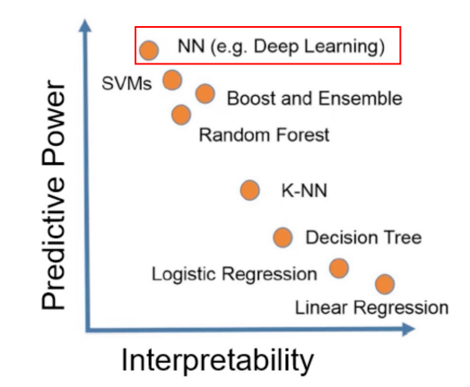

# Task01 预备知识学习

## 1 什么是可解释人工智能？

相关案例：

- 猫狗分类的神经网络应用
- 坦克识别中的重要特征划分
- 大熊猫的图片加上噪声会被判定为长臂猿的例子
- AI绘画、ChatGPT
- 医疗、无人驾驶、金融等领域与AI的结合

可解释机器学习就是研究如何打开人工智能的黑箱子，洞悉AI的脑回路和注意力，进而解释与了解，改进与信赖。

## 2 学习可解释机器学习的原因

- 研究AI的本质
- 可解释分析是机器学习和数据挖掘的通用研究方法
- 和所有AI方向交叉融合：数据挖掘、计算机视觉、自然语言处理、强化学习、知识图谱、联邦学习
- 包括但不限于：大模型、弱监督、缺陷异常检测、细粒度分类、决策AI和强化学习、图神经网络、AI纠偏、AI4Science、Machine Teaching、对抗样本、可信计算

- Machine Teaching：
    1. 用AI学习鸟类的分类，让AI教会人类学习
    2. 绝艺围棋AI指导棋：围棋定式、招式
    3. 铁路轨道伤损识别
    4. AI作画：指导人类绘画

- 细粒度图像分类：
    1. 花和叶子的识别
    2. 荔枝的类别识别
    3. 类似的海洋生物的识别
    4. 奥特曼、韩国女星的识别
    5. X光胸片的肺炎判定
    6. 工业缺陷的类激活图：用分类问题解决定位问题
    7. 生物医学、生物信息学、基因数据挖掘、蛋白质结构预测领域

- 一些前沿AI方向：
    1. ChatGPT聊天机器人
    2. AI绘画
    3. 大模型：用海量数据、海量算力、海量参数进行训练
    4. 蛋白质的空间预测|

## 3 具有可解释性分析的AI模型

- 本身可解释性好的机器学习模型：KNN（k-最近邻算法）、Logistic回归算法、线性回归算法、决策树、朴素贝叶斯

- 传统机器学习算法的可解释性分析：算法自带的可视化、算法自带的特征权重、Permutation Importance置换重要度、PDP图、ICE图、Shapley值、Lime

- 深度学习（CV、NLP）可解释性分析：深度学习的可解释性很差

- 卷积神经网络的可解释性分析：
    1. 卷积核提取不同的特征，浅层卷积核提取边缘、颜色、斑块等底层像素特征，中层卷积核提取条纹、纹路、形状等中层纹理特征，高层卷积核提取眼睛、轮胎、文字等高层语义特征，分类输出层输出最抽象的分类结果。判断特征重要性，可使用遮挡、缩放、平移、旋转方式；用反卷积的思路：找到能使某个神经元激活的原图像素、或者小图
    2. 基于类激活热力图（CAM）的可视化
    3. 语义编码降维可视化
    4. 生成满足某些要求的图像
    5. 白盒攻击（在已经获取机器学习模型内部的所有信息和参数上进行攻击，令损失函数最大，直接计算得到对抗样本）和黑盒攻击（在神经网络结构为黑箱时，仅通过模型的输入和输出，逆推生成对抗样本）

## 4 本章总结

本次任务，主要介绍了可解释机器学习的相关概念和应用场景，包括以下内容：

1. 可解释机器学习就是研究如何打开人工智能的黑箱子，洞悉AI的脑回路和注意力，进而解释与了解，改进与信赖。
2. 学习可解释机器学习的主要原因是研究AI本质、学习机器学习和数据挖掘的通用研究方法、与AI方向交叉融合等
3. 有多种可解释的AI模型，包括传统机器学习模型（KNN、线性回归、Logistic回归、决策树等）、卷积神经网络（卷积核的特征提取、基于CAM的可视化、语义编码降维可视化等）、算法模型可视化等可解释性分析
4. 相关应用场景包括Machine Teaching、细粒度图像分类、AI绘画、ChatGPT等
