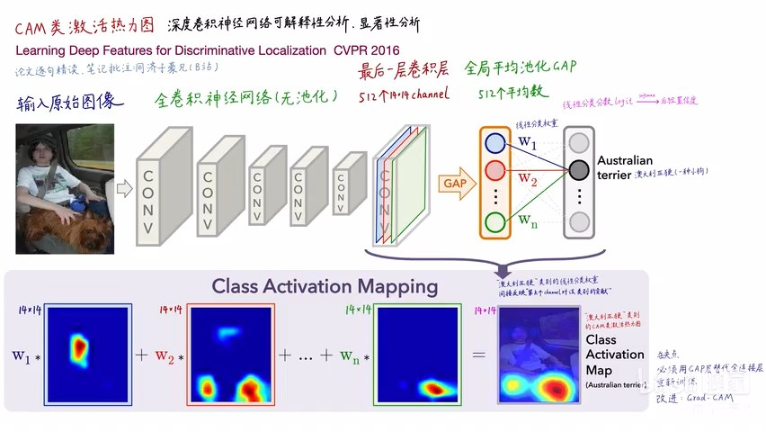

# Task03 【算法】CAM

## 1 CAM简介

- 理论来源：Learning Deep Features for Discriminative Localization（CVPR 2016）CAM类激活热力图

- CAM算法的精妙之处
    1. 对深度学习实现可解释性分析、显著性分析
    2. 可扩展性强，后续衍生出各种基于CAM的算法
    3. 每张图片的每个类别，都能生成CAM热力图
    4. 弱监督定位：使用图像分类模型解决定位问题，将定位信息保留到模型的最后一层
    5. 潜在的“注意力机制”
    6. 可用于Machine Teaching

- 相关工作
    1. 弱监督的物体定位：用图像分类标注训练定位、检测、分割，可使用图像遮挡测试进行定位，可使用重叠图块进行预测，这些工作需要多次前向预测，并且是非端到端的；也可使用全局最大池化，导致只能获得边缘点，而非物体范围。可以使用GAP方式进行绘制CAM热力图，并进行物体定位。
    2. 可视化卷积神经网络内部的特征：使用ZFNet可解决目标检测和定位问题，只分析卷积层，没有分析全连接层之后的层，将全连接层替换为GAP层，可从头到尾进行可解释性分析

- CAM缺点：
    1. 必须有GAP层，否则要修改模型结构后重新训练
    2. 只能分析最后一层卷积层输出，无法分析中间层

## 2 CAM原理

- 网络结构：全卷积神经网络（无池化），最后一层卷积层（512个14x14的通道），进行全局平均池化GAP得到512个平均数，最后经过线性分类层（softmax）得到后验置信度。

- 计算CAM：通过线性分类权重，间接反映了类别对通道（channel）的关注程度，最后一层卷积层既保留了语义信息，又保留了位置信息。将某一类的线性分类权重与最后一层卷积层进行对应相乘，可得到该类的CAM类激活热力图。

&emsp;&emsp;假设$f_k(x,y)$表示最后一层卷积层输出的feature map中第$k$个channel上坐标为$(x, y)$的值，将$F^k$记为全局平均池化GAP值，即：
$$
F^k = \sum_{x, y} f_k(x, y)
$$

对于某一类$c$，softmax层的输入值记为$S_c$，即：
$$
S_c = \sum_k w_k^c F_k
$$
其中，$w_k^c$表示第$k$个channel的类$c$的权重。

最后softmax层的输出值记为$P_c$，即
$$
P_c = \frac{\exp(S_c)}{\sum_c \exp(S_c)}
$$

设$M_c$为类$c$的CAM值，记为：
$$
M_c(x, y) = \sum_k w_k^c f_k(x, y)
$$

则$\displaystyle S_c= \sum_{x,y} M_c(x, y)$

**注**：每个feature map（即channel）代表了一个卷积核从图像中提取出的一类视觉特征，$w_c$权重间接反映了该特征对类$c$的重要程度。

- 为什么在CAM中不使用池化层：
    1. 池化的作用：减少计算量、防止过拟合、平移不变性
    2. 由于池化引入平移不变性，丢失了长宽方向的位置信息，故不使用池化的卷积神经网络

- 全局平均池化GAP（Network in Network）：每一个channel计算一个平均值，可取代全连接层（避免使用全连接层导致参数量爆炸），减少参数量，防止过拟合，每个GAP平均值，间接代表了卷积层最后一层输出的每个channel。

&emsp;&emsp;GAP对关键区域范围内的特征都有影响，但在GMP中，非最大值的特征不影响模型分类性能，虽然GAP和GMP分类性能接近，但定位性能不同。

## 3 弱监督的物体定位

- 使用GAP代替全连接层，重新训练模型：下采样次数越少，最后一层卷积层输出的feature map越大，空间信息丢失越少，定位性能越好。

- 实验结果：
    1. 在分类问题中，用GAP层改动后，分类性能略有下降；
    2. 在定位问题中，用GAP层改动后，用弱监督训练得到的CAM，定位准确率达到50%以上

## 4 用语义特征编码进行线性分类

- 方法：将GAP层的输出结果，用SVM模型进行线性分类
- 验证：在细粒度图像分类、概念语义发现（场景关键物品检测、短语概念弱监督定位、文字区域检测、VGA视觉问答）问题的性能对比

## 5 可视化关键区域

- 方法：将每个类别的权重排序，将前三个权重对应的channel的高激活值在原图的区域中显示出来
- 结论：不同channel提取不同特征，但都对应特定类别的相关语义

## 6 本章总结

本次任务，主要介绍了CAM的论文内容、相关理论和算法，包括：

1. CAM类激活热力图主要对深度学习实现可解释性分析、显著性分析，并能够解决弱监督定位问题，具有潜在的“注意力机制”
2. CAM的计算方法：使用GAP代替全连接层，将权重与最后一层卷积层对应相乘求和，得到CAM热力值
3. 使用GAP代替全连接层的实验效果
4. 在细粒度图像分类、概念语义发现问题的性能对比
5. 在原图中可视化相关语义的关键区域
