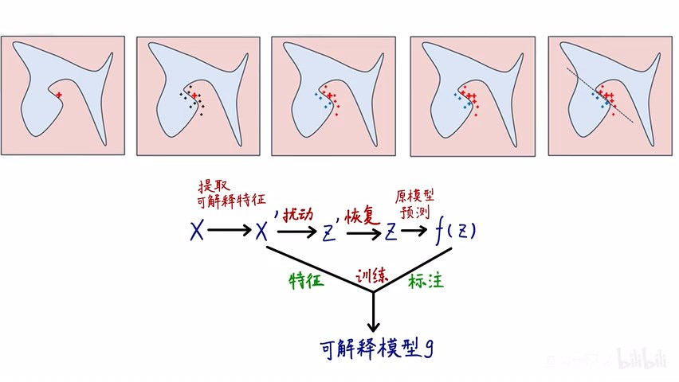

# Task06 【算法】LIME

## 1 LIME简介

- 理论来源：“Why Should I Trust You?”Explaining the Predictions of Any Classifier论文

- 论文内容主要包括LIME、SP-LIME和模拟与人工验证的实验

- LIME是可解释任意机器学习模型预测结果的通用方法

- LIME算法的通俗解释：
  1. 在高维空间中，选取一个待测样本
  2. 选取该样本的邻域数据
  3. 获取邻域数据的相关权重
  4. 将上述数据输入到原模型中，进行预测，得到预测结果
  5. 选择一个可解释性的模型，比如决策树、线性模型
  6. 使用这些邻域数据和原始模型得到的预测结果进行模型训练，拟合原始模型

- LIME的优点
    1. 兼容任意一种机器学习算法
    2. 特征重要性：解释、理解、信赖、改进（特征工程）
    3. What-if场景：例如每个月多挣500元，额度是多少
    4. 可解释单个样本预测结果，选取代表性样本，反映模型的全局性能
    5. 可人工设计、构造可解释特征

- LIME的缺点：
    1. 人工设计、构造的“可解释特征”不一定科学
    2. “局部”线性可能无法拟合原模型
    3. 不同样本，如何计算邻域样本权重
    4. 每个待测样本都需要训练对应可解释模型，耗时长

## 2 解释的示例

- 普通机器学习的解释性：通过病人的感冒症状，判断各项症状对感冒结果的贡献程度
- 数据泄漏：如果将病人ID作为特征，导致模型训练时会有偏差（OOD泛化）
- 模型比较：比较两个模型在邮件分类中，分析关键字的重要程度，准确率高不能说明模型好

- LIME的目标：
    1. 必须易于被人类解释，特征数量必须很少，训练原模型的特征可以难以理解，但训练解释模型的特征必须易于理解
    2. 必须在局部保真，在局部邻域中拟合的曲线必须跟原始模型的边界贴近
    3. 用多个有代表性的单个预测结果，反映整个模型的可解释性

## 3 LIME算法原理

- LIME是使用“可解释特征”训练“可解释模型”，在“特定样本的局部线性邻域”拟合“原模型”

&emsp;&emsp;假设原模型训练用的特征为$x \in \mathbb{R}^d$，可解释模型训练用的特征表示为$x' \in \{0, 1\}^{d'}$。

&emsp;&emsp;选择一个可解释模型记为$g \in G$，$\Omega(g)$表示模型$g$的超参数（可解释模型复杂度），例如决策树的深度，或者是线性模型非零权重的个数。

&emsp;&emsp;原模型可设为$f:\mathbb{R}^d \rightarrow \mathbb{R}$，则$f(x)$表示预测的概率，将$\pi_x(z)$表示邻近度量指标，即样本$z$与样本$x$的距离。

记$\mathcal{L}(f,g,\pi_x)$表示局部不可信度，则LIME的原理公式如下：
$$
\xi(x) = \mathop{\arg\min} \limits_{g\in G} \left[ \mathcal{L}(f,g,\pi_x) + \Omega(g) \right] \tag 1
$$

- SP-LIME：

&emsp;&emsp;记样本之间的距离表示为$\pi_x(z) = \exp(-D(x,z)^2 / \sigma^2)$，根据上述原理，可得到局部不可信度：

$$
\mathcal{L}(f,g,\pi_x) = \sum_{z,z'\in Z} \pi_x(z) (f(z) - g(z'))^2
$$
训练线性模型均方误差损失函数对应（1）式式中的局部不可信度。

**注**：该方法与数据集尺寸无关

- 两大挑战：
    1. LIME最难的步骤是如何构造可解释特征，仍需要人工先验知识
    2. 原模型在局部邻域仍然非线性，用可解释模型无法很好拟合

- 解决方案：选择线性模型之外更好的可解释模型，兼容各类数据集和原模型。

## 4 选取有代表性的样本解释模型

- 不能只看原始数据和预测结果，还需要看解释，考虑多样性和有代表性，不能有冗余的特征量

- SP算法：
    1. 获取数据集中每个样本的每个可解释特征权重 $\mathcal{W}_i$
    2. 计算每个可解释特征的代表性 $I_j = \sqrt{\sum_{i=1}^n |\mathcal{W}_{ij}|}$
    3. 找到使得可解释特征代表性求和最大的样本 $V = V \cup \mathop{\arg \max} \limits_{i} (V \cup {i}, \mathcal{W}, I)$

&emsp;&emsp;$c(V, \mathcal{W}, I)$表示特征覆盖度，记为
$$
c(V, \mathcal{W}, I) = \sum_{j=1}^{d'} \mathbb{1}_{[\exists i \in V: \mathcal{W}_{ij} > 0]} I_j \tag 3
$$

找到能使$c$最大化的样本集$V$，即
$$
Pick(\mathcal{W}, I) = \mathop{\arg \max} \limits_{V, |V| \leqslant B} c(V, \mathcal{W}, I) \tag 4
$$

## 5 实验部分

- 模拟实验：使用books和DVDs文本情感分类数据集，对比LIME、random、parzen、greedy各个算法性能，分析特征重要度

- 人工实验：
    1. 能够挑出更好的模型
    2. 根据解释进行特征工程
    3. 根据解释发现模型异常

通过特征解释，人类可以挑选出更优的模型，SP比RP好，LIME比greedy好

## 6 本章总结

本次任务，主要介绍了LIME的论文和算法，包括：
    
1. LIME是可解释任意机器学习模型预测结果的通用方法
2. LIME的目标需要易于被人类解释，在局部保真，用多个有代表性的单个预测结果，反映整个模型的可解释性
3. LIME是使用“可解释特征”训练“可解释模型”，在“特定样本的局部线性邻域”拟合“原模型”
4. 使用SP算法选取有代表性的样本解释模型‘
5. 通过模拟实验和人工实验，验证LIME算法的性能
