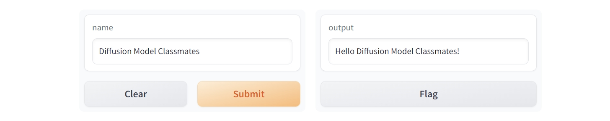

# 第2章 Hugging Face简介

## 2.1 Hugging Face核心功能介绍

- 模型、数据集存储库：Hugging Face Hub，主要用于托管模型和数据集，并详细描述模型名称、分类标签、模型的开源协议、arXiv.org的论文引用等。
- 模型卡片：包括模型用途、制作模型的背景、模型的详细介绍、引用论文、使用说明、推理API等。
- 推理API：文字形式的输入输出、上传图片和调用游览器获取麦克风实时音频。
- Space应用：提供创建和部署机器学习应用的功能。

## 2.2 Hugging Face开源库

- Transformers：下载和训练SOTA的预训练模型，支持PyTorch、TensorFlow和JAX。
- Datasets：使用代码方法，轻松加载各种数据集。
- Diffusers：扩散模型工具箱，使用各种噪声调度器，调节模型推理过程中的生成速度和质量。
- Accelerate：支持在任何类型的设备上运行原本PyTorch训练脚本。
- Optimum：Transformers扩展，性能优化工具。
- timm：深度学习库，包含图像模型、优化器、调度器以及训练/验证脚本等。

## 2.3 Gradio工具介绍

Gradio用于构建机器学习和数据科学演示以及Web应用，能够通过浏览器拖放图片、粘贴文本、录制声音并进行演示互动。


```python
import gradio as gr

def greet(name):
    return "Hello " + name + "!"

demo = gr.Interface(fn=greet, inputs="text", outputs="text")

demo.launch()
```


