# 第7章 DDIM反转

## 7.1 实战：反转


```python
import torch
import requests
import torch.nn as nn
import torch.nn.functional as F
from PIL import Image
from io import BytesIO
from tqdm.auto import tqdm
from matplotlib import pyplot as plt
from torchvision import transforms as tfms
from diffusers import StableDiffusionPipeline, DDIMScheduler
```

```python
def load_image(url, size=None):
    response = requests.get(url,timeout=1)
    img = Image.open(BytesIO(response.content)).convert('RGB')
    if size is not None:
        img = img.resize(size)
    return img

device = torch.device("cuda" if torch.cuda.is_available() else "cpu")
```

1. 载入一个预训练过的管线


```python
# 载入一个管线
pipe = StableDiffusionPipeline.from_pretrained("runwayml/stable-diffusion-v1-5").to(device)
# 配置DDIM调度器
pipe.scheduler = DDIMScheduler.from_config(pipe.scheduler.config)
# 采样一次，保证代码正常
prompt = 'Beautiful DSLR Photograph of a penguin on the beach, golden hour'
negative_prompt = 'blurry, ugly, stock photo'
im = pipe(prompt, negative_prompt=negative_prompt).images[0]
im.resize((256, 256))
```

    
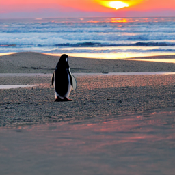
    


2. DDIM采样

在给定时刻$t$，带有噪声的图像$x_t$通过对原始图像$x_0$加上高斯噪声$\epsilon$得到：
$$
x_t = \sqrt{\alpha_t} x_0 + \sqrt{1 - \alpha_t} \epsilon
$$
其中，$\epsilon$是方差归一化后的高斯噪声，$\alpha_t$定义噪声调度器。


```python
# 使用alphas_cumprod函数得到alphas
timesteps = pipe.scheduler.timesteps.cpu()
alphas = pipe.scheduler.alphas_cumprod[timesteps]
plt.plot(timesteps, alphas, label='alpha_t');
plt.legend();
```


    
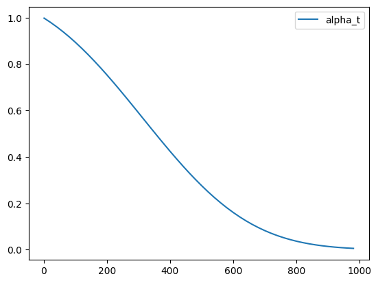
    


当时间步为0时，从一幅无噪声的干净图像开始，此时$\alpha_t=1$，当达到更高的时间步，得到一幅几乎全是噪声的图像，$\alpha_t$也几乎下降到0。

> 前向过程在给定$x_{t-1}$和$x_0$的情况下变得更加确定。在生成过程中，随机噪声$\epsilon_t$前面的系数变为0，可得到隐式概率模型，其中模型样本是更加固定的过程从隐变量生成的(从$x_T$到$x_0$)，该模型命名为去噪扩散隐式模型（DDIM）。


```python
@torch.no_grad()
def sample(prompt, start_step=0, start_latents=None,
           guidance_scale=3.5, num_inference_steps=30,
           num_images_per_prompt=1, do_classifier_free_guidance=True,
           negative_prompt='', device=device):
    # 对文本提示语进行编码  
    text_embeddings = pipe._encode_prompt(
            prompt, device, num_images_per_prompt, do_classifier_free_guidance, negative_prompt
    )
    # 设置推理步数
    pipe.scheduler.set_timesteps(num_inference_steps, device=device)
    # 创建随机起点
    if start_latents is None:
        start_latents = torch.randn(1, 4, 64, 64, device=device)
        start_latents *= pipe.scheduler.init_noise_sigma
    
    latents = start_latents.clone()

    for i in tqdm(range(start_step, num_inference_steps)):
    
        t = pipe.scheduler.timesteps[i]
        
        # 如果正在进行CFG，则对隐层进行扩展
        latent_model_input = torch.cat([latents] * 2) if do_classifier_free_guidance else latents
        latent_model_input = pipe.scheduler.scale_model_input(latent_model_input, t)
        
        # 预测噪声
        noise_pred = pipe.unet(latent_model_input, t, encoder_hidden_states=text_embeddings).sample
        
        # 进行引导
        if do_classifier_free_guidance:
            noise_pred_uncond, noise_pred_text = noise_pred.chunk(2)
            noise_pred = noise_pred_uncond + guidance_scale * (noise_pred_text - noise_pred_uncond)


        # Normally we'd rely on the scheduler to handle the update step:
        # latents = pipe.scheduler.step(noise_pred, t, latents).prev_sample
        
        # 自行实现调度器
        prev_t = max(1, t.item() - (1000//num_inference_steps)) # t-1
        alpha_t = pipe.scheduler.alphas_cumprod[t.item()]
        alpha_t_prev = pipe.scheduler.alphas_cumprod[prev_t]
        predicted_x0 = (latents - (1-alpha_t).sqrt()*noise_pred) / alpha_t.sqrt()
        direction_pointing_to_xt = (1-alpha_t_prev).sqrt()*noise_pred
        latents = alpha_t_prev.sqrt()*predicted_x0 + direction_pointing_to_xt
    
    # 进行后处理
    images = pipe.decode_latents(latents)
    images = pipe.numpy_to_pil(images)

    return images
```


```python
prompt = 'Watercolor painting of a beach sunset'
sample(prompt, negative_prompt=negative_prompt, num_inference_steps=50)[0].resize((256, 256))
```

    
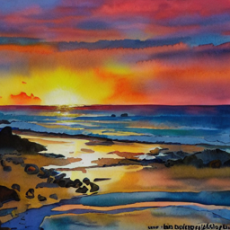
    


3. 反转

反转的目标是得到“带噪”的隐式表示。


```python
input_image = load_image('https://images.pexels.com/photos/8306128/pexels-photo-8306128.jpeg', size=(512, 512))
input_image
```


    

    


```python
input_image_prompt = "Photograph of a puppy on the grass"
```


```python
# 使用VAE进行编码
with torch.no_grad(): 
    latent = pipe.vae.encode(tfms.functional.to_tensor(input_image).unsqueeze(0).to(device)*2-1)
l = 0.18215 * latent.latent_dist.sample()
```


```python
# 反转
@torch.no_grad()
def invert(start_latents, prompt, guidance_scale=3.5, num_inference_steps=80,
           num_images_per_prompt=1, do_classifier_free_guidance=True,
           negative_prompt='', device=device):
  
    # 对提示文本进行编码
    text_embeddings = pipe._encode_prompt(
            prompt, device, num_images_per_prompt, do_classifier_free_guidance, negative_prompt
    )
    
    # 指定起点
    latents = start_latents.clone()
    
    # 保存反转的隐层
    intermediate_latents = []
    
    # 设置推理步数
    pipe.scheduler.set_timesteps(num_inference_steps, device=device)
    
    # 反转时间步
    timesteps = reversed(pipe.scheduler.timesteps)
    
    
    for i in tqdm(range(1, num_inference_steps), total=num_inference_steps-1):
        # 跳过最后一次迭代
        if i >= num_inference_steps - 1: continue

        t = timesteps[i]
        
        # 如果正在进行CFG，则对隐层进行扩展
        latent_model_input = torch.cat([latents] * 2) if do_classifier_free_guidance else latents
        latent_model_input = pipe.scheduler.scale_model_input(latent_model_input, t)
        
        # 预测残留的噪声
        noise_pred = pipe.unet(latent_model_input, t, encoder_hidden_states=text_embeddings).sample
        
        # 引导
        if do_classifier_free_guidance:
            noise_pred_uncond, noise_pred_text = noise_pred.chunk(2)
            noise_pred = noise_pred_uncond + guidance_scale * (noise_pred_text - noise_pred_uncond)

        current_t = max(0, t.item() - (1000//num_inference_steps)) # t
        next_t = t # min(999, t.item() + (1000//num_inference_steps)) # t+1
        alpha_t = pipe.scheduler.alphas_cumprod[current_t]
        alpha_t_next = pipe.scheduler.alphas_cumprod[next_t]
        
        # 反转的更新步（重新排列更新步，利用当前隐层得到新的隐层）
        latents = (latents - (1-alpha_t).sqrt() * noise_pred) * (alpha_t_next.sqrt() / alpha_t.sqrt()) + (1-alpha_t_next).sqrt() * noise_pred

        # 保存隐层
        intermediate_latents.append(latents)
            
    return torch.cat(intermediate_latents)
```


```python
inverted_latents = invert(l, input_image_prompt,num_inference_steps=50)
inverted_latents.shape
```


    torch.Size([48, 4, 64, 64])


```python
# 解码反转的最后一个隐层
with torch.no_grad():
    im = pipe.decode_latents(inverted_latents[-1].unsqueeze(0))
pipe.numpy_to_pil(im)[0]
```


    
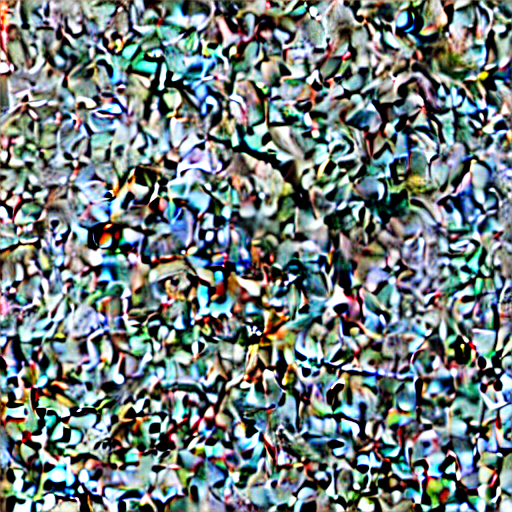
    


```python
# 可以通过常规调用方法，将反转隐层传递给管线
pipe(input_image_prompt, latents=inverted_latents[-1][None], num_inference_steps=50, guidance_scale=3.5).images[0]
```


    
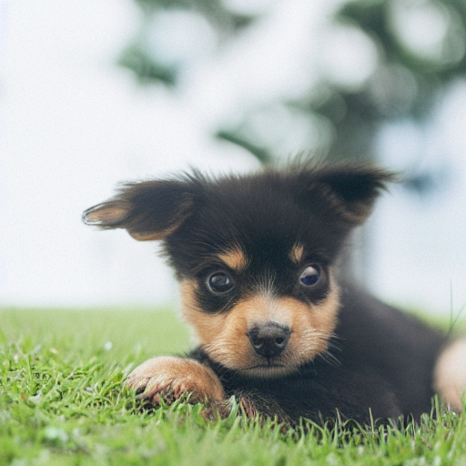
    


```python
# 从第20步的隐式表示开始，得到的结果距离最初的图片很近了！
start_step=20
sample(input_image_prompt, start_latents=inverted_latents[-(start_step+1)][None], 
       start_step=start_step, num_inference_steps=50)[0]
```

    
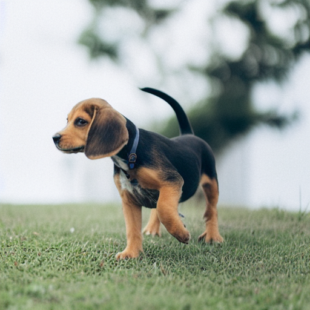
    


```python
# 把小狗换成小猫，从第10步的隐式表示开始
start_step=10
new_prompt = input_image_prompt.replace('puppy', 'cat')
sample(new_prompt, start_latents=inverted_latents[-(start_step+1)][None], 
       start_step=start_step, num_inference_steps=50)[0]
```


    
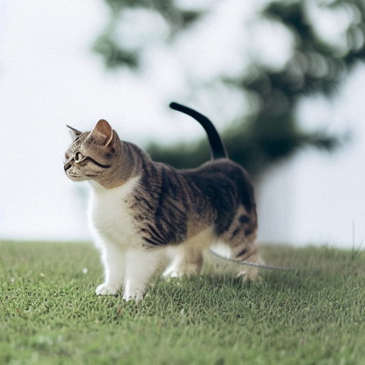
    


## 7.2 组合封装


```python
def edit(input_image, input_image_prompt, edit_prompt, num_steps=100, start_step=30, guidance_scale=3.5):
    with torch.no_grad(): latent = pipe.vae.encode(tfms.functional.to_tensor(input_image).unsqueeze(0).to(device)*2-1)
    l = 0.18215 * latent.latent_dist.sample()
    inverted_latents = invert(l, input_image_prompt,num_inference_steps=num_steps)
    final_im = sample(edit_prompt, start_latents=inverted_latents[-(start_step+1)][None], 
                      start_step=start_step, num_inference_steps=num_steps, guidance_scale=guidance_scale)[0]
    return final_im
```


```python
edit(input_image, 'A puppy on the grass', 'an old grey dog on the grass', num_steps=50, start_step=10)
```


    
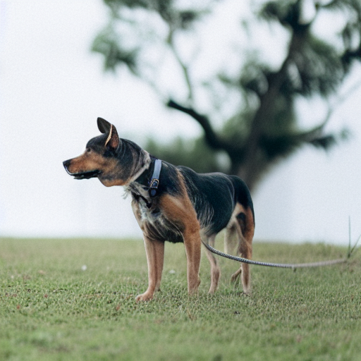
    


```python
face = load_image('https://images.pexels.com/photos/1493111/pexels-photo-1493111.jpeg', size=(512, 512))
face
```


    
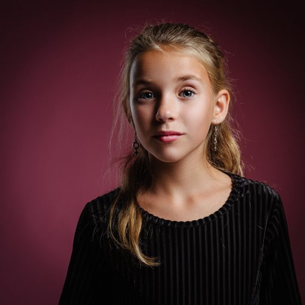
    


```python
edit(face, 'A photograph of a face', 'A photograph of a face with sunglasses', num_steps=250, start_step=30, guidance_scale=3.5)
```


    
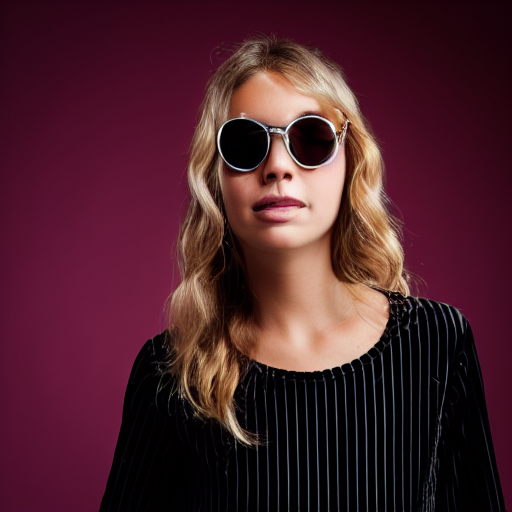
    


## 7.3 ControlNet的结构与训练过程

**目标：** 主要解决图像细节的提示，包括人物四肢的角度、背景中物体的位置、每一缕光线照射的角度等。

**方案：** ControlNet能够嵌入任意已经训练好的扩散模型，可以提供更多控制条件。

> ControlNet的基本结构由一个对应的预训练网络的神经网络模块和两个“零卷积”层组成。在训练过程中，固定预训练网络的权重，只更新ControlNet基本结构中的网络“副本”和零卷积层的权重。网络“副本”将学会如何让模型按照新的控制条件来生成结果，被固定的网络会保留原先网络已经学会的所有知识。

**ControlNet模型的训练过程：**
1. 收集数据集，并包含对应的prompt。   
2. 将prompt输入被固定的稳定扩散模型，并将标注好的图像控制条件输入ControlNet，然后按照稳定扩散模型的训练过程迭代ControlNet block的权重。
3. 在训练过程中，随机将50%的文本提示语替换为空白字符串。
4. 训练结束后，使用ControlNet对应的图像控制条件，来控制扩散模型生成符合条件的图像。

## 7.4 ControlNet实战

### 7.4.1 生成人物的肖像


```python
from diffusers import StableDiffusionControlNetPipeline
from diffusers.utils import load_image

image = load_image("https://huggingface.co/datasets/huggingface/documentation-images/resolve/main/diffusers/input_image_vermeer.png")
image
```


    
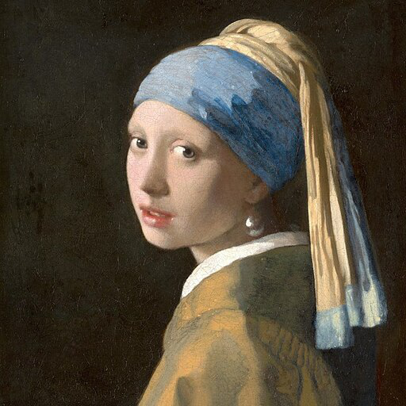
    


```python
import cv2
from PIL import Image
import numpy as np

image = np.array(image)

low_threshold = 100
high_threshold = 200

# 提取图片边缘线条
image = cv2.Canny(image, low_threshold, high_threshold)
image = image[:, :, None]
image = np.concatenate([image, image, image], axis=2)
canny_image = Image.fromarray(image)
canny_image
```


    

    


```python
# 使用半精度节约计算资源，加快推理速度
from diffusers import StableDiffusionControlNetPipeline, ControlNetModel
import torch

controlnet = ControlNetModel.from_pretrained("lllyasviel/sd-controlnet-canny", torch_dtype=torch.float16).to(device)
pipe = StableDiffusionControlNetPipeline.from_pretrained("runwayml/stable-diffusion-v1-5", controlnet=controlnet, 
                                                        torch_dtype=torch.float16).to(device)
```


```python
# 使用速度最快的扩散模型调度器UniPCMultistepScheduler
from diffusers import UniPCMultistepScheduler

pipe.scheduler = UniPCMultistepScheduler.from_config(pipe.scheduler.config)
```


```python
def image_grid(imgs, rows, cols):
    assert len(imgs) == rows * cols
    
    w, h = imgs[0].size
    grid = Image.new("RGB", size=(cols * w, rows * h))
    grid_w, grid_h = grid.size
    
    for i, img in enumerate(imgs):
        grid.paste(img, box=(i % cols * w, i // cols * h))
    
    return grid
```


```python
prompt = ", best quality, extremely detailed"
prompt = [t + prompt for t in ["Sandra Oh", "Kim Kardashian", "rihanna", "taylor swift"]]
generator = [torch.Generator(device=device).manual_seed(2) for i in range(len(prompt))]

output = pipe(
    prompt,
    canny_image,
    negative_prompt=["monochrome, lowres, bad anatomy, worst quality, low quality"] * len(prompt),
    generator=generator,
    num_inference_steps=30
)

image_grid(output.images, 2, 2)
```


    
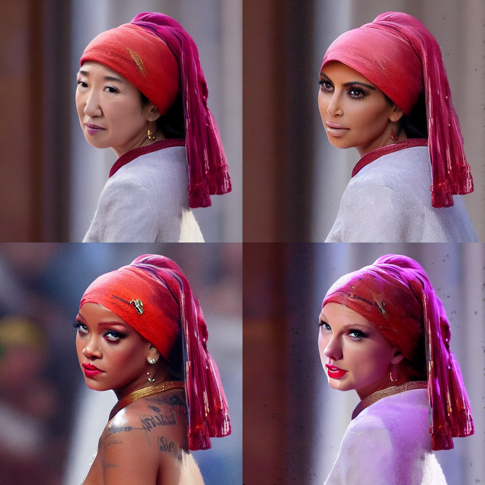
    


### 7.4.2 提取身体姿态


```python
urls = ["yoga1.jpeg", "yoga2.jpeg", "yoga3.jpeg", "yoga4.jpeg"]
imgs = [
    load_image("https://huggingface.co/datasets/YiYiXu/controlnet-testing/resolve/main/" + url) for url in urls
]
image_grid(imgs, 2, 2)
```


    
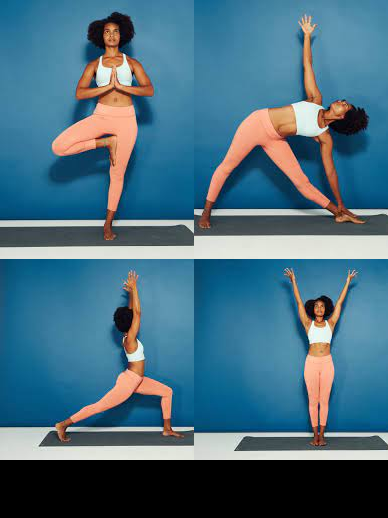
    


```python
from controlnet_aux import OpenposeDetector

model = OpenposeDetector.from_pretrained("lllyasviel/ControlNet")

poses = [model(img) for img in imgs]
image_grid(poses, 2, 2)
```


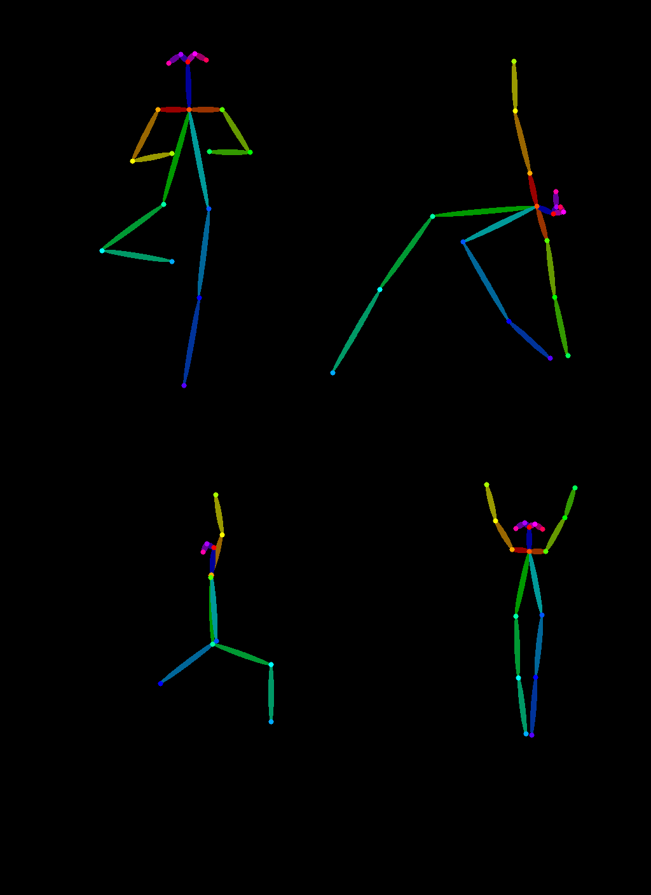
    

```python
from diffusers import ControlNetModel, UniPCMultistepScheduler, StableDiffusionControlNetPipeline

controlnet = ControlNetModel.from_pretrained("fusing/stable-diffusion-v1-5-controlnet-openpose", 
                                             torch_dtype=torch.float16).to(device)
```


```python
model_id = "runwayml/stable-diffusion-v1-5"
pipe = StableDiffusionControlNetPipeline.from_pretrained(
    model_id,
    controlnet = controlnet,
    torch_dtype=torch.float16
).to(device)
```


```python
pipe.scheduler = UniPCMultistepScheduler.from_config(pipe.scheduler.config)
pipe.enable_model_cpu_offload()
pipe.enable_xformers_memory_efficient_attention()
```


```python
generator = [torch.Generator(device=device).manual_seed(10) for i in range(4)]
prompt = "super-hero character, best quality, extremely detailed"

output = pipe(
    [prompt] * 4,
    poses,
    negative_prompt=["monochrome, lowres, bad anatomy, worst quality, low quality"] * 4,
    generator=generator,
    num_inference_steps=20
)
```


```python
image_grid(output.images, 2, 2)
```


    
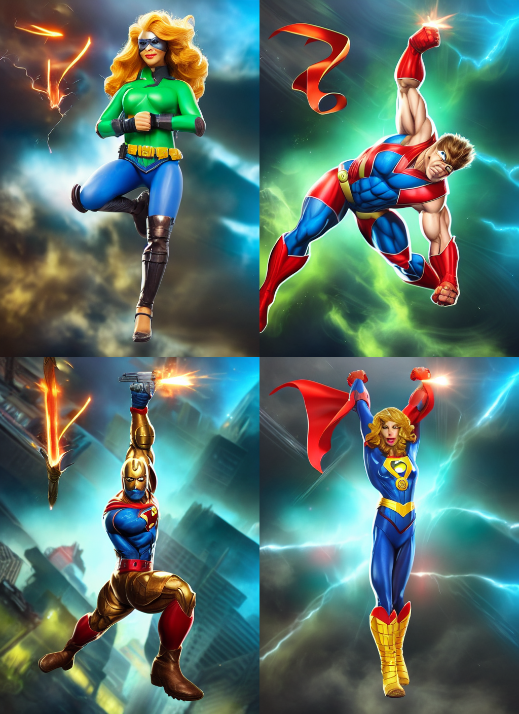
    


