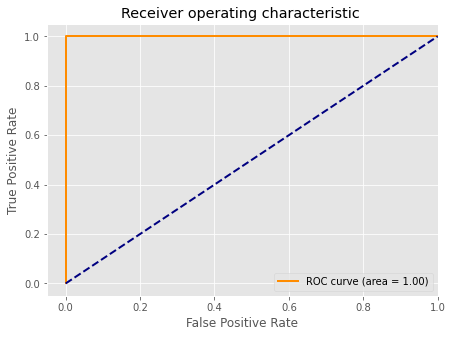

# Task06 掌握分类问题的评估及超参数调优

## 1 知识梳理

### 1.1 用管道简化工作流
- 使用`sklearn.pipeline.make_pipeline`建立工作流
- 使用`sklearn.pipelime.Pipeline`构建工作流对象，然后在使用该对象的`fit`方法

### 1.2 使用k折交叉验证评估模型性能
- 具体步骤：
    1. 将数据集随机分成$k$个数量基本一致的组，将第1组作为验证集，其余$k-1$组作为训练集
    2. 计算验证集的均方误差$\text{MSE}_1$
    3. 重复步骤(1)(2)$k$次，将得到的$k$个$\text{MSE}$取平均：$$CV_{(k)}=\frac{1}{k}\sum_{i=1}^k \text{MSE}_i$$
- $k$折交叉验证：使用`sklearn.model_selection.cross_val_score`
- 分层$k$折交叉验证：使用`sklearn.model_selection.StratifiedKFold`

### 1.3 使用学习和验证曲线调试算法

- 用学习曲线诊断偏差与方差：使用`sklearn.model_selection.learning_curve`
- 用验证曲线解决欠拟合和过拟合：使用`sklearn.model_selection.validation_curve`

### 1.4 通过网格搜索进行超参数调优
- 网格搜索：使用`sklearn.model_selection.GridSearchCV`
- 随机网格搜索：使用`sklearn.model_selection.RandomizedSearchCV`
- 嵌套交叉验证：构建网格搜索对象，并在交叉验证中传入网格搜索对象

### 1.5 比较不同的性能评估指标

- 混淆矩阵
    1. 误差率：$\displaystyle ERR= \frac{FP+FN}{FP+FN+TP+TN}$
    2. 准确率：$\displaystyle ACC=\frac{TP+TN}{FP+FN+TP+TN}$
    3. 假阳率：$\displaystyle FPR=\frac{FP}{N}=\frac{FP}{FP+TN}$
    4. 真阳率：$\displaystyle TPR=\frac{TP}{P}=\frac{TP}{FN+TP}$
    5. 精度：$\displaystyle PRE=\frac{TP}{TP+FP}$
    6. 召回率：$\displaystyle REC=TPR=\frac{TP}{P}=\frac{TP}{FN+TP}$
    7. $\displaystyle \text{F1-score}=2 \cdot \frac{PRE \times REC}{PRE + REC}$
- 各种指标计算：  
  准确率：使用`sklearn.metrics.precision_score`  
  召回率：使用`sklearn.metrics.recall_score`  
  F1-Score：使用`sklearn.metrics.f1_score`

## 2 实战练习

本例使用sklearn内置数据集：葡萄酒识别数据集


```python
# 引入相关科学计算包
import numpy as np
import pandas as pd
import matplotlib.pyplot as plt
%matplotlib inline 
plt.style.use("ggplot")      
import seaborn as sns
```


```python
from sklearn import datasets
# sklearn内置数据集：葡萄酒识别数据集
wine = datasets.load_wine()
X = wine.data
y = wine.target
features = wine.feature_names
wine_data = pd.DataFrame(X, columns=features)
wine_data['target'] = y
wine_data.head()
```


<div>
<style scoped>
    .dataframe tbody tr th:only-of-type {
        vertical-align: middle;
    }

    .dataframe tbody tr th {
        vertical-align: top;
    }

    .dataframe thead th {
        text-align: right;
    }
</style>
<table border="0" class="dataframe">
  <thead>
    <tr style="text-align: right;">
      <th></th>
      <th>alcohol</th>
      <th>malic_acid</th>
      <th>ash</th>
      <th>alcalinity_of_ash</th>
      <th>magnesium</th>
      <th>total_phenols</th>
      <th>flavanoids</th>
      <th>nonflavanoid_phenols</th>
      <th>proanthocyanins</th>
      <th>color_intensity</th>
      <th>hue</th>
      <th>od280/od315_of_diluted_wines</th>
      <th>proline</th>
      <th>target</th>
    </tr>
  </thead>
  <tbody>
    <tr>
      <th>0</th>
      <td>14.23</td>
      <td>1.71</td>
      <td>2.43</td>
      <td>15.6</td>
      <td>127.0</td>
      <td>2.80</td>
      <td>3.06</td>
      <td>0.28</td>
      <td>2.29</td>
      <td>5.64</td>
      <td>1.04</td>
      <td>3.92</td>
      <td>1065.0</td>
      <td>0</td>
    </tr>
    <tr>
      <th>1</th>
      <td>13.20</td>
      <td>1.78</td>
      <td>2.14</td>
      <td>11.2</td>
      <td>100.0</td>
      <td>2.65</td>
      <td>2.76</td>
      <td>0.26</td>
      <td>1.28</td>
      <td>4.38</td>
      <td>1.05</td>
      <td>3.40</td>
      <td>1050.0</td>
      <td>0</td>
    </tr>
    <tr>
      <th>2</th>
      <td>13.16</td>
      <td>2.36</td>
      <td>2.67</td>
      <td>18.6</td>
      <td>101.0</td>
      <td>2.80</td>
      <td>3.24</td>
      <td>0.30</td>
      <td>2.81</td>
      <td>5.68</td>
      <td>1.03</td>
      <td>3.17</td>
      <td>1185.0</td>
      <td>0</td>
    </tr>
    <tr>
      <th>3</th>
      <td>14.37</td>
      <td>1.95</td>
      <td>2.50</td>
      <td>16.8</td>
      <td>113.0</td>
      <td>3.85</td>
      <td>3.49</td>
      <td>0.24</td>
      <td>2.18</td>
      <td>7.80</td>
      <td>0.86</td>
      <td>3.45</td>
      <td>1480.0</td>
      <td>0</td>
    </tr>
    <tr>
      <th>4</th>
      <td>13.24</td>
      <td>2.59</td>
      <td>2.87</td>
      <td>21.0</td>
      <td>118.0</td>
      <td>2.80</td>
      <td>2.69</td>
      <td>0.39</td>
      <td>1.82</td>
      <td>4.32</td>
      <td>1.04</td>
      <td>2.93</td>
      <td>735.0</td>
      <td>0</td>
    </tr>
  </tbody>
</table>
</div>


各个特征的相关解释：
   - alcohol：酒精
   - malic_acid：苹果酸
   - ash：灰
   - alcalinity_of_ash：灰的碱度
   - magnesium：镁
   - total_phenols：总酚
   - flavanoids：类黄酮
   - nonflavanoid_phenols：非类黄酮酚
   - proanthocyanins：原花青素
   - color_intensity：色彩强度
   - hue：色调
   - od280/od315_of_diluted_wines：稀释酒的OD280 / OD315
   - proline：脯氨酸

### 2.1 使用网格搜索进行超参数调优

#### 2.2.1 使用网格搜索`GridSearchCV()`


```python
from sklearn.preprocessing import StandardScaler
from sklearn.pipeline import make_pipeline
from sklearn.model_selection import GridSearchCV
from sklearn.svm import SVC
import time

start_time = time.time()
pipe_svc = make_pipeline(StandardScaler(),SVC(random_state=1))
param_range = [0.0001,0.001,0.01,0.1,1.0,10.0,100.0,1000.0]
param_grid = [{'svc__C':param_range,'svc__kernel':['linear']},{'svc__C':param_range,'svc__gamma':param_range,'svc__kernel':['rbf']}]
gs = GridSearchCV(estimator=pipe_svc,param_grid=param_grid,scoring='accuracy',cv=10,n_jobs=-1)
gs = gs.fit(X,y)
end_time = time.time()
print("网格搜索经历时间：%.3f S" % float(end_time-start_time))
print('最佳得分:', gs.best_score_)
print('最优参数是:', gs.best_params_)
```

    网格搜索经历时间：3.285 S
    最佳得分: 0.9833333333333334
    最优参数是: {'svc__C': 1.0, 'svc__gamma': 0.01, 'svc__kernel': 'rbf'}
    

#### 2.2.2 随机网格搜索RandomizedSearchCV()


```python
from sklearn.model_selection import RandomizedSearchCV
from sklearn.svm import SVC
import time

start_time = time.time()
pipe_svc = make_pipeline(StandardScaler(),SVC(random_state=1))
param_range = [0.0001,0.001,0.01,0.1,1.0,10.0,100.0,1000.0]
param_grid = [{'svc__C':param_range,'svc__kernel':['linear']},{'svc__C':param_range,'svc__gamma':param_range,'svc__kernel':['rbf']}]
# param_grid = [{'svc__C':param_range,'svc__kernel':['linear','rbf'],'svc__gamma':param_range}]
gs = RandomizedSearchCV(estimator=pipe_svc, param_distributions=param_grid,scoring='accuracy',cv=10,n_jobs=-1)
gs = gs.fit(X,y)
end_time = time.time()
print("随机网格搜索经历时间：%.3f S" % float(end_time-start_time))
print('最佳得分:', gs.best_score_)
print('最优参数是:', gs.best_params_)
```

    随机网格搜索经历时间：0.236 S
    最佳得分: 0.9774509803921569
    最优参数是: {'svc__kernel': 'rbf', 'svc__gamma': 0.001, 'svc__C': 10.0}
    

### 2.3 混淆矩阵和ROC曲线


```python
# 查看数据集的分类数，可知有3类
wine_data['target'].unique()
wine_data['target'].value_counts()
```


    1    71
    0    59
    2    48
    Name: target, dtype: int64


```python
# 取出类别0和1作为基础数据集
df = wine_data.query("target==[0,1]")
y = df['target'].values
X = df.iloc[:, :-1].values
```

#### 2.3.1 绘制混淆矩阵


```python
from sklearn.model_selection import train_test_split
from sklearn.svm import SVC
from sklearn.metrics import confusion_matrix

X_train,X_test,y_train,y_test = train_test_split(X,y,test_size=0.2,stratify=y,random_state=1)
pipe_svc = make_pipeline(StandardScaler(),SVC(random_state=1))

pipe_svc.fit(X_train,y_train)
y_pred = pipe_svc.predict(X_test)
# 得到混淆矩阵
confmat = confusion_matrix(y_true=y_test,y_pred=y_pred)

fig,ax = plt.subplots(figsize=(2.5,2.5))
ax.matshow(confmat, cmap=plt.cm.Blues,alpha=0.3)
for i in range(confmat.shape[0]):
    for j in range(confmat.shape[1]):
        ax.text(x=j,y=i,s=confmat[i,j],va='center',ha='center')
plt.xlabel('predicted label')
plt.ylabel('true label')
plt.show()
```


    

    


#### 2.3.2 绘制ROC曲线


```python
from sklearn.metrics import roc_curve,auc
from sklearn.metrics import make_scorer,f1_score
scorer = make_scorer(f1_score,pos_label=0)
# 使用网格搜索
gs = GridSearchCV(estimator=pipe_svc,param_grid=param_grid,scoring=scorer,cv=10)
y_pred = gs.fit(X_train,y_train).decision_function(X_test)
# 得到真阳率和假阳率
fpr,tpr,threshold = roc_curve(y_test, y_pred)
# 得到AUC值
roc_auc = auc(fpr,tpr)

# 绘制ROC曲线
lw = 2
plt.figure(figsize=(7,5));
# 设置假阳率为横坐标，真阳率为纵坐标
plt.plot(fpr, tpr, color='darkorange',
         lw=lw, label='ROC curve (area = %0.2f)' % roc_auc)
plt.plot([0, 1], [0, 1], color='navy', lw=lw, linestyle='--')
plt.xlim([-0.05, 1.0])
plt.ylim([-0.05, 1.05])
plt.xlabel('False Positive Rate')
plt.ylabel('True Positive Rate')
plt.title('Receiver operating characteristic ')
plt.legend(loc="lower right")
plt.show()
```


    

    

