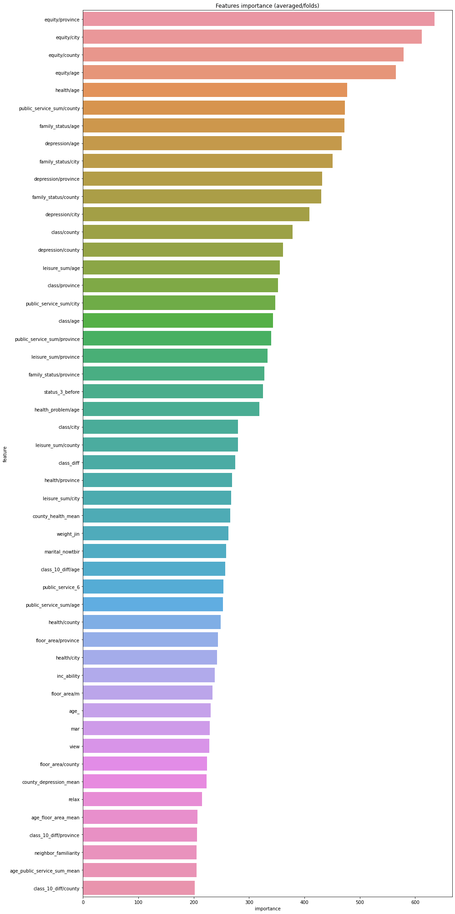

# Task14 集成学习案例一（幸福感预测）

## 1 主要思路

### 1.1 基本思路
1. 导入数据集，并删除幸福感为-8的数据行
2. 将训练集的特征列数据和测试集的数据进行合并形成`data`，主要用于数据预处理中利用众数和均值进行缺失值填充
3. 数据预处理阶段
  - 标记问题数据
  - 填充缺失值
  - 处理特殊格式的数据
  - 按照日常生活处理异常数据
  - 使用众数处理异常值
  - 使用均值处理异常值
4. 数据增广
 - 添加自定义的特征
 - 删除数据特别少的和之前用过的特征（263维）
 - 选择重要的49个特征构建训练集（49维）
 - 部分特征进行one-hot编码（383维）
5. 特征建模：分别对263维、49维、383维特征数据进行建模，训练模型并进行集成学习
6. 模型融合：将上述4种模型进行融合，使用集成学习
7. 保存结果

### 1.2 评价指标
最终的评价指标为均方误差MSE，即：
$$Score = \frac{1}{n} \sum_1 ^n (y_i - y ^*)^2$$

## 2 Baseline代码实战

### 2.1 导入package


```python
import os
import time
import pandas as pd
import numpy as np
import seaborn as sns
from sklearn.linear_model import LogisticRegression
from sklearn.svm import SVC, LinearSVC
from sklearn.ensemble import RandomForestClassifier
from sklearn.neighbors import KNeighborsClassifier
from sklearn.naive_bayes import GaussianNB
from sklearn.linear_model import Perceptron
from sklearn.linear_model import SGDClassifier
from sklearn.tree import DecisionTreeClassifier
from sklearn import metrics
from datetime import datetime
import matplotlib.pyplot as plt
from sklearn.metrics import roc_auc_score, roc_curve, mean_squared_error, mean_absolute_error, f1_score
import lightgbm as lgb
import xgboost as xgb
from sklearn.ensemble import RandomForestRegressor as rfr
from sklearn.ensemble import ExtraTreesRegressor as etr
from sklearn.linear_model import BayesianRidge as br
from sklearn.ensemble import GradientBoostingRegressor as gbr
from sklearn.linear_model import Ridge
from sklearn.linear_model import Lasso
from sklearn.linear_model import LinearRegression as lr
from sklearn.linear_model import ElasticNet as en
from sklearn.kernel_ridge import KernelRidge as kr
from sklearn.model_selection import KFold, StratifiedKFold, GroupKFold, RepeatedKFold
from sklearn.model_selection import train_test_split
from sklearn.model_selection import GridSearchCV
from sklearn import preprocessing
import logging
import warnings

warnings.filterwarnings('ignore')  # 消除warning

%matplotlib inline
```

### 2.2 导入数据集


```python
# latin-1向下兼容ASCII
train = pd.read_csv(
    "../assets/ch06/case01/data/train.csv", parse_dates=['survey_time'], encoding='latin-1')
test = pd.read_csv(
    "../assets/ch06/case01/data/test.csv", parse_dates=['survey_time'], encoding='latin-1')
```


```python
# 查看幸福感
train["happiness"].unique()
```


    array([ 4,  5,  2,  3,  1, -8], dtype=int64)


由于个人幸福感为1、2、3、4、5，其中1代表幸福感最低，5代表幸福感最高，可删除幸福感为-8的数据行。


```python
# 删除幸福感为-8的数据行
train = train[train["happiness"] != -8].reset_index(drop=True)
train["happiness"].unique()
```


    array([4, 5, 2, 3, 1], dtype=int64)


```python
train_data_copy = train.copy()

# 目标列（幸福感的预测列）
target_col = "happiness"
# 获取目标列
target = train_data_copy[target_col]
# 删除目标列
del train_data_copy[target_col]

# 将训练集的特征列数据和测试集的数据进行合并，主要用于数据预处理
data = pd.concat([train_data_copy, test], axis=0, ignore_index=True)
```

### 2.3 查看数据的基本信息


```python
# 数据的基本信息
train.happiness.describe() 
```


    count    7988.000000
    mean        3.867927
    std         0.818717
    min         1.000000
    25%         4.000000
    50%         4.000000
    75%         4.000000
    max         5.000000
    Name: happiness, dtype: float64


可知整个训练集有7988项数据，但是75%的数据都是幸福感4以上，数据有倾斜。

### 2.4 数据预处理

#### 2.4.1 标记问题数据
参考“index.xlsx”文档，通用含义中介绍“-1 = 不适用; -2 = 不知道; -3 = 拒绝回答; -8 = 无法回答”，对数据中出现的负数值进行处理


```python
# csv中有负数值：-1、-2、-3、-8，将他们视为有问题的特征，并记录有问题特征的个数，但是不删去
def getres1(row):
    return len([x for x in row.values if type(x) == int and x < 0])


def getres2(row):
    return len([x for x in row.values if type(x) == int and x == -8])


def getres3(row):
    return len([x for x in row.values if type(x) == int and x == -1])


def getres4(row):
    return len([x for x in row.values if type(x) == int and x == -2])


def getres5(row):
    return len([x for x in row.values if type(x) == int and x == -3])
```


```python
# 标记数据<0的特征个数
data['neg1'] = data[data.columns].apply(lambda row: getres1(row), axis=1)
# 平滑处理
data.loc[data['neg1'] > 20, 'neg1'] = 20

# 标记数据=-8的特征个数
data['neg2'] = data[data.columns].apply(lambda row: getres2(row), axis=1)
# 标记数据=-1的特征个数
data['neg3'] = data[data.columns].apply(lambda row: getres3(row), axis=1)
# 标记数据=-2的特征个数
data['neg4'] = data[data.columns].apply(lambda row: getres4(row), axis=1)
# 标记数据=-3的特征个数
data['neg5'] = data[data.columns].apply(lambda row: getres5(row), axis=1)
```

#### 2.4.2 填充缺失值
使用`fillna(value)`补全缺失值，其中`value`的数值根据具体的情况来确定。例如将大部分缺失信息认为是零，将家庭成员数认为是1，将家庭收入这个特征认为是66365，即所有家庭的收入平均值。


```python
# 筛选出有缺失值的特征列
data.T[data.T.isna().T.any()].index
```


    Index(['edu_other', 'edu_status', 'edu_yr', 'join_party', 'property_other',
           'hukou_loc', 'social_neighbor', 'social_friend', 'work_status',
           'work_yr', 'work_type', 'work_manage', 'family_income', 'invest_other',
           'minor_child', 'marital_1st', 's_birth', 'marital_now', 's_edu',
           's_political', 's_hukou', 's_income', 's_work_exper', 's_work_status',
           's_work_type'],
          dtype='object')


其中edu_other，join_party，property_other，invest_other这4列不进行处理

|变量名|问题描述|
|:--|:--|
|edu_other|您目前的最高教育程度是-其他|
|join_party|您目前政治面貌是共产党员，入党时间|
|property_other|您现在这座房子的产权属于-其他，请注明|
|invest_other|您家目前是否从事以下投资活动-其他，请注明|


```python
data['work_status'] = data['work_status'].fillna(0)
data['work_yr'] = data['work_yr'].fillna(0)
data['work_manage'] = data['work_manage'].fillna(0)
data['work_type'] = data['work_type'].fillna(0)

data['edu_yr'] = data['edu_yr'].fillna(0)
data['edu_status'] = data['edu_status'].fillna(0)

data['s_work_type'] = data['s_work_type'].fillna(0)
data['s_work_status'] = data['s_work_status'].fillna(0)
data['s_political'] = data['s_political'].fillna(0)
data['s_hukou'] = data['s_hukou'].fillna(0)
data['s_income'] = data['s_income'].fillna(0)
data['s_birth'] = data['s_birth'].fillna(0)
data['s_edu'] = data['s_edu'].fillna(0)
data['s_work_exper'] = data['s_work_exper'].fillna(0)

data['minor_child'] = data['minor_child'].fillna(0)
data['marital_now'] = data['marital_now'].fillna(0)
data['marital_1st'] = data['marital_1st'].fillna(0)
data['social_neighbor'] = data['social_neighbor'].fillna(0)
data['social_friend'] = data['social_friend'].fillna(0)
```


```python
data['hukou_loc'].value_counts(dropna=False)
```


    1.0    8038
    2.0    1800
    3.0    1074
    4.0      40
    NaN       4
    Name: hukou_loc, dtype: int64


```python
# 该缺失值填充为1，默认值：当前户口登记地为本乡（镇、街道）
data['hukou_loc'] = data['hukou_loc'].fillna(1)
```


```python
# 取去年全年家庭总收入的平均值
family_income_mean = int(data['family_income'].mean())
data['family_income'] = data['family_income'].fillna(family_income_mean)
```

#### 2.4.3 处理特殊格式的数据
比如与时间有关的信息，这里主要分为两部分进行处理：首先是将“连续”的年龄，进行分层处理，即划分年龄段，可将年龄分为了6个区间。其次是计算具体的年龄，在Excel表格中，只有出生年月以及调查时间等信息，根据此计算出每一位调查者的真实年龄。


```python
# 防止时间格式不同的报错errors='coerce'
data['survey_time'] = pd.to_datetime(
    data['survey_time'], format='%Y-%m-%d', errors='coerce')
# 仅仅取year，方便计算年龄
data['survey_time'] = data['survey_time'].dt.year
data['age'] = data['survey_time'] - data['birth']
```


```python
# 查看年龄的分布
age_value = data['age'].unique()
age_value.sort()
age_value
```


    array([18, 19, 20, 21, 22, 23, 24, 25, 26, 27, 28, 29, 30, 31, 32, 33, 34,
           35, 36, 37, 38, 39, 40, 41, 42, 43, 44, 45, 46, 47, 48, 49, 50, 51,
           52, 53, 54, 55, 56, 57, 58, 59, 60, 61, 62, 63, 64, 65, 66, 67, 68,
           69, 70, 71, 72, 73, 74, 75, 76, 77, 78, 79, 80, 81, 82, 83, 84, 85,
           86, 87, 88, 89, 90, 91, 92, 93, 94, 95], dtype=int64)


```python
# 将年龄分为6个区间
bins = [0, 17, 26, 34, 50, 63, 100]
data['age_bin'] = pd.cut(data['age'], bins, labels=[0, 1, 2, 3, 4, 5])
```

#### 2.4.4 按照日常生活情况处理异常数据

使用我们日常生活中的真实情况，例如“宗教信息”特征为负数的认为是“不信仰宗教”，并认为“参加宗教活动的频率”为1，即没有参加过宗教活动，主观的进行补全。就像自己填表一样，这里可按照填表人的想法自行进行缺省值的补全。


```python
# 对宗教处理
# 宗教信仰：1为不信仰宗教
data.loc[data['religion'] < 0, 'religion'] = 1
# 参加宗教活动的频率：1为从来没有参加过
data.loc[data['religion_freq'] < 0, 'religion_freq'] = 1

# 对教育程度处理
# 最高教育程度：基于教育现状，至少都是初中
data.loc[data['edu'] < 0, 'edu'] = 4  # 初中
# 最高教育程度的状态：可跳过为0
data.loc[data['edu_status'] < 0, 'edu_status'] = 0
# 已经完成的最高学历是哪一年获得的：可为0
data.loc[data['edu_yr'] < 0, 'edu_yr'] = 0

# 对个人收入处理
# 个人去年全年总收入：可为0，认为无收入
data.loc[data['income'] < 0, 'income'] = 0

# 对政治面貌处理
# 可为1，认为是群众
data.loc[data['political'] < 0, 'political'] = 1

# 对体重处理
# 身高大于160cm，体重应该不会小于80斤，需要处理
data.loc[(data['weight_jin'] <= 80) & (data['height_cm'] >= 160),
         'weight_jin'] = data['weight_jin'] * 2
# 体重小于60斤，需要处理
data.loc[data['weight_jin'] <= 60, 'weight_jin'] = data['weight_jin'] * 2

# 对身高处理
# 成年人的实际情况，普遍在150cm以上
data.loc[data['height_cm'] < 150, 'height_cm'] = 150

# 对健康处理
# 可为4，默认是比较健康
data.loc[data['health'] < 0, 'health'] = 4
# 在过去的四周中，由于健康问题影响到您的工作或其他日常活动的频繁程度是：可为4，默认是很少
data.loc[data['health_problem'] < 0, 'health_problem'] = 4

# 对沮丧处理
# 可为4，默认是很少
data.loc[data['depression'] < 0, 'depression'] = 4

# 对媒体处理
# 可都为1，默认是从不
data.loc[data['media_1'] < 0, 'media_1'] = 1
data.loc[data['media_2'] < 0, 'media_2'] = 1
data.loc[data['media_3'] < 0, 'media_3'] = 1
data.loc[data['media_4'] < 0, 'media_4'] = 1
data.loc[data['media_5'] < 0, 'media_5'] = 1
data.loc[data['media_6'] < 0, 'media_6'] = 1

# 对空闲活动处理
# 可按照自己的想法来填补异常数据
data.loc[data['leisure_1'] < 0, 'leisure_1'] = 1
data.loc[data['leisure_2'] < 0, 'leisure_2'] = 5
data.loc[data['leisure_3'] < 0, 'leisure_3'] = 3
```

#### 2.4.5 使用众数处理异常值

使用众数（代码中使用`mode()`来实现异常值的修正），由于这里的特征是空闲活动，所以采用众数对于缺失值进行处理比较合理。


```python
# 对空闲活动处理，取众数
data.loc[data['leisure_4'] < 0, 'leisure_4'] = data['leisure_4'].mode()
data.loc[data['leisure_5'] < 0, 'leisure_5'] = data['leisure_5'].mode()
data.loc[data['leisure_6'] < 0, 'leisure_6'] = data['leisure_6'].mode()
data.loc[data['leisure_7'] < 0, 'leisure_7'] = data['leisure_7'].mode()
data.loc[data['leisure_8'] < 0, 'leisure_8'] = data['leisure_8'].mode()
data.loc[data['leisure_9'] < 0, 'leisure_9'] = data['leisure_9'].mode()
data.loc[data['leisure_10'] < 0, 'leisure_10'] = data['leisure_10'].mode()
data.loc[data['leisure_11'] < 0, 'leisure_11'] = data['leisure_11'].mode()
data.loc[data['leisure_12'] < 0, 'leisure_12'] = data['leisure_12'].mode()
data.loc[data['socialize'] < 0, 'socialize'] = 2
data.loc[data['relax'] < 0, 'relax'] = 4
data.loc[data['learn'] < 0, 'learn'] = 1

# 对社交处理
data.loc[data['social_neighbor'] < 0, 'social_neighbor'] = 0
data.loc[data['social_friend'] < 0, 'social_friend'] = 0
data.loc[data['socia_outing'] < 0, 'socia_outing'] = 1
data.loc[data['neighbor_familiarity'] < 0, 'social_neighbor'] = 4

# 对社会公平性处理
data.loc[data['equity'] < 0, 'equity'] = 4

# 对社会等级处理
data.loc[data['class_10_before'] < 0, 'class_10_before'] = 3
data.loc[data['class'] < 0, 'class'] = 5
data.loc[data['class_10_after'] < 0, 'class_10_after'] = 5
data.loc[data['class_14'] < 0, 'class_14'] = 2

# 对工作情况处理
data.loc[data['work_status'] < 0, 'work_status'] = 0
data.loc[data['work_yr'] < 0, 'work_yr'] = 0
data.loc[data['work_manage'] < 0, 'work_manage'] = 0
data.loc[data['work_type'] < 0, 'work_type'] = 0

# 对社会保障处理
data.loc[data['insur_1'] < 0, 'insur_1'] = 1
data.loc[data['insur_2'] < 0, 'insur_2'] = 1
data.loc[data['insur_3'] < 0, 'insur_3'] = 1
data.loc[data['insur_4'] < 0, 'insur_4'] = 1
data.loc[data['insur_1'] == 0, 'insur_1'] = 0
data.loc[data['insur_2'] == 0, 'insur_2'] = 0
data.loc[data['insur_3'] == 0, 'insur_3'] = 0
data.loc[data['insur_4'] == 0, 'insur_4'] = 0
```

#### 2.4.6 使用均值处理异常值 
取均值进行缺失值的补全（代码实现为`means()`），在这里因为家庭的收入是连续值，所以不能再使用取众数的方法进行处理，这里就直接使用了均值进行缺失值的补全。


```python
# 对家庭情况处理
family_income_mean = data['family_income'].mean()
data.loc[data['family_income'] < 0, 'family_income'] = family_income_mean
data.loc[data['family_m'] < 0, 'family_m'] = 2
data.loc[data['family_status'] < 0, 'family_status'] = 3
data.loc[data['house'] < 0, 'house'] = 1
data.loc[data['car'] < 0, 'car'] = 0
data.loc[data['car'] == 2, 'car'] = 0  # 变为0和1
data.loc[data['son'] < 0, 'son'] = 1
data.loc[data['daughter'] < 0, 'daughter'] = 0
data.loc[data['minor_child'] < 0, 'minor_child'] = 0
# 对‘婚姻’处理
data.loc[data['marital_1st'] < 0, 'marital_1st'] = 0
data.loc[data['marital_now'] < 0, 'marital_now'] = 0
# 对‘配偶’处理
data.loc[data['s_birth'] < 0, 's_birth'] = 0
data.loc[data['s_edu'] < 0, 's_edu'] = 0
data.loc[data['s_political'] < 0, 's_political'] = 0
data.loc[data['s_hukou'] < 0, 's_hukou'] = 0
data.loc[data['s_income'] < 0, 's_income'] = 0
data.loc[data['s_work_type'] < 0, 's_work_type'] = 0
data.loc[data['s_work_status'] < 0, 's_work_status'] = 0
data.loc[data['s_work_exper'] < 0, 's_work_exper'] = 0
# 对‘父母情况’处理
data.loc[data['f_birth'] < 0, 'f_birth'] = 1945
data.loc[data['f_edu'] < 0, 'f_edu'] = 1
data.loc[data['f_political'] < 0, 'f_political'] = 1
data.loc[data['f_work_14'] < 0, 'f_work_14'] = 2
data.loc[data['m_birth'] < 0, 'm_birth'] = 1940
data.loc[data['m_edu'] < 0, 'm_edu'] = 1
data.loc[data['m_political'] < 0, 'm_political'] = 1
data.loc[data['m_work_14'] < 0, 'm_work_14'] = 2
# 和同龄人相比社会经济地位
data.loc[data['status_peer'] < 0, 'status_peer'] = 2
# 和3年前比社会经济地位
data.loc[data['status_3_before'] < 0, 'status_3_before'] = 2
# 对‘观点’处理
data.loc[data['view'] < 0, 'view'] = 4
# 对期望年收入处理
data.loc[data['inc_ability'] <= 0, 'inc_ability'] = 2
inc_exp_mean = data['inc_exp'].mean()
data.loc[data['inc_exp'] <= 0, 'inc_exp'] = inc_exp_mean  # 取均值

# 部分特征处理，取众数（首先去除缺失值的数据）
for i in range(1, 9+1):
    data.loc[data['public_service_'+str(i)] < 0, 'public_service_'+str(
        i)] = data['public_service_'+str(i)].dropna().mode()[0]
for i in range(1, 13+1):
    data.loc[data['trust_'+str(i)] < 0, 'trust_'+str(i)
             ] = data['trust_'+str(i)].dropna().mode()[0]
```

### 2.5 数据增广

#### 2.5.1 添加自动义特征
需要进一步分析每一个特征之间的关系，从而进行数据增广。经过思考，添加了如下的特征：
  - 第一次结婚年龄
  - 最近结婚年龄
  - 是否再婚
  - 配偶年龄
  - 配偶年龄差
  - 各种收入比（与配偶之间的收入比、十年后预期收入与现在收入之比等等）
  - 收入与住房面积比（其中也包括10年后期望收入等等各种情况）
  - 社会阶级（10年后的社会阶级、14年后的社会阶级等等）
  - 悠闲指数
  - 满意指数 
  - 信任指数
  - 同一省、市、县进行了归一化（同一省市内的收入的平均值）
  - 一个个体相对于同省、市、县其他人的各个指标的情况
  - 同龄人之间的相互比较（即在同龄人中的收入情况、健康情况等等）


```python
# 第一次结婚年龄
data['marital_1stbir'] = data['marital_1st'] - data['birth']
# 最近结婚年龄
data['marital_nowtbir'] = data['marital_now'] - data['birth']
# 是否再婚
data['mar'] = data['marital_nowtbir'] - data['marital_1stbir']
# 配偶年龄
data['marital_sbir'] = data['marital_now']-data['s_birth']
# 配偶年龄差
data['age_'] = data['marital_nowtbir'] - data['marital_sbir']

# 收入比
data['income/s_income'] = data['income']/(data['s_income']+1)  # 同居伴侣
data['income+s_income'] = data['income']+(data['s_income']+1)
data['income/family_income'] = data['income']/(data['family_income']+1)
data['all_income/family_income'] = (data['income'] +
                                    data['s_income'])/(data['family_income']+1)
data['income/inc_exp'] = data['income']/(data['inc_exp']+1)
data['family_income/m'] = data['family_income']/(data['family_m']+0.01)
data['income/m'] = data['income']/(data['family_m']+0.01)

# 收入/面积比
data['income/floor_area'] = data['income']/(data['floor_area']+0.01)
data['all_income/floor_area'] = (data['income'] +
                                 data['s_income'])/(data['floor_area']+0.01)
data['family_income/floor_area'] = data['family_income'] / \
    (data['floor_area']+0.01)
data['floor_area/m'] = data['floor_area']/(data['family_m']+0.01)

# class
data['class_10_diff'] = (data['class_10_after'] - data['class'])
data['class_diff'] = data['class'] - data['class_10_before']
data['class_14_diff'] = data['class'] - data['class_14']
# 悠闲指数，进行leisure的累加
leisure_fea_lis = ['leisure_'+str(i) for i in range(1, 13)]
data['leisure_sum'] = data[leisure_fea_lis].sum(axis=1)  # skew
# 满意指数，进行public_service的累加
public_service_fea_lis = ['public_service_'+str(i) for i in range(1, 10)]
data['public_service_sum'] = data[public_service_fea_lis].sum(axis=1)  # skew

# 信任指数
trust_fea_lis = ['trust_'+str(i) for i in range(1, 14)]
data['trust_sum'] = data[trust_fea_lis].sum(axis=1)  # skew

# province mean
data['province_income_mean'] = data.groupby(
    ['province'])['income'].transform('mean').values
data['province_family_income_mean'] = data.groupby(
    ['province'])['family_income'].transform('mean').values
data['province_equity_mean'] = data.groupby(
    ['province'])['equity'].transform('mean').values
data['province_depression_mean'] = data.groupby(
    ['province'])['depression'].transform('mean').values
data['province_floor_area_mean'] = data.groupby(
    ['province'])['floor_area'].transform('mean').values
data['province_health_mean'] = data.groupby(
    ['province'])['health'].transform('mean').values
data['province_class_10_diff_mean'] = data.groupby(
    ['province'])['class_10_diff'].transform('mean').values
data['province_class_mean'] = data.groupby(
    ['province'])['class'].transform('mean').values
data['province_health_problem_mean'] = data.groupby(
    ['province'])['health_problem'].transform('mean').values
data['province_family_status_mean'] = data.groupby(
    ['province'])['family_status'].transform('mean').values
data['province_leisure_sum_mean'] = data.groupby(
    ['province'])['leisure_sum'].transform('mean').values
data['province_public_service_sum_mean'] = data.groupby(
    ['province'])['public_service_sum'].transform('mean').values
data['province_trust_sum_mean'] = data.groupby(
    ['province'])['trust_sum'].transform('mean').values

# city mean
data['city_income_mean'] = data.groupby(
    ['city'])['income'].transform('mean').values  # 按照city分组
data['city_family_income_mean'] = data.groupby(
    ['city'])['family_income'].transform('mean').values
data['city_equity_mean'] = data.groupby(
    ['city'])['equity'].transform('mean').values
data['city_depression_mean'] = data.groupby(
    ['city'])['depression'].transform('mean').values
data['city_floor_area_mean'] = data.groupby(
    ['city'])['floor_area'].transform('mean').values
data['city_health_mean'] = data.groupby(
    ['city'])['health'].transform('mean').values
data['city_class_10_diff_mean'] = data.groupby(
    ['city'])['class_10_diff'].transform('mean').values
data['city_class_mean'] = data.groupby(
    ['city'])['class'].transform('mean').values
data['city_health_problem_mean'] = data.groupby(
    ['city'])['health_problem'].transform('mean').values
data['city_family_status_mean'] = data.groupby(
    ['city'])['family_status'].transform('mean').values
data['city_leisure_sum_mean'] = data.groupby(
    ['city'])['leisure_sum'].transform('mean').values
data['city_public_service_sum_mean'] = data.groupby(
    ['city'])['public_service_sum'].transform('mean').values
data['city_trust_sum_mean'] = data.groupby(
    ['city'])['trust_sum'].transform('mean').values

# county mean
data['county_income_mean'] = data.groupby(
    ['county'])['income'].transform('mean').values
data['county_family_income_mean'] = data.groupby(
    ['county'])['family_income'].transform('mean').values
data['county_equity_mean'] = data.groupby(
    ['county'])['equity'].transform('mean').values
data['county_depression_mean'] = data.groupby(
    ['county'])['depression'].transform('mean').values
data['county_floor_area_mean'] = data.groupby(
    ['county'])['floor_area'].transform('mean').values
data['county_health_mean'] = data.groupby(
    ['county'])['health'].transform('mean').values
data['county_class_10_diff_mean'] = data.groupby(
    ['county'])['class_10_diff'].transform('mean').values
data['county_class_mean'] = data.groupby(
    ['county'])['class'].transform('mean').values
data['county_health_problem_mean'] = data.groupby(
    ['county'])['health_problem'].transform('mean').values
data['county_family_status_mean'] = data.groupby(
    ['county'])['family_status'].transform('mean').values
data['county_leisure_sum_mean'] = data.groupby(
    ['county'])['leisure_sum'].transform('mean').values
data['county_public_service_sum_mean'] = data.groupby(
    ['county'])['public_service_sum'].transform('mean').values
data['county_trust_sum_mean'] = data.groupby(
    ['county'])['trust_sum'].transform('mean').values

# ratio 相比同省
data['income/province'] = data['income']/(data['province_income_mean'])
data['family_income/province'] = data['family_income'] / \
    (data['province_family_income_mean'])
data['equity/province'] = data['equity']/(data['province_equity_mean'])
data['depression/province'] = data['depression'] / \
    (data['province_depression_mean'])
data['floor_area/province'] = data['floor_area'] / \
    (data['province_floor_area_mean'])
data['health/province'] = data['health']/(data['province_health_mean'])
data['class_10_diff/province'] = data['class_10_diff'] / \
    (data['province_class_10_diff_mean'])
data['class/province'] = data['class']/(data['province_class_mean'])
data['health_problem/province'] = data['health_problem'] / \
    (data['province_health_problem_mean'])
data['family_status/province'] = data['family_status'] / \
    (data['province_family_status_mean'])
data['leisure_sum/province'] = data['leisure_sum'] / \
    (data['province_leisure_sum_mean'])
data['public_service_sum/province'] = data['public_service_sum'] / \
    (data['province_public_service_sum_mean'])
data['trust_sum/province'] = data['trust_sum'] / \
    (data['province_trust_sum_mean']+1)

# ratio 相比同市
data['income/city'] = data['income']/(data['city_income_mean'])
data['family_income/city'] = data['family_income'] / \
    (data['city_family_income_mean'])
data['equity/city'] = data['equity']/(data['city_equity_mean'])
data['depression/city'] = data['depression']/(data['city_depression_mean'])
data['floor_area/city'] = data['floor_area']/(data['city_floor_area_mean'])
data['health/city'] = data['health']/(data['city_health_mean'])
data['class_10_diff/city'] = data['class_10_diff'] / \
    (data['city_class_10_diff_mean'])
data['class/city'] = data['class']/(data['city_class_mean'])
data['health_problem/city'] = data['health_problem'] / \
    (data['city_health_problem_mean'])
data['family_status/city'] = data['family_status'] / \
    (data['city_family_status_mean'])
data['leisure_sum/city'] = data['leisure_sum']/(data['city_leisure_sum_mean'])
data['public_service_sum/city'] = data['public_service_sum'] / \
    (data['city_public_service_sum_mean'])
data['trust_sum/city'] = data['trust_sum']/(data['city_trust_sum_mean'])

# ratio 相比同个地区
data['income/county'] = data['income']/(data['county_income_mean'])
data['family_income/county'] = data['family_income'] / \
    (data['county_family_income_mean'])
data['equity/county'] = data['equity']/(data['county_equity_mean'])
data['depression/county'] = data['depression']/(data['county_depression_mean'])
data['floor_area/county'] = data['floor_area']/(data['county_floor_area_mean'])
data['health/county'] = data['health']/(data['county_health_mean'])
data['class_10_diff/county'] = data['class_10_diff'] / \
    (data['county_class_10_diff_mean'])
data['class/county'] = data['class']/(data['county_class_mean'])
data['health_problem/county'] = data['health_problem'] / \
    (data['county_health_problem_mean'])
data['family_status/county'] = data['family_status'] / \
    (data['county_family_status_mean'])
data['leisure_sum/county'] = data['leisure_sum'] / \
    (data['county_leisure_sum_mean'])
data['public_service_sum/county'] = data['public_service_sum'] / \
    (data['county_public_service_sum_mean'])
data['trust_sum/county'] = data['trust_sum']/(data['county_trust_sum_mean'])

# age mean
data['age_income_mean'] = data.groupby(
    ['age'])['income'].transform('mean').values
data['age_family_income_mean'] = data.groupby(
    ['age'])['family_income'].transform('mean').values
data['age_equity_mean'] = data.groupby(
    ['age'])['equity'].transform('mean').values
data['age_depression_mean'] = data.groupby(
    ['age'])['depression'].transform('mean').values
data['age_floor_area_mean'] = data.groupby(
    ['age'])['floor_area'].transform('mean').values
data['age_health_mean'] = data.groupby(
    ['age'])['health'].transform('mean').values
data['age_class_10_diff_mean'] = data.groupby(
    ['age'])['class_10_diff'].transform('mean').values
data['age_class_mean'] = data.groupby(
    ['age'])['class'].transform('mean').values
data['age_health_problem_mean'] = data.groupby(
    ['age'])['health_problem'].transform('mean').values
data['age_family_status_mean'] = data.groupby(
    ['age'])['family_status'].transform('mean').values
data['age_leisure_sum_mean'] = data.groupby(
    ['age'])['leisure_sum'].transform('mean').values
data['age_public_service_sum_mean'] = data.groupby(
    ['age'])['public_service_sum'].transform('mean').values
data['age_trust_sum_mean'] = data.groupby(
    ['age'])['trust_sum'].transform('mean').values

# 和同龄人相比
data['income/age'] = data['income']/(data['age_income_mean'])
data['family_income/age'] = data['family_income'] / \
    (data['age_family_income_mean'])
data['equity/age'] = data['equity']/(data['age_equity_mean'])
data['depression/age'] = data['depression']/(data['age_depression_mean'])
data['floor_area/age'] = data['floor_area']/(data['age_floor_area_mean'])
data['health/age'] = data['health']/(data['age_health_mean'])
data['class_10_diff/age'] = data['class_10_diff'] / \
    (data['age_class_10_diff_mean'])
data['class/age'] = data['class']/(data['age_class_mean'])
data['health_problem/age'] = data['health_problem'] / \
    (data['age_health_problem_mean'])
data['family_status/age'] = data['family_status'] / \
    (data['age_family_status_mean'])
data['leisure_sum/age'] = data['leisure_sum']/(data['age_leisure_sum_mean'])
data['public_service_sum/age'] = data['public_service_sum'] / \
    (data['age_public_service_sum_mean'])
data['trust_sum/age'] = data['trust_sum']/(data['age_trust_sum_mean'])
```


```python
print('shape',data.shape)
data.head()
```

    shape (10956, 272)
    


<div>
<style scoped>
    .dataframe tbody tr th:only-of-type {
        vertical-align: middle;
    }

    .dataframe tbody tr th {
        vertical-align: top;
    }

    .dataframe thead th {
        text-align: right;
    }
</style>
<table border="0" class="dataframe">
  <thead>
    <tr style="text-align: right;">
      <th></th>
      <th>id</th>
      <th>survey_type</th>
      <th>province</th>
      <th>city</th>
      <th>county</th>
      <th>survey_time</th>
      <th>gender</th>
      <th>birth</th>
      <th>nationality</th>
      <th>religion</th>
      <th>...</th>
      <th>depression/age</th>
      <th>floor_area/age</th>
      <th>health/age</th>
      <th>class_10_diff/age</th>
      <th>class/age</th>
      <th>health_problem/age</th>
      <th>family_status/age</th>
      <th>leisure_sum/age</th>
      <th>public_service_sum/age</th>
      <th>trust_sum/age</th>
    </tr>
  </thead>
  <tbody>
    <tr>
      <th>0</th>
      <td>1</td>
      <td>1</td>
      <td>12</td>
      <td>32</td>
      <td>59</td>
      <td>2015</td>
      <td>1</td>
      <td>1959</td>
      <td>1</td>
      <td>1</td>
      <td>...</td>
      <td>1.285211</td>
      <td>0.410351</td>
      <td>0.848837</td>
      <td>0.000000</td>
      <td>0.683307</td>
      <td>0.521429</td>
      <td>0.733668</td>
      <td>0.724620</td>
      <td>0.666638</td>
      <td>0.925941</td>
    </tr>
    <tr>
      <th>1</th>
      <td>2</td>
      <td>2</td>
      <td>18</td>
      <td>52</td>
      <td>85</td>
      <td>2015</td>
      <td>1</td>
      <td>1992</td>
      <td>1</td>
      <td>1</td>
      <td>...</td>
      <td>0.733333</td>
      <td>0.952824</td>
      <td>1.179337</td>
      <td>1.012552</td>
      <td>1.344444</td>
      <td>0.891344</td>
      <td>1.359551</td>
      <td>1.011792</td>
      <td>1.130778</td>
      <td>1.188442</td>
    </tr>
    <tr>
      <th>2</th>
      <td>3</td>
      <td>2</td>
      <td>29</td>
      <td>83</td>
      <td>126</td>
      <td>2015</td>
      <td>2</td>
      <td>1967</td>
      <td>1</td>
      <td>0</td>
      <td>...</td>
      <td>1.343537</td>
      <td>0.972328</td>
      <td>1.150485</td>
      <td>1.190955</td>
      <td>1.195762</td>
      <td>1.055679</td>
      <td>1.190955</td>
      <td>0.966470</td>
      <td>1.193204</td>
      <td>0.803693</td>
    </tr>
    <tr>
      <th>3</th>
      <td>4</td>
      <td>2</td>
      <td>10</td>
      <td>28</td>
      <td>51</td>
      <td>2015</td>
      <td>2</td>
      <td>1943</td>
      <td>1</td>
      <td>1</td>
      <td>...</td>
      <td>1.111663</td>
      <td>0.642329</td>
      <td>1.276353</td>
      <td>4.977778</td>
      <td>1.199143</td>
      <td>1.188329</td>
      <td>1.162630</td>
      <td>0.899346</td>
      <td>1.153810</td>
      <td>1.300950</td>
    </tr>
    <tr>
      <th>4</th>
      <td>5</td>
      <td>1</td>
      <td>7</td>
      <td>18</td>
      <td>36</td>
      <td>2015</td>
      <td>2</td>
      <td>1994</td>
      <td>1</td>
      <td>1</td>
      <td>...</td>
      <td>0.750000</td>
      <td>0.587284</td>
      <td>1.177106</td>
      <td>0.000000</td>
      <td>0.236957</td>
      <td>1.116803</td>
      <td>1.093645</td>
      <td>1.045313</td>
      <td>0.728161</td>
      <td>1.117428</td>
    </tr>
  </tbody>
</table>
<p>5 rows × 272 columns</p>
</div>


#### 2.5.2 删除数值特别少的和之前用过的特征
删去有效样本数很少的特征，例如负值太多的特征或者是缺失值太多的特征，这里一共删除了包括“目前的最高教育程度”在内的9类特征。


```python
del_list = ['id', 'survey_time', 'edu_other', 'invest_other',
            'property_other', 'join_party', 'province', 'city', 'county']
# 已删除指定特征之后的特征
use_feature = [clo for clo in data.columns if clo not in del_list]
# 对缺失数据进行补0
data.fillna(0, inplace=True)
# 训练集的数据量
train_shape = train.shape[0]
# 删除后所有的特征
features = data[use_feature].columns
# 263维训练集的特征列数据
X_train_263 = data[:train_shape][use_feature].values
# 263维训练集的预测列数据
y_train = target
# 263维测试集的特征列数据
X_test_263 = data[train_shape:][use_feature].values
# 最终得到263个特征
X_train_263.shape
```


    (7988, 263)


#### 2.5.3 选择重要的49个特征


```python
imp_fea_49 = ['equity', 'depression', 'health', 'class', 'family_status', 'health_problem', 'class_10_after',
              'equity/province', 'equity/city', 'equity/county',
              'depression/province', 'depression/city', 'depression/county',
              'health/province', 'health/city', 'health/county',
              'class/province', 'class/city', 'class/county',
              'family_status/province', 'family_status/city', 'family_status/county',
              'family_income/province', 'family_income/city', 'family_income/county',
              'floor_area/province', 'floor_area/city', 'floor_area/county',
              'leisure_sum/province', 'leisure_sum/city', 'leisure_sum/county',
              'public_service_sum/province', 'public_service_sum/city', 'public_service_sum/county',
              'trust_sum/province', 'trust_sum/city', 'trust_sum/county',
              'income/m', 'public_service_sum', 'class_diff', 'status_3_before', 'age_income_mean', 'age_floor_area_mean',
              'weight_jin', 'height_cm',
              'health/age', 'depression/age', 'equity/age', 'leisure_sum/age'
              ]
train_shape = train.shape[0]
X_train_49 = data[:train_shape][imp_fea_49].values
X_test_49 = data[train_shape:][imp_fea_49].values
# 最重要的49个特征
X_train_49.shape
```


    (7988, 49)


#### 2.5.4 进行one-hot编码
使用One-hot进行编码的原因：有部分特征为分离值，例如性别中男女，男为1，女为2，通过使用One-hot将其变为男为0，女为1，来增强机器学习算法的鲁棒性能；再如民族这个特征，原本是1-56这56个数值，如果直接分类会让分类器的鲁棒性变差，所以使用One-hot编码将其变为6个特征进行非零即一的处理。


```python
# 已经是0、1的值不需要onehot
cat_fea = ['survey_type', 'gender', 'nationality', 'edu_status', 'political', 'hukou', 'hukou_loc', 'work_exper', 'work_status', 'work_type',
           'work_manage', 'marital', 's_political', 's_hukou', 's_work_exper', 's_work_status', 's_work_type', 'f_political', 'f_work_14',
           'm_political', 'm_work_14']
noc_fea = [clo for clo in use_feature if clo not in cat_fea]

onehot_data = data[cat_fea].values
enc = preprocessing.OneHotEncoder(categories='auto')
# 变为onehot编码格式
oh_data = enc.fit_transform(onehot_data).toarray()

X_train_oh = oh_data[:train_shape, :]
X_test_oh = oh_data[train_shape:, :]

# 先是noc，再是cat_fea
X_train_383 = np.column_stack(
    [data[:train_shape][noc_fea].values, X_train_oh])
X_test_383 = np.column_stack([data[train_shape:][noc_fea].values, X_test_oh])
X_train_383.shape
```


    (7988, 383)


### 2.6 特征建模

#### 2.6.1 对one-hot编码之前的特征（263维）进行建模

##### 1. LightGBM


```python
##### lgb_263 #
# lightGBM决策树
lgb_263_param = {
    'num_leaves': 7,
    'min_data_in_leaf': 20,  # 叶子可能具有的最小记录数
    'objective': 'regression',
    'max_depth': -1,
    'learning_rate': 0.003,
    "boosting": "gbdt",  # 用gbdt算法
    "feature_fraction": 0.18,  # 例如 0.18时，意味着在每次迭代中随机选择18％的参数来建树
    "bagging_freq": 1,
    "bagging_fraction": 0.55,  # 每次迭代时用的数据比例
    "bagging_seed": 14,
    "metric": 'mse',
    "lambda_l1": 0.1,
    "lambda_l2": 0.2,
    "verbosity": -1}

# 使用5折交叉验证
folds = StratifiedKFold(n_splits=5, shuffle=True, random_state=4)
oof_lgb_263 = np.zeros(len(X_train_263))
predictions_lgb_263 = np.zeros(len(X_test_263))

for fold_, (trn_idx, val_idx) in enumerate(folds.split(X_train_263, y_train)):
    print("fold n°{}".format(fold_+1))
    trn_data = lgb.Dataset(X_train_263[trn_idx], y_train[trn_idx])
    val_data = lgb.Dataset(
        X_train_263[val_idx], y_train[val_idx])  # train:val=4:1

    num_round = 10000
    lgb_263 = lgb.train(lgb_263_param, trn_data, num_round, valid_sets=[
                        trn_data, val_data], verbose_eval=500, early_stopping_rounds=800)
    oof_lgb_263[val_idx] = lgb_263.predict(
        X_train_263[val_idx], num_iteration=lgb_263.best_iteration)
    predictions_lgb_263 += lgb_263.predict(
        X_test_263, num_iteration=lgb_263.best_iteration) / folds.n_splits

print("CV score: {:<8.8f}".format(mean_squared_error(oof_lgb_263, target)))
```

    fold n°1
    Training until validation scores don't improve for 800 rounds
    [500]	training's l2: 0.499759	valid_1's l2: 0.532511
    [1000]	training's l2: 0.451528	valid_1's l2: 0.499127
    [1500]	training's l2: 0.425443	valid_1's l2: 0.485366
    [2000]	training's l2: 0.407389	valid_1's l2: 0.479308
    [2500]	training's l2: 0.393001	valid_1's l2: 0.475557
    [3000]	training's l2: 0.380766	valid_1's l2: 0.473685
    [3500]	training's l2: 0.370009	valid_1's l2: 0.47256
    [4000]	training's l2: 0.36022	valid_1's l2: 0.471582
    [4500]	training's l2: 0.35124	valid_1's l2: 0.470863
    [5000]	training's l2: 0.342828	valid_1's l2: 0.470557
    [5500]	training's l2: 0.334901	valid_1's l2: 0.470027
    [6000]	training's l2: 0.327379	valid_1's l2: 0.469945
    [6500]	training's l2: 0.320136	valid_1's l2: 0.469929
    Early stopping, best iteration is:
    [6113]	training's l2: 0.325685	valid_1's l2: 0.469866
    fold n°2
    Training until validation scores don't improve for 800 rounds
    [500]	training's l2: 0.504322	valid_1's l2: 0.513628
    [1000]	training's l2: 0.454889	valid_1's l2: 0.47926
    [1500]	training's l2: 0.428782	valid_1's l2: 0.465975
    [2000]	training's l2: 0.410927	valid_1's l2: 0.459213
    [2500]	training's l2: 0.397259	valid_1's l2: 0.455058
    [3000]	training's l2: 0.385427	valid_1's l2: 0.45243
    [3500]	training's l2: 0.374843	valid_1's l2: 0.45074
    [4000]	training's l2: 0.365255	valid_1's l2: 0.449343
    [4500]	training's l2: 0.356341	valid_1's l2: 0.448434
    [5000]	training's l2: 0.348006	valid_1's l2: 0.447479
    [5500]	training's l2: 0.339997	valid_1's l2: 0.446742
    [6000]	training's l2: 0.332342	valid_1's l2: 0.446239
    [6500]	training's l2: 0.325096	valid_1's l2: 0.445999
    [7000]	training's l2: 0.318177	valid_1's l2: 0.445795
    [7500]	training's l2: 0.31147	valid_1's l2: 0.445203
    [8000]	training's l2: 0.305186	valid_1's l2: 0.444816
    [8500]	training's l2: 0.299023	valid_1's l2: 0.444776
    [9000]	training's l2: 0.293044	valid_1's l2: 0.444549
    [9500]	training's l2: 0.287267	valid_1's l2: 0.444302
    [10000]	training's l2: 0.281737	valid_1's l2: 0.444043
    Did not meet early stopping. Best iteration is:
    [10000]	training's l2: 0.281737	valid_1's l2: 0.444043
    fold n°3
    Training until validation scores don't improve for 800 rounds
    [500]	training's l2: 0.503169	valid_1's l2: 0.518027
    [1000]	training's l2: 0.455063	valid_1's l2: 0.480538
    [1500]	training's l2: 0.429865	valid_1's l2: 0.46407
    [2000]	training's l2: 0.412415	valid_1's l2: 0.455411
    [2500]	training's l2: 0.39818	valid_1's l2: 0.449859
    [3000]	training's l2: 0.386272	valid_1's l2: 0.446564
    [3500]	training's l2: 0.375497	valid_1's l2: 0.444636
    [4000]	training's l2: 0.365709	valid_1's l2: 0.442973
    [4500]	training's l2: 0.356724	valid_1's l2: 0.442256
    [5000]	training's l2: 0.348307	valid_1's l2: 0.441686
    [5500]	training's l2: 0.34018	valid_1's l2: 0.441066
    [6000]	training's l2: 0.332494	valid_1's l2: 0.440792
    [6500]	training's l2: 0.325101	valid_1's l2: 0.440477
    [7000]	training's l2: 0.318142	valid_1's l2: 0.440624
    Early stopping, best iteration is:
    [6645]	training's l2: 0.323027	valid_1's l2: 0.440355
    fold n°4
    Training until validation scores don't improve for 800 rounds
    [500]	training's l2: 0.504278	valid_1's l2: 0.512194
    [1000]	training's l2: 0.455536	valid_1's l2: 0.477492
    [1500]	training's l2: 0.429192	valid_1's l2: 0.465315
    [2000]	training's l2: 0.411059	valid_1's l2: 0.459404
    [2500]	training's l2: 0.396757	valid_1's l2: 0.45599
    [3000]	training's l2: 0.384704	valid_1's l2: 0.453799
    [3500]	training's l2: 0.374064	valid_1's l2: 0.452263
    [4000]	training's l2: 0.364263	valid_1's l2: 0.451174
    [4500]	training's l2: 0.35523	valid_1's l2: 0.450311
    [5000]	training's l2: 0.346777	valid_1's l2: 0.4498
    [5500]	training's l2: 0.338868	valid_1's l2: 0.449091
    [6000]	training's l2: 0.331341	valid_1's l2: 0.448833
    [6500]	training's l2: 0.324036	valid_1's l2: 0.448504
    [7000]	training's l2: 0.317199	valid_1's l2: 0.448216
    [7500]	training's l2: 0.310577	valid_1's l2: 0.448083
    [8000]	training's l2: 0.304131	valid_1's l2: 0.448229
    Early stopping, best iteration is:
    [7370]	training's l2: 0.312295	valid_1's l2: 0.448006
    fold n°5
    Training until validation scores don't improve for 800 rounds
    [500]	training's l2: 0.503075	valid_1's l2: 0.519874
    [1000]	training's l2: 0.454635	valid_1's l2: 0.484866
    [1500]	training's l2: 0.428716	valid_1's l2: 0.47116
    [2000]	training's l2: 0.410711	valid_1's l2: 0.465009
    [2500]	training's l2: 0.39625	valid_1's l2: 0.461581
    [3000]	training's l2: 0.383981	valid_1's l2: 0.459275
    [3500]	training's l2: 0.372984	valid_1's l2: 0.45812
    [4000]	training's l2: 0.362999	valid_1's l2: 0.45749
    [4500]	training's l2: 0.35375	valid_1's l2: 0.457329
    [5000]	training's l2: 0.345103	valid_1's l2: 0.457353
    [5500]	training's l2: 0.337024	valid_1's l2: 0.45702
    [6000]	training's l2: 0.329495	valid_1's l2: 0.457015
    [6500]	training's l2: 0.322073	valid_1's l2: 0.457128
    Early stopping, best iteration is:
    [5850]	training's l2: 0.331719	valid_1's l2: 0.456903
    CV score: 0.45183444
    

接着，使用已经训练完的lightGBM的模型进行特征重要性的判断以及可视化，从结果可以看出，排在重要性第一位的是health/age，就是同龄人中的健康程度，与我们主观的看法基本一致。


```python
# ---------------特征重要性
pd.set_option('display.max_columns', None)
# 显示所有行
pd.set_option('display.max_rows', None)
# 设置value的显示长度为100，默认为50
pd.set_option('max_colwidth', 100)
df = pd.DataFrame(data[use_feature].columns.tolist(), columns=['feature'])
# 得到特征的重要性
df['importance'] = list(lgb_263.feature_importance())
# 进行从高到低的排序
df = df.sort_values(by='importance', ascending=False)
plt.figure(figsize=(14, 28))
# 使用条形图展示
sns.barplot(x="importance", y="feature", data=df.head(50))
plt.title('Features importance (averaged/folds)')
plt.tight_layout()
```


    

    


##### 2. XGBoost


```python
# xgb_263
# xgboost
xgb_263_params = {'eta': 0.02,  # lr
                  'max_depth': 6,
                  'min_child_weight': 3,  # 最小叶子节点样本权重和
                  'gamma': 0,  # 指定节点分裂所需的最小损失函数下降值。
                  'subsample': 0.7,  # 控制对于每棵树，随机采样的比例
                  'colsample_bytree': 0.3,  # 用来控制每棵随机采样的列数的占比 (每一列是一个特征)。
                  'lambda': 2,
                  'objective': 'reg:linear',
                  'objective': 'reg:squarederror',
                  'eval_metric': 'rmse',
                  'nthread': -1}

# 同样使用5折交叉验证
folds = StratifiedKFold(n_splits=5, shuffle=True, random_state=2019)
oof_xgb_263 = np.zeros(len(X_train_263))
predictions_xgb_263 = np.zeros(len(X_test_263))

for fold_, (trn_idx, val_idx) in enumerate(folds.split(X_train_263, y_train)):
    print("fold n°{}".format(fold_+1))
    trn_data = xgb.DMatrix(X_train_263[trn_idx], y_train[trn_idx])
    val_data = xgb.DMatrix(X_train_263[val_idx], y_train[val_idx])

    watchlist = [(trn_data, 'train'), (val_data, 'valid_data')]
    xgb_263 = xgb.train(dtrain=trn_data, num_boost_round=3000, evals=watchlist,
                        early_stopping_rounds=600, verbose_eval=500, params=xgb_263_params)
    oof_xgb_263[val_idx] = xgb_263.predict(xgb.DMatrix(
        X_train_263[val_idx]), ntree_limit=xgb_263.best_ntree_limit)
    predictions_xgb_263 += xgb_263.predict(xgb.DMatrix(
        X_test_263), ntree_limit=xgb_263.best_ntree_limit) / folds.n_splits

print("CV score: {:<8.8f}".format(mean_squared_error(oof_xgb_263, target)))
```

    fold n°1
    [0]	train-rmse:3.39998	valid_data-rmse:3.40012
    [500]	train-rmse:0.40684	valid_data-rmse:0.68586
    [1000]	train-rmse:0.27447	valid_data-rmse:0.68726
    [1180]	train-rmse:0.23710	valid_data-rmse:0.68750
    fold n°2
    [0]	train-rmse:3.40000	valid_data-rmse:3.40010
    [500]	train-rmse:0.41147	valid_data-rmse:0.67776
    [1000]	train-rmse:0.27467	valid_data-rmse:0.67695
    [1413]	train-rmse:0.19707	valid_data-rmse:0.67919
    fold n°3
    [0]	train-rmse:3.40001	valid_data-rmse:3.40035
    [500]	train-rmse:0.40949	valid_data-rmse:0.67102
    [1000]	train-rmse:0.27413	valid_data-rmse:0.67200
    [1155]	train-rmse:0.24179	valid_data-rmse:0.67261
    fold n°4
    [0]	train-rmse:3.40003	valid_data-rmse:3.40045
    [500]	train-rmse:0.40928	valid_data-rmse:0.66992
    [1000]	train-rmse:0.27661	valid_data-rmse:0.67019
    [1247]	train-rmse:0.22801	valid_data-rmse:0.67058
    fold n°5
    [0]	train-rmse:3.40024	valid_data-rmse:3.39999
    [500]	train-rmse:0.40821	valid_data-rmse:0.66303
    [1000]	train-rmse:0.27369	valid_data-rmse:0.66565
    [1075]	train-rmse:0.25714	valid_data-rmse:0.66587
    CV score: 0.45235743
    

##### 3.RandomForestRegressor随机森林


```python
# RandomForestRegressor随机森林
folds = KFold(n_splits=5, shuffle=True, random_state=2019)
oof_rfr_263 = np.zeros(len(X_train_263))
predictions_rfr_263 = np.zeros(len(X_test_263))

for fold_, (trn_idx, val_idx) in enumerate(folds.split(X_train_263, y_train)):
    print("fold n°{}".format(fold_+1))
    tr_x = X_train_263[trn_idx]
    tr_y = y_train[trn_idx]
    # verbose = 0 为不在标准输出流输出日志信息
    # verbose = 1 为输出进度条记录
    # verbose = 2 为每个epoch输出一行记录
    rfr_263 = rfr(n_estimators=1600, max_depth=9, min_samples_leaf=9, min_weight_fraction_leaf=0.0,
                  max_features=0.25, verbose=0, n_jobs=-1)  # 并行化

    rfr_263.fit(tr_x, tr_y)
    oof_rfr_263[val_idx] = rfr_263.predict(X_train_263[val_idx])

    predictions_rfr_263 += rfr_263.predict(X_test_263) / folds.n_splits

print("CV score: {:<8.8f}".format(mean_squared_error(oof_rfr_263, target)))
```

    fold n°1
    fold n°2
    fold n°3
    fold n°4
    fold n°5
    CV score: 0.47793348
    

##### 4.GradientBoostingRegressor梯度提升决策树


```python
# GradientBoostingRegressor梯度提升决策树
folds = StratifiedKFold(n_splits=5, shuffle=True, random_state=2018)
oof_gbr_263 = np.zeros(train_shape)
predictions_gbr_263 = np.zeros(len(X_test_263))

for fold_, (trn_idx, val_idx) in enumerate(folds.split(X_train_263, y_train)):
    print("fold n°{}".format(fold_+1))
    tr_x = X_train_263[trn_idx]
    tr_y = y_train[trn_idx]
    gbr_263 = gbr(n_estimators=400, learning_rate=0.01, subsample=0.65, max_depth=7, min_samples_leaf=20,
                  max_features=0.22, verbose=0)
    gbr_263.fit(tr_x, tr_y)
    oof_gbr_263[val_idx] = gbr_263.predict(X_train_263[val_idx])

    predictions_gbr_263 += gbr_263.predict(X_test_263) / folds.n_splits

print("CV score: {:<8.8f}".format(mean_squared_error(oof_gbr_263, target)))
```

    fold n°1
    fold n°2
    fold n°3
    fold n°4
    fold n°5
    CV score: 0.45699559
    

##### 5.ExtraTreesRegressor 极端随机森林回归


```python
# ExtraTreesRegressor 极端随机森林回归
folds = KFold(n_splits=5, shuffle=True, random_state=13)
oof_etr_263 = np.zeros(train_shape)
predictions_etr_263 = np.zeros(len(X_test_263))

for fold_, (trn_idx, val_idx) in enumerate(folds.split(X_train_263, y_train)):
    print("fold n°{}".format(fold_+1))
    tr_x = X_train_263[trn_idx]
    tr_y = y_train[trn_idx]
    etr_263 = etr(n_estimators=1000, max_depth=8, min_samples_leaf=12, min_weight_fraction_leaf=0.0,
                  max_features=0.4, verbose=0, n_jobs=-1)  # max_feature：划分时考虑的最大特征数
    etr_263.fit(tr_x, tr_y)
    oof_etr_263[val_idx] = etr_263.predict(X_train_263[val_idx])

    predictions_etr_263 += etr_263.predict(X_test_263) / folds.n_splits

print("CV score: {:<8.8f}".format(mean_squared_error(oof_etr_263, target)))
```

    fold n°1
    fold n°2
    fold n°3
    fold n°4
    fold n°5
    CV score: 0.48610236
    

得到了以上5种模型的预测结果以及模型架构及参数。其中在每一种特征工程中，进行5折的交叉验证，并重复两次（Kernel Ridge Regression，核脊回归），取得每一个特征数下的模型的结果。


```python
train_stack2 = np.vstack(
    [oof_lgb_263, oof_xgb_263, oof_gbr_263, oof_rfr_263, oof_etr_263]).transpose()
# transpose()函数的作用就是调换x,y,z的位置,也就是数组的索引值
test_stack2 = np.vstack([predictions_lgb_263, predictions_xgb_263,
                        predictions_gbr_263, predictions_rfr_263, predictions_etr_263]).transpose()

# 交叉验证:5折，重复2次
folds_stack = RepeatedKFold(n_splits=5, n_repeats=2, random_state=7)
oof_stack2 = np.zeros(train_stack2.shape[0])
predictions_lr2 = np.zeros(test_stack2.shape[0])

for fold_, (trn_idx, val_idx) in enumerate(folds_stack.split(train_stack2, target)):
    print("fold {}".format(fold_))
    trn_data, trn_y = train_stack2[trn_idx], target.iloc[trn_idx].values
    val_data, val_y = train_stack2[val_idx], target.iloc[val_idx].values
    # Kernel Ridge Regression
    lr2 = kr()
    lr2.fit(trn_data, trn_y)

    oof_stack2[val_idx] = lr2.predict(val_data)
    # 除以10是因为重复2次的5折交叉验证，共10次
    predictions_lr2 += lr2.predict(test_stack2) / 10

mean_squared_error(target.values, oof_stack2)
```

    fold 0
    fold 1
    fold 2
    fold 3
    fold 4
    fold 5
    fold 6
    fold 7
    fold 8
    fold 9
    


    0.44808285995555786


#### 2.6.2 对重要的特征（49维）进行建模

##### 1.LightGBM


```python
# lgb_49
# 一个叶子上数据的最小数量 \ feature_fraction将会在每棵树训练之前选择 45% 的特征。可以用来加速训练，可以用来处理过拟合。
# bagging_fraction不进行重采样的情况下随机选择部分数据。可以用来加速训练，可以用来处理过拟合。
lgb_49_param = {
    'num_leaves': 9,
    'min_data_in_leaf': 23,
    'objective': 'regression',
    'max_depth': -1,
    'learning_rate': 0.002,
    "boosting": "gbdt",
    "feature_fraction": 0.45,
    "bagging_freq": 1,
    "bagging_fraction": 0.65,
    "bagging_seed": 15,
    "metric": 'mse',
    "lambda_l2": 0.2,
    "verbosity": -1,
    "force_col_wise": True}
folds = StratifiedKFold(n_splits=5, shuffle=True, random_state=9)
oof_lgb_49 = np.zeros(len(X_train_49))
predictions_lgb_49 = np.zeros(len(X_test_49))

for fold_, (trn_idx, val_idx) in enumerate(folds.split(X_train_49, y_train)):
    print("fold n°{}".format(fold_+1))
    trn_data = lgb.Dataset(X_train_49[trn_idx], y_train[trn_idx])
    val_data = lgb.Dataset(X_train_49[val_idx], y_train[val_idx])

    num_round = 12000
    lgb_49 = lgb.train(lgb_49_param, trn_data, num_round, valid_sets=[
                       trn_data, val_data], verbose_eval=1000, early_stopping_rounds=1000)
    oof_lgb_49[val_idx] = lgb_49.predict(
        X_train_49[val_idx], num_iteration=lgb_49.best_iteration)
    predictions_lgb_49 += lgb_49.predict(X_test_49,
                                         num_iteration=lgb_49.best_iteration) / folds.n_splits

print("CV score: {:<8.8f}".format(mean_squared_error(oof_lgb_49, target)))
```

    fold n°1
    Training until validation scores don't improve for 1000 rounds
    [1000]	training's l2: 0.471019	valid_1's l2: 0.494326
    [2000]	training's l2: 0.430666	valid_1's l2: 0.474748
    [3000]	training's l2: 0.408207	valid_1's l2: 0.469893
    [4000]	training's l2: 0.390556	valid_1's l2: 0.46828
    [5000]	training's l2: 0.375144	valid_1's l2: 0.46747
    [6000]	training's l2: 0.361309	valid_1's l2: 0.467255
    Early stopping, best iteration is:
    [5457]	training's l2: 0.368666	valid_1's l2: 0.467017
    fold n°2
    Training until validation scores don't improve for 1000 rounds
    [1000]	training's l2: 0.471402	valid_1's l2: 0.493843
    [2000]	training's l2: 0.43052	valid_1's l2: 0.474481
    [3000]	training's l2: 0.407758	valid_1's l2: 0.469914
    [4000]	training's l2: 0.389637	valid_1's l2: 0.46848
    [5000]	training's l2: 0.374293	valid_1's l2: 0.467984
    [6000]	training's l2: 0.360368	valid_1's l2: 0.46791
    [7000]	training's l2: 0.347628	valid_1's l2: 0.468419
    Early stopping, best iteration is:
    [6259]	training's l2: 0.356974	valid_1's l2: 0.467782
    fold n°3
    Training until validation scores don't improve for 1000 rounds
    [1000]	training's l2: 0.474022	valid_1's l2: 0.487747
    [2000]	training's l2: 0.433151	valid_1's l2: 0.464339
    [3000]	training's l2: 0.410082	valid_1's l2: 0.460623
    [4000]	training's l2: 0.392208	valid_1's l2: 0.460245
    Early stopping, best iteration is:
    [3588]	training's l2: 0.399063	valid_1's l2: 0.459916
    fold n°4
    Training until validation scores don't improve for 1000 rounds
    [1000]	training's l2: 0.467292	valid_1's l2: 0.508077
    [2000]	training's l2: 0.427587	valid_1's l2: 0.489703
    [3000]	training's l2: 0.405916	valid_1's l2: 0.48449
    [4000]	training's l2: 0.388609	valid_1's l2: 0.48129
    [5000]	training's l2: 0.373794	valid_1's l2: 0.479316
    [6000]	training's l2: 0.360553	valid_1's l2: 0.477517
    [7000]	training's l2: 0.348442	valid_1's l2: 0.476095
    [8000]	training's l2: 0.337103	valid_1's l2: 0.474862
    [9000]	training's l2: 0.326261	valid_1's l2: 0.474065
    [10000]	training's l2: 0.31619	valid_1's l2: 0.47324
    [11000]	training's l2: 0.306605	valid_1's l2: 0.47275
    [12000]	training's l2: 0.297541	valid_1's l2: 0.472706
    Did not meet early stopping. Best iteration is:
    [12000]	training's l2: 0.297541	valid_1's l2: 0.472706
    fold n°5
    Training until validation scores don't improve for 1000 rounds
    [1000]	training's l2: 0.468538	valid_1's l2: 0.504093
    [2000]	training's l2: 0.428006	valid_1's l2: 0.486731
    [3000]	training's l2: 0.405601	valid_1's l2: 0.482439
    [4000]	training's l2: 0.387814	valid_1's l2: 0.480658
    [5000]	training's l2: 0.372535	valid_1's l2: 0.479483
    [6000]	training's l2: 0.358699	valid_1's l2: 0.479134
    [7000]	training's l2: 0.346094	valid_1's l2: 0.479209
    Early stopping, best iteration is:
    [6272]	training's l2: 0.355147	valid_1's l2: 0.479113
    CV score: 0.46930531
    

##### 2.XGBoost


```python
# xgb_49
xgb_49_params = {'eta': 0.02,
                 'max_depth': 5,
                 'min_child_weight': 3,
                 'gamma': 0,
                 'subsample': 0.7,
                 'colsample_bytree': 0.35,
                 'lambda': 2,
                 'objective': 'reg:linear',
                 'objective': 'reg:squarederror',
                 'eval_metric': 'rmse',
                 'nthread': -1}


folds = KFold(n_splits=5, shuffle=True, random_state=2019)
oof_xgb_49 = np.zeros(len(X_train_49))
predictions_xgb_49 = np.zeros(len(X_test_49))

for fold_, (trn_idx, val_idx) in enumerate(folds.split(X_train_49, y_train)):
    print("fold n°{}".format(fold_+1))
    trn_data = xgb.DMatrix(X_train_49[trn_idx], y_train[trn_idx])
    val_data = xgb.DMatrix(X_train_49[val_idx], y_train[val_idx])

    watchlist = [(trn_data, 'train'), (val_data, 'valid_data')]
    xgb_49 = xgb.train(dtrain=trn_data, num_boost_round=3000, evals=watchlist,
                       early_stopping_rounds=600, verbose_eval=500, params=xgb_49_params)
    oof_xgb_49[val_idx] = xgb_49.predict(xgb.DMatrix(
        X_train_49[val_idx]), ntree_limit=xgb_49.best_ntree_limit)
    predictions_xgb_49 += xgb_49.predict(xgb.DMatrix(X_test_49),
                                         ntree_limit=xgb_49.best_ntree_limit) / folds.n_splits

print("CV score: {:<8.8f}".format(mean_squared_error(oof_xgb_49, target)))
```

    fold n°1
    [0]	train-rmse:3.40422	valid_data-rmse:3.38325
    [500]	train-rmse:0.52669	valid_data-rmse:0.71888
    [1000]	train-rmse:0.43538	valid_data-rmse:0.72006
    [1201]	train-rmse:0.40366	valid_data-rmse:0.72215
    fold n°2
    [0]	train-rmse:3.39826	valid_data-rmse:3.40774
    [500]	train-rmse:0.52848	valid_data-rmse:0.70257
    [1000]	train-rmse:0.43896	valid_data-rmse:0.70373
    [1200]	train-rmse:0.40824	valid_data-rmse:0.70477
    fold n°3
    [0]	train-rmse:3.40193	valid_data-rmse:3.39292
    [500]	train-rmse:0.53210	valid_data-rmse:0.66724
    [1000]	train-rmse:0.43940	valid_data-rmse:0.66994
    [1057]	train-rmse:0.43049	valid_data-rmse:0.67011
    fold n°4
    [0]	train-rmse:3.40244	valid_data-rmse:3.39011
    [500]	train-rmse:0.53292	valid_data-rmse:0.68121
    [1000]	train-rmse:0.44117	valid_data-rmse:0.68323
    [1067]	train-rmse:0.43054	valid_data-rmse:0.68362
    fold n°5
    [0]	train-rmse:3.39341	valid_data-rmse:3.42628
    [500]	train-rmse:0.53509	valid_data-rmse:0.66088
    [1000]	train-rmse:0.44116	valid_data-rmse:0.66250
    [1132]	train-rmse:0.42087	valid_data-rmse:0.66347
    CV score: 0.47024327
    

##### 3.GradientBoostingRegressor梯度提升决策树


```python
folds = StratifiedKFold(n_splits=5, shuffle=True, random_state=2018)
oof_gbr_49 = np.zeros(train_shape)
predictions_gbr_49 = np.zeros(len(X_test_49))

# GradientBoostingRegressor梯度提升决策树
for fold_, (trn_idx, val_idx) in enumerate(folds.split(X_train_49, y_train)):
    print("fold n°{}".format(fold_+1))
    tr_x = X_train_49[trn_idx]
    tr_y = y_train[trn_idx]
    gbr_49 = gbr(n_estimators=600, learning_rate=0.01, subsample=0.65, max_depth=6, min_samples_leaf=20,
                 max_features=0.35, verbose=0)
    gbr_49.fit(tr_x, tr_y)
    oof_gbr_49[val_idx] = gbr_49.predict(X_train_49[val_idx])

    predictions_gbr_49 += gbr_49.predict(X_test_49) / folds.n_splits

print("CV score: {:<8.8f}".format(mean_squared_error(oof_gbr_49, target)))
```

    fold n°1
    fold n°2
    fold n°3
    fold n°4
    fold n°5
    CV score: 0.47133568
    

至此，得到了以上3种模型的基于49个特征的预测结果、模型以及参数。其中在每一种特征工程中，进行5折的交叉验证，并重复两次（Kernel Ridge Regression，核脊回归），取得每一个特征下的模型结果。


```python
train_stack3 = np.vstack([oof_lgb_49, oof_xgb_49, oof_gbr_49]).transpose()
test_stack3 = np.vstack(
    [predictions_lgb_49, predictions_xgb_49, predictions_gbr_49]).transpose()

folds_stack = RepeatedKFold(n_splits=5, n_repeats=2, random_state=7)
oof_stack3 = np.zeros(train_stack3.shape[0])
predictions_lr3 = np.zeros(test_stack3.shape[0])

# 交叉验证:5折，重复2次
for fold_, (trn_idx, val_idx) in enumerate(folds_stack.split(train_stack3, target)):
    print("fold {}".format(fold_))
    trn_data, trn_y = train_stack3[trn_idx], target.iloc[trn_idx].values
    val_data, val_y = train_stack3[val_idx], target.iloc[val_idx].values
    # Kernel Ridge Regression
    lr3 = kr()
    lr3.fit(trn_data, trn_y)

    oof_stack3[val_idx] = lr3.predict(val_data)
    predictions_lr3 += lr3.predict(test_stack3) / 10

mean_squared_error(target.values, oof_stack3)
```

    fold 0
    fold 1
    fold 2
    fold 3
    fold 4
    fold 5
    fold 6
    fold 7
    fold 8
    fold 9
    


    0.4674133026936052


#### 2.6.3 对one-hot编码之后的特征（383维）进行建模

##### 1.Kernel Ridge Regression 基于核的岭回归


```python
folds = KFold(n_splits=5, shuffle=True, random_state=13)
oof_kr_383 = np.zeros(train_shape)
predictions_kr_383 = np.zeros(len(X_test_383))

for fold_, (trn_idx, val_idx) in enumerate(folds.split(X_train_383, y_train)):
    print("fold n°{}".format(fold_+1))
    tr_x = X_train_383[trn_idx]
    tr_y = y_train[trn_idx]
    
    # Kernel Ridge Regression 岭回归
    kr_383 = kr()
    kr_383.fit(tr_x, tr_y)
    oof_kr_383[val_idx] = kr_383.predict(X_train_383[val_idx])

    predictions_kr_383 += kr_383.predict(X_test_383) / folds.n_splits

print("CV score: {:<8.8f}".format(mean_squared_error(oof_kr_383, target)))
```

    fold n°1
    fold n°2
    fold n°3
    fold n°4
    fold n°5
    CV score: 0.52582616
    

##### 2.普通岭回归


```python
folds = KFold(n_splits=5, shuffle=True, random_state=13)
oof_ridge_383 = np.zeros(train_shape)
predictions_ridge_383 = np.zeros(len(X_test_383))

for fold_, (trn_idx, val_idx) in enumerate(folds.split(X_train_383, y_train)):
    print("fold n°{}".format(fold_+1))
    tr_x = X_train_383[trn_idx]
    tr_y = y_train[trn_idx]
    # 使用岭回归
    ridge_383 = Ridge(alpha=1200)
    ridge_383.fit(tr_x, tr_y)
    oof_ridge_383[val_idx] = ridge_383.predict(X_train_383[val_idx])

    predictions_ridge_383 += ridge_383.predict(X_test_383) / folds.n_splits

print("CV score: {:<8.8f}".format(mean_squared_error(oof_ridge_383, target)))
```

    fold n°1
    fold n°2
    fold n°3
    fold n°4
    fold n°5
    CV score: 0.48687670
    

##### 3.ElasticNet 弹性网络


```python
folds = KFold(n_splits=5, shuffle=True, random_state=13)
oof_en_383 = np.zeros(train_shape)
predictions_en_383 = np.zeros(len(X_test_383))

for fold_, (trn_idx, val_idx) in enumerate(folds.split(X_train_383, y_train)):
    print("fold n°{}".format(fold_+1))
    tr_x = X_train_383[trn_idx]
    tr_y = y_train[trn_idx]
    # ElasticNet 弹性网络
    en_383 = en(alpha=1.0, l1_ratio=0.06)
    en_383.fit(tr_x, tr_y)
    oof_en_383[val_idx] = en_383.predict(X_train_383[val_idx])

    predictions_en_383 += en_383.predict(X_test_383) / folds.n_splits

print("CV score: {:<8.8f}".format(mean_squared_error(oof_en_383, target)))
```

    fold n°1
    fold n°2
    fold n°3
    fold n°4
    fold n°5
    CV score: 0.53296555
    

##### 4.BayesianRidge贝叶斯岭回归


```python
folds = KFold(n_splits=5, shuffle=True, random_state=13)
oof_br_383 = np.zeros(train_shape)
predictions_br_383 = np.zeros(len(X_test_383))

for fold_, (trn_idx, val_idx) in enumerate(folds.split(X_train_383, y_train)):
    print("fold n°{}".format(fold_+1))
    tr_x = X_train_383[trn_idx]
    tr_y = y_train[trn_idx]
    # BayesianRidge 贝叶斯回归
    br_383 = br()
    br_383.fit(tr_x, tr_y)
    oof_br_383[val_idx] = br_383.predict(X_train_383[val_idx])

    predictions_br_383 += br_383.predict(X_test_383) / folds.n_splits

print("CV score: {:<8.8f}".format(mean_squared_error(oof_br_383, target)))
```

    fold n°1
    fold n°2
    fold n°3
    fold n°4
    fold n°5
    CV score: 0.48717330
    

至此，得到了以上4种模型的基于383个特征的预测结果、模型及参数。其中在每一种特征工程中，进行5折的交叉验证，并重复两次（LinearRegression简单的线性回归），取得每一个特征下的模型结果。


```python
train_stack1 = np.vstack(
    [oof_br_383, oof_kr_383, oof_en_383, oof_ridge_383]).transpose()
test_stack1 = np.vstack([predictions_br_383, predictions_kr_383,
                        predictions_en_383, predictions_ridge_383]).transpose()

folds_stack = RepeatedKFold(n_splits=5, n_repeats=2, random_state=7)
oof_stack1 = np.zeros(train_stack1.shape[0])
predictions_lr1 = np.zeros(test_stack1.shape[0])

for fold_, (trn_idx, val_idx) in enumerate(folds_stack.split(train_stack1, target)):
    print("fold {}".format(fold_))
    trn_data, trn_y = train_stack1[trn_idx], target.iloc[trn_idx].values
    val_data, val_y = train_stack1[val_idx], target.iloc[val_idx].values
    # LinearRegression简单的线性回归
    lr1 = lr()
    lr1.fit(trn_data, trn_y)

    oof_stack1[val_idx] = lr1.predict(val_data)
    predictions_lr1 += lr1.predict(test_stack1) / 10

mean_squared_error(target.values, oof_stack1)
```

    fold 0
    fold 1
    fold 2
    fold 3
    fold 4
    fold 5
    fold 6
    fold 7
    fold 8
    fold 9
    


    0.4879737673389125


#### 2.6.4 对重要的特征（49维）进行更多的建模

##### 1.KernelRidge核岭回归


```python
folds = KFold(n_splits=5, shuffle=True, random_state=13)
oof_kr_49 = np.zeros(train_shape)
predictions_kr_49 = np.zeros(len(X_test_49))

for fold_, (trn_idx, val_idx) in enumerate(folds.split(X_train_49, y_train)):
    print("fold n°{}".format(fold_+1))
    tr_x = X_train_49[trn_idx]
    tr_y = y_train[trn_idx]
    kr_49 = kr()
    kr_49.fit(tr_x, tr_y)
    oof_kr_49[val_idx] = kr_49.predict(X_train_49[val_idx])

    predictions_kr_49 += kr_49.predict(X_test_49) / folds.n_splits

print("CV score: {:<8.8f}".format(mean_squared_error(oof_kr_49, target)))
```

    fold n°1
    fold n°2
    fold n°3
    fold n°4
    fold n°5
    CV score: 0.50255991
    

##### 2.Ridge岭回归


```python
folds = KFold(n_splits=5, shuffle=True, random_state=13)
oof_ridge_49 = np.zeros(train_shape)
predictions_ridge_49 = np.zeros(len(X_test_49))

for fold_, (trn_idx, val_idx) in enumerate(folds.split(X_train_49, y_train)):
    print("fold n°{}".format(fold_+1))
    tr_x = X_train_49[trn_idx]
    tr_y = y_train[trn_idx]
    ridge_49 = Ridge(alpha=6)
    ridge_49.fit(tr_x, tr_y)
    oof_ridge_49[val_idx] = ridge_49.predict(X_train_49[val_idx])

    predictions_ridge_49 += ridge_49.predict(X_test_49) / folds.n_splits

print("CV score: {:<8.8f}".format(mean_squared_error(oof_ridge_49, target)))
```

    fold n°1
    fold n°2
    fold n°3
    fold n°4
    fold n°5
    CV score: 0.49451286
    

##### 3.BayesianRidge贝叶斯岭回归


```python
folds = KFold(n_splits=5, shuffle=True, random_state=13)
oof_br_49 = np.zeros(train_shape)
predictions_br_49 = np.zeros(len(X_test_49))

for fold_, (trn_idx, val_idx) in enumerate(folds.split(X_train_49, y_train)):
    print("fold n°{}".format(fold_+1))
    tr_x = X_train_49[trn_idx]
    tr_y = y_train[trn_idx]
    br_49 = br()
    br_49.fit(tr_x,tr_y)
    oof_br_49[val_idx] = br_49.predict(X_train_49[val_idx])
    
    predictions_br_49 += br_49.predict(X_test_49) / folds.n_splits

print("CV score: {:<8.8f}".format(mean_squared_error(oof_br_49, target)))
```

    fold n°1
    fold n°2
    fold n°3
    fold n°4
    fold n°5
    CV score: 0.49534595
    

##### 4.ElasticNet弹性网络


```python
folds = KFold(n_splits=5, shuffle=True, random_state=13)
oof_en_49 = np.zeros(train_shape)
predictions_en_49 = np.zeros(len(X_test_49))

for fold_, (trn_idx, val_idx) in enumerate(folds.split(X_train_49, y_train)):
    print("fold n°{}".format(fold_+1))
    tr_x = X_train_49[trn_idx]
    tr_y = y_train[trn_idx]
    en_49 = en(alpha=1.0, l1_ratio=0.05)
    en_49.fit(tr_x, tr_y)
    oof_en_49[val_idx] = en_49.predict(X_train_49[val_idx])

    predictions_en_49 += en_49.predict(X_test_49) / folds.n_splits

print("CV score: {:<8.8f}".format(mean_squared_error(oof_en_49, target)))
```

    fold n°1
    fold n°2
    fold n°3
    fold n°4
    fold n°5
    CV score: 0.53841695
    

可得到了以上4种新模型的基于49个特征的预测结果、模型及参数。其中在每一种特征工程中，进行5折的交叉验证，并重复两次（LinearRegression简单的线性回归），取得每一个特征下的模型结果。


```python
train_stack4 = np.vstack(
    [oof_br_49, oof_kr_49, oof_en_49, oof_ridge_49]).transpose()
test_stack4 = np.vstack([predictions_br_49, predictions_kr_49,
                        predictions_en_49, predictions_ridge_49]).transpose()

folds_stack = RepeatedKFold(n_splits=5, n_repeats=2, random_state=7)
oof_stack4 = np.zeros(train_stack4.shape[0])
predictions_lr4 = np.zeros(test_stack4.shape[0])

for fold_, (trn_idx, val_idx) in enumerate(folds_stack.split(train_stack4, target)):
    print("fold {}".format(fold_))
    trn_data, trn_y = train_stack4[trn_idx], target.iloc[trn_idx].values
    val_data, val_y = train_stack4[val_idx], target.iloc[val_idx].values
    # LinearRegression
    lr4 = lr()
    lr4.fit(trn_data, trn_y)

    oof_stack4[val_idx] = lr4.predict(val_data)
    predictions_lr4 += lr4.predict(test_stack1) / 10

mean_squared_error(target.values, oof_stack4)
```

    fold 0
    fold 1
    fold 2
    fold 3
    fold 4
    fold 5
    fold 6
    fold 7
    fold 8
    fold 9
    


    0.49491522644555636


### 2.7 模型融合

将以上的4种集成学习模型再次进行集成学习的训练，可直接使用LinearRegression简单线性回归的进行集成。


```python
train_stack5 = np.vstack(
    [oof_stack1, oof_stack2, oof_stack3, oof_stack4]).transpose()
test_stack5 = np.vstack([predictions_lr1, predictions_lr2,
                        predictions_lr3, predictions_lr4]).transpose()

folds_stack = RepeatedKFold(n_splits=5, n_repeats=2, random_state=7)
oof_stack5 = np.zeros(train_stack5.shape[0])
predictions_lr5 = np.zeros(test_stack5.shape[0])

for fold_, (trn_idx, val_idx) in enumerate(folds_stack.split(train_stack5, target)):
    print("fold {}".format(fold_))
    trn_data, trn_y = train_stack5[trn_idx], target.iloc[trn_idx].values
    val_data, val_y = train_stack5[val_idx], target.iloc[val_idx].values
    # LinearRegression
    lr5 = lr()
    lr5.fit(trn_data, trn_y)

    oof_stack5[val_idx] = lr5.predict(val_data)
    predictions_lr5 += lr5.predict(test_stack5) / 10

mean_squared_error(target.values, oof_stack5)
```

    fold 0
    fold 1
    fold 2
    fold 3
    fold 4
    fold 5
    fold 6
    fold 7
    fold 8
    fold 9
    


    0.44806916574215994


### 2.8 保存结果


```python
predictions_lr5
```


    array([3.82311463, 2.87474409, 3.47787113, ..., 4.00686539, 3.99606513,
           4.90726537])


```python
# 读取样例文件，用于得到提交格式
submit_example = pd.read_csv('../assets/ch06/case01/submit_example.csv', sep=',', encoding='latin-1')
# 将预测结果赋值给预测列
submit_example['happiness'] = predictions_lr5
# 查看幸福感分布
submit_example.happiness.describe()
```


    count    2968.000000
    mean        3.880071
    std         0.462741
    min         1.683506
    25%         3.669306
    50%         3.951973
    75%         4.187723
    max         5.036309
    Name: happiness, dtype: float64


由于预测结果是1-5的连续值，但是需要的是整数值，必须进行整数解的近似，并保存到了csv文件中。


```python
submit_example['happiness'] = submit_example['happiness'].apply(
    lambda val: np.around(val))

submit_example.to_csv("submision.csv", index=False)
submit_example.happiness.describe()
```


    count    2968.000000
    mean        3.866577
    std         0.484740
    min         2.000000
    25%         4.000000
    50%         4.000000
    75%         4.000000
    max         5.000000
    Name: happiness, dtype: float64


