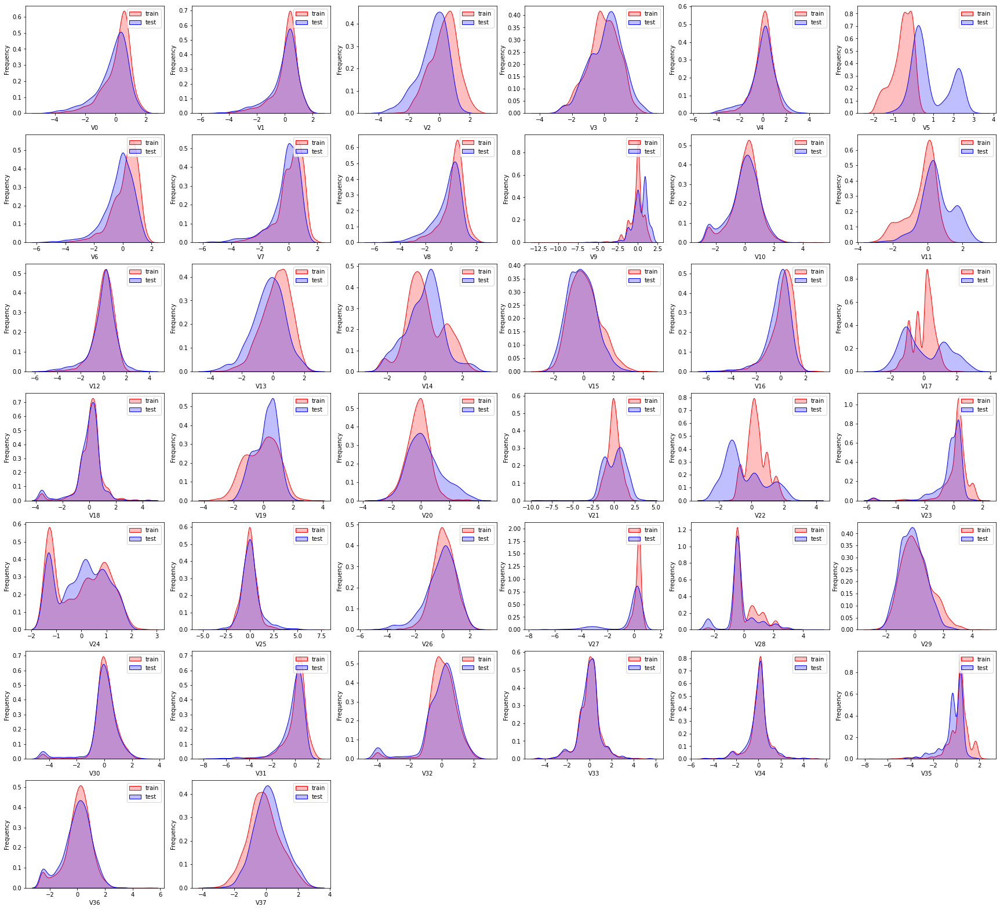
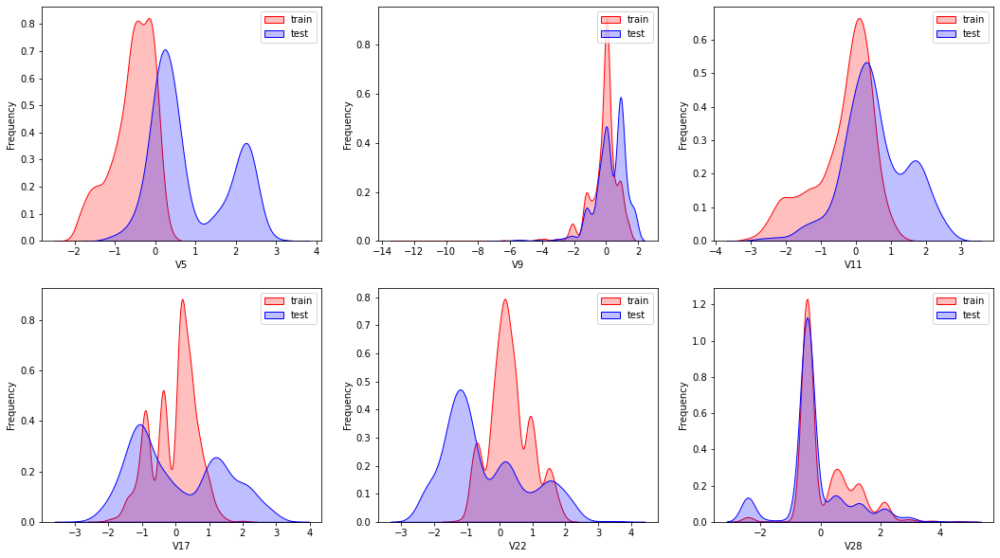
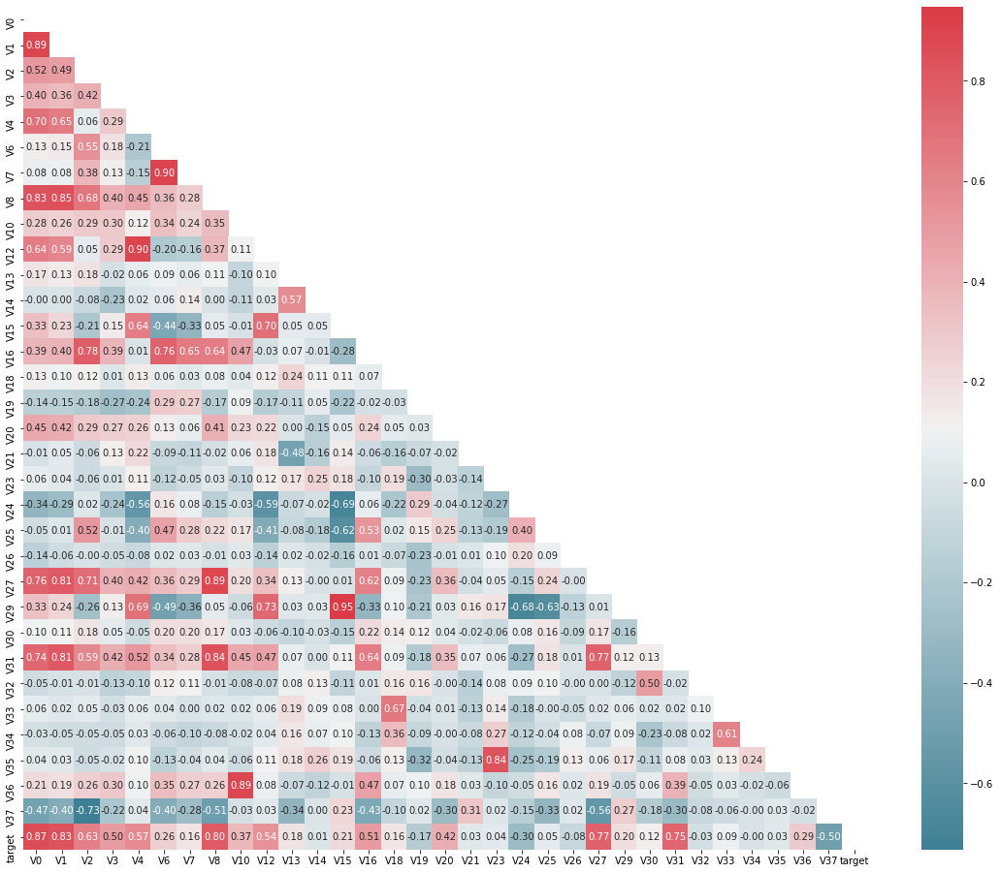
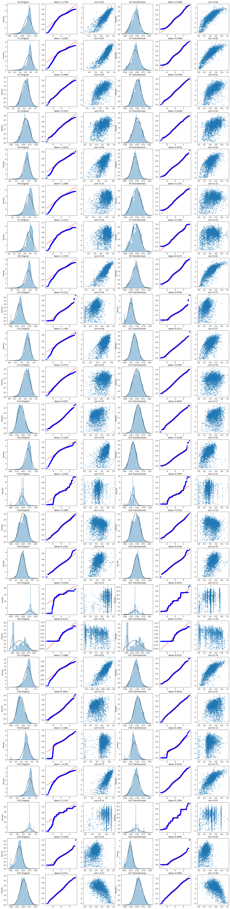
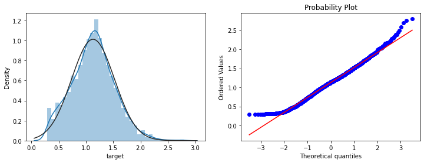
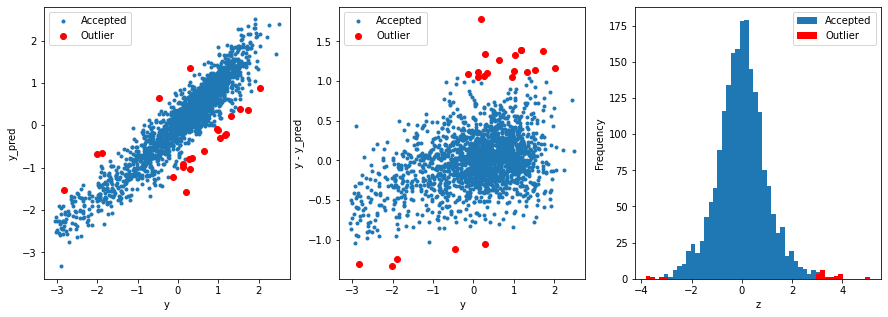
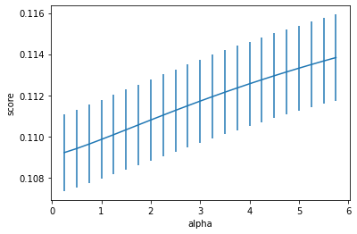

# Task15 集成学习案例二 （蒸汽量预测）

## 1 主要思路

### 1.1 基本思路
1. 导入数据集，标记数据来源，并合并训练集和测试集
2. 探索数据分布，目的是找出相关性低的特征，降维
  - 采用核密度估计对特征值进行分析
  - 删除分布不均的特征
  - 查看特征之间的相关性，并删除相关性低的特征
  - 对数据归一化
3. 特征工程，目的是对各列（特征列和目标列）进行正态化
  - 对各特征列比较Box-Cox变换前后，并进行变换
  - 对目标列进行正态分布检验，并使用指数变换
4. 模型构建并使用集成学习
  - 构建训练集、验证集和测试集
  - 编写RMES、MES评价函数
  - 使用Z检验寻找并删除离群点
  - 训练模型，并进行模型融合
5. 预测结果并保存

### 1.2 评价指标
最终的评价指标为均方误差MSE，即：
$$Score = \frac{1}{n} \sum_1 ^n (y_i - y ^*)^2$$

## 2 Baseline代码实战

### 2.1 导入package


```python
from sklearn.preprocessing import PolynomialFeatures, MinMaxScaler, StandardScaler
from sklearn.model_selection import GridSearchCV, RepeatedKFold, cross_val_score, cross_val_predict, KFold
from sklearn.ensemble import RandomForestRegressor, GradientBoostingRegressor, AdaBoostRegressor
from sklearn.metrics import make_scorer, mean_squared_error
from xgboost import XGBRegressor
from sklearn.neighbors import KNeighborsRegressor
from sklearn.svm import LinearSVR, SVR
from sklearn.linear_model import LinearRegression, Lasso, Ridge, ElasticNet
from sklearn.model_selection import train_test_split
from scipy import stats
import numpy as np
import pandas as pd
import seaborn as sns
import matplotlib.pyplot as plt
import warnings
warnings.filterwarnings("ignore")


%matplotlib inline
```

### 2.2 加载数据


```python
data_train = pd.read_csv('../assets/ch06/case02/data/train.txt',sep = '\t')
data_test = pd.read_csv('../assets/ch06/case02/data/test.txt',sep = '\t')
```


```python
# 标记数据来源
data_train["origin"] = "train"
data_test["origin"] = "test"
# 合并训练集和测试集
data_all = pd.concat([data_train, data_test], axis=0, ignore_index=True)
# 显示前5条数据
data_all.head()
```


<div>
<style scoped>
    .dataframe tbody tr th:only-of-type {
        vertical-align: middle;
    }

    .dataframe tbody tr th {
        vertical-align: top;
    }

    .dataframe thead th {
        text-align: right;
    }
</style>
<table border="0" class="dataframe">
  <thead>
    <tr style="text-align: right;">
      <th></th>
      <th>V0</th>
      <th>V1</th>
      <th>V2</th>
      <th>V3</th>
      <th>V4</th>
      <th>V5</th>
      <th>V6</th>
      <th>V7</th>
      <th>V8</th>
      <th>V9</th>
      <th>...</th>
      <th>V30</th>
      <th>V31</th>
      <th>V32</th>
      <th>V33</th>
      <th>V34</th>
      <th>V35</th>
      <th>V36</th>
      <th>V37</th>
      <th>target</th>
      <th>origin</th>
    </tr>
  </thead>
  <tbody>
    <tr>
      <th>0</th>
      <td>0.566</td>
      <td>0.016</td>
      <td>-0.143</td>
      <td>0.407</td>
      <td>0.452</td>
      <td>-0.901</td>
      <td>-1.812</td>
      <td>-2.360</td>
      <td>-0.436</td>
      <td>-2.114</td>
      <td>...</td>
      <td>0.109</td>
      <td>-0.615</td>
      <td>0.327</td>
      <td>-4.627</td>
      <td>-4.789</td>
      <td>-5.101</td>
      <td>-2.608</td>
      <td>-3.508</td>
      <td>0.175</td>
      <td>train</td>
    </tr>
    <tr>
      <th>1</th>
      <td>0.968</td>
      <td>0.437</td>
      <td>0.066</td>
      <td>0.566</td>
      <td>0.194</td>
      <td>-0.893</td>
      <td>-1.566</td>
      <td>-2.360</td>
      <td>0.332</td>
      <td>-2.114</td>
      <td>...</td>
      <td>0.124</td>
      <td>0.032</td>
      <td>0.600</td>
      <td>-0.843</td>
      <td>0.160</td>
      <td>0.364</td>
      <td>-0.335</td>
      <td>-0.730</td>
      <td>0.676</td>
      <td>train</td>
    </tr>
    <tr>
      <th>2</th>
      <td>1.013</td>
      <td>0.568</td>
      <td>0.235</td>
      <td>0.370</td>
      <td>0.112</td>
      <td>-0.797</td>
      <td>-1.367</td>
      <td>-2.360</td>
      <td>0.396</td>
      <td>-2.114</td>
      <td>...</td>
      <td>0.361</td>
      <td>0.277</td>
      <td>-0.116</td>
      <td>-0.843</td>
      <td>0.160</td>
      <td>0.364</td>
      <td>0.765</td>
      <td>-0.589</td>
      <td>0.633</td>
      <td>train</td>
    </tr>
    <tr>
      <th>3</th>
      <td>0.733</td>
      <td>0.368</td>
      <td>0.283</td>
      <td>0.165</td>
      <td>0.599</td>
      <td>-0.679</td>
      <td>-1.200</td>
      <td>-2.086</td>
      <td>0.403</td>
      <td>-2.114</td>
      <td>...</td>
      <td>0.417</td>
      <td>0.279</td>
      <td>0.603</td>
      <td>-0.843</td>
      <td>-0.065</td>
      <td>0.364</td>
      <td>0.333</td>
      <td>-0.112</td>
      <td>0.206</td>
      <td>train</td>
    </tr>
    <tr>
      <th>4</th>
      <td>0.684</td>
      <td>0.638</td>
      <td>0.260</td>
      <td>0.209</td>
      <td>0.337</td>
      <td>-0.454</td>
      <td>-1.073</td>
      <td>-2.086</td>
      <td>0.314</td>
      <td>-2.114</td>
      <td>...</td>
      <td>1.078</td>
      <td>0.328</td>
      <td>0.418</td>
      <td>-0.843</td>
      <td>-0.215</td>
      <td>0.364</td>
      <td>-0.280</td>
      <td>-0.028</td>
      <td>0.384</td>
      <td>train</td>
    </tr>
  </tbody>
</table>
<p>5 rows × 40 columns</p>
</div>


### 2.3 探索数据分布

#### 2.3.1 采用核密度估计对所有的特征值进行分析
由于是传感器的数据（连续变量），所以使用 kdeplot(核密度估计图) 进行数据的初步分析，即EDA。  
核密度估计(kernel density estimation)是在概率论中用来估计未知的密度函数，属于非参数检验方法之一。通过核密度估计图可以比较直观的看出数据样本本身的分布特征。


```python
fcols = 6
frows = len(data_all.columns) // fcols + 1
plt.figure(figsize=(5*fcols, 4*frows))
i = 0

for column in data_all.columns[0:-2]:
    i += 1
    # 在相应的位置展示分布图
    plt.subplot(frows, fcols, i)
    # 训练集的数据分布标为红色
    g = sns.kdeplot(
        data_all[column][(data_all["origin"] == "train")], color="Red", shade=True)
    # 测试集的数据分布标为蓝色
    g = sns.kdeplot(data_all[column][(
        data_all["origin"] == "test")], ax=g, color="Blue", shade=True)
    g.set_xlabel(column)
    g.set_ylabel("Frequency")
    g = g.legend(["train", "test"])
```





从以上的图中可以看出特征"V5","V9","V11","V17","V22","V28"中训练集数据分布和测试集数据分布不均，所以我们删除这些特征数据

#### 2.3.2 删除分布不均的特征


```python
del_columns = ["V5", "V9", "V11", "V17", "V22", "V28"]
fcols = 3
frows = len(del_columns) // fcols
plt.figure(figsize=(6*fcols, 5*frows))
i = 0

for column in del_columns:
    i += 1
    plt.subplot(frows, fcols, i)
    g = sns.kdeplot(data_all[column][(data_all["origin"] == "train")], color="Red", shade = True)
    g = sns.kdeplot(data_all[column][(data_all["origin"] == "test")], ax =g, color="Blue", shade= True)
    g.set_xlabel(column)
    g.set_ylabel("Frequency")
    g = g.legend(["train","test"])
```





```python
# 删除分布不均的特征
data_all.drop(del_columns, axis=1, inplace=True)
```

#### 2.3.3 查看特征之间的相关性（相关程度）
通过corr计算特征之间的相关性，数值越大，说明线性相关性越高；采用heatmap热力图展示各特征值与target的相关性。


```python
# 删除origin标识，得到原始数据，用于计算相关系数矩阵
data_train_origin=data_all[data_all["origin"]=="train"].drop("origin",axis=1)
# 指定绘图对象宽度和高度
plt.figure(figsize=(20, 16))
# 特征列
cols = data_train_origin.columns.tolist()
# 相关系数矩阵，即计算任意两个变量之间的相关系数（相似度）
mcorr = data_train_origin[cols].corr(method="spearman")  
# 构造与mcorr同维数矩阵，数据类型为bool型，用于在heatmap中传入mask
mask = np.zeros_like(mcorr, dtype=np.bool)  
# 对角线上方为True，用于绘制下三角图
mask[np.triu_indices_from(mask)] = True
# 返回matplotlib colormap对象，调色板
cmap = sns.diverging_palette(220, 10, as_cmap=True)  
# 热力图，用于展示个特征的相似度
g = sns.heatmap(mcorr, mask=mask, cmap=cmap, square=True, annot=True, fmt='0.2f')  
plt.show()
```





#### 2.3.4 删除相关性低的特征列
对数据进一步降维，将相关性的绝对值小于阈值（设置为0.1）的特征列删除


```python
# 设置阈值为0.1
threshold = 0.1
# 计算相关系数矩阵，并对相关性取绝对值
corr_matrix = data_train_origin.corr().abs()
# 取出要删除的特征列
drop_col = corr_matrix[corr_matrix["target"] < threshold].index
# 删除相关性低的特征列
data_all.drop(drop_col, axis=1, inplace=True)
```

#### 2.3.5 对数据进行归一化


```python
cols_numeric=list(data_all.columns)
cols_numeric.remove("origin")
df = data_all[data_all.columns[0:-2]]
# 进行归一化
df = (df-df.min())/(df.max()-df.min())
df.describe()
```


<div>
<style scoped>
    .dataframe tbody tr th:only-of-type {
        vertical-align: middle;
    }

    .dataframe tbody tr th {
        vertical-align: top;
    }

    .dataframe thead th {
        text-align: right;
    }
</style>
<table border="0" class="dataframe">
  <thead>
    <tr style="text-align: right;">
      <th></th>
      <th>V0</th>
      <th>V1</th>
      <th>V2</th>
      <th>V3</th>
      <th>V4</th>
      <th>V6</th>
      <th>V7</th>
      <th>V8</th>
      <th>V10</th>
      <th>V12</th>
      <th>...</th>
      <th>V20</th>
      <th>V23</th>
      <th>V24</th>
      <th>V27</th>
      <th>V29</th>
      <th>V30</th>
      <th>V31</th>
      <th>V35</th>
      <th>V36</th>
      <th>V37</th>
    </tr>
  </thead>
  <tbody>
    <tr>
      <th>count</th>
      <td>4813.000000</td>
      <td>4813.000000</td>
      <td>4813.000000</td>
      <td>4813.000000</td>
      <td>4813.000000</td>
      <td>4813.000000</td>
      <td>4813.000000</td>
      <td>4813.000000</td>
      <td>4813.000000</td>
      <td>4813.000000</td>
      <td>...</td>
      <td>4813.000000</td>
      <td>4813.000000</td>
      <td>4813.000000</td>
      <td>4813.000000</td>
      <td>4813.000000</td>
      <td>4813.000000</td>
      <td>4813.000000</td>
      <td>4813.000000</td>
      <td>4813.000000</td>
      <td>4813.000000</td>
    </tr>
    <tr>
      <th>mean</th>
      <td>0.694172</td>
      <td>0.721357</td>
      <td>0.602300</td>
      <td>0.603139</td>
      <td>0.523743</td>
      <td>0.748823</td>
      <td>0.745740</td>
      <td>0.715607</td>
      <td>0.348518</td>
      <td>0.578507</td>
      <td>...</td>
      <td>0.456147</td>
      <td>0.744438</td>
      <td>0.356712</td>
      <td>0.881401</td>
      <td>0.388683</td>
      <td>0.589459</td>
      <td>0.792709</td>
      <td>0.762873</td>
      <td>0.332385</td>
      <td>0.545795</td>
    </tr>
    <tr>
      <th>std</th>
      <td>0.144198</td>
      <td>0.131443</td>
      <td>0.140628</td>
      <td>0.152462</td>
      <td>0.106430</td>
      <td>0.132560</td>
      <td>0.132577</td>
      <td>0.118105</td>
      <td>0.134882</td>
      <td>0.105088</td>
      <td>...</td>
      <td>0.134083</td>
      <td>0.134085</td>
      <td>0.265512</td>
      <td>0.128221</td>
      <td>0.133475</td>
      <td>0.130786</td>
      <td>0.102976</td>
      <td>0.102037</td>
      <td>0.127456</td>
      <td>0.150356</td>
    </tr>
    <tr>
      <th>min</th>
      <td>0.000000</td>
      <td>0.000000</td>
      <td>0.000000</td>
      <td>0.000000</td>
      <td>0.000000</td>
      <td>0.000000</td>
      <td>0.000000</td>
      <td>0.000000</td>
      <td>0.000000</td>
      <td>0.000000</td>
      <td>...</td>
      <td>0.000000</td>
      <td>0.000000</td>
      <td>0.000000</td>
      <td>0.000000</td>
      <td>0.000000</td>
      <td>0.000000</td>
      <td>0.000000</td>
      <td>0.000000</td>
      <td>0.000000</td>
      <td>0.000000</td>
    </tr>
    <tr>
      <th>25%</th>
      <td>0.626676</td>
      <td>0.679416</td>
      <td>0.514414</td>
      <td>0.503888</td>
      <td>0.478182</td>
      <td>0.683324</td>
      <td>0.696938</td>
      <td>0.664934</td>
      <td>0.284327</td>
      <td>0.532892</td>
      <td>...</td>
      <td>0.370475</td>
      <td>0.719362</td>
      <td>0.040616</td>
      <td>0.888575</td>
      <td>0.292445</td>
      <td>0.550092</td>
      <td>0.761816</td>
      <td>0.727273</td>
      <td>0.270584</td>
      <td>0.445647</td>
    </tr>
    <tr>
      <th>50%</th>
      <td>0.729488</td>
      <td>0.752497</td>
      <td>0.617072</td>
      <td>0.614270</td>
      <td>0.535866</td>
      <td>0.774125</td>
      <td>0.771974</td>
      <td>0.742884</td>
      <td>0.366469</td>
      <td>0.591635</td>
      <td>...</td>
      <td>0.447305</td>
      <td>0.788817</td>
      <td>0.381736</td>
      <td>0.916015</td>
      <td>0.375734</td>
      <td>0.594428</td>
      <td>0.815055</td>
      <td>0.800020</td>
      <td>0.347056</td>
      <td>0.539317</td>
    </tr>
    <tr>
      <th>75%</th>
      <td>0.790195</td>
      <td>0.799553</td>
      <td>0.700464</td>
      <td>0.710474</td>
      <td>0.585036</td>
      <td>0.842259</td>
      <td>0.836405</td>
      <td>0.790835</td>
      <td>0.432965</td>
      <td>0.641971</td>
      <td>...</td>
      <td>0.522660</td>
      <td>0.792706</td>
      <td>0.574728</td>
      <td>0.932555</td>
      <td>0.471837</td>
      <td>0.650798</td>
      <td>0.852229</td>
      <td>0.800020</td>
      <td>0.414861</td>
      <td>0.643061</td>
    </tr>
    <tr>
      <th>max</th>
      <td>1.000000</td>
      <td>1.000000</td>
      <td>1.000000</td>
      <td>1.000000</td>
      <td>1.000000</td>
      <td>1.000000</td>
      <td>1.000000</td>
      <td>1.000000</td>
      <td>1.000000</td>
      <td>1.000000</td>
      <td>...</td>
      <td>1.000000</td>
      <td>1.000000</td>
      <td>1.000000</td>
      <td>1.000000</td>
      <td>1.000000</td>
      <td>1.000000</td>
      <td>1.000000</td>
      <td>1.000000</td>
      <td>1.000000</td>
      <td>1.000000</td>
    </tr>
  </tbody>
</table>
<p>8 rows × 25 columns</p>
</div>


```python
# 原数据拼接
data_all = pd.concat(
    [df, data_all['target'], data_all['origin']], axis=1, ignore_index=False)
```

### 2.4 特征工程

绘图显示Box-Cox变换对数据分布影响，Box-Cox用于连续的响应变量不满足正态分布的情况。在进行Box-Cox变换之后，可以一定程度上减小不可观测的误差和预测变量的相关性。

对于quantitle-quantile(q-q)图，可参考： https://blog.csdn.net/u012193416/article/details/83210790

#### 2.4.1 对各特征数据绘制使用Box-Cox前后的对比图


```python
fcols = 6
frows = len(cols_numeric)-1
plt.figure(figsize=(4*fcols, 4*frows))
i = 0

for var in cols_numeric:
    if var != 'target':
        # 仅留下训练集数据
        dat = data_all[[var, 'target']].dropna()
        
        # 不使用boxcox之前
        # 绘制直方图和核密度估计图的合成图，并拟合标准正态分布
        i += 1
        plt.subplot(frows, fcols, i)
        sns.distplot(dat[var], fit=stats.norm)
        plt.title(var+' Original')
        plt.xlabel('')
        
        # 绘制q-q图，用于检测特征数据是否符合正态分布
        i += 1
        plt.subplot(frows, fcols, i)
        _ = stats.probplot(dat[var], plot=plt)
        # 计算特征数据与正态分布的偏离度
        plt.title('skew='+'{:.4f}'.format(stats.skew(dat[var])))
        plt.xlabel('')
        plt.ylabel('')
        
        # 绘制数据点图，用于观察特征数据与目标列数据
        i += 1
        plt.subplot(frows, fcols, i)
        plt.plot(dat[var], dat['target'], '.', alpha=0.5)
        plt.title(
            'corr='+'{:.2f}'.format(np.corrcoef(dat[var], dat['target'])[0][1]))
        
        # 使用boxcox进行数据分布正态化
        i += 1
        plt.subplot(frows, fcols, i)
        trans_var, lambda_var = stats.boxcox(dat[var].dropna()+1)
        # 进行归一化
        trans_var = (trans_var-trans_var.min())/(trans_var.max()-trans_var.min())
        # 绘制直方图和核密度估计图的合成图，并拟合标准正态分布
        sns.distplot(trans_var, fit=stats.norm)
        plt.title(var+' Tramsformed')
        plt.xlabel('')

        i += 1
        plt.subplot(frows, fcols, i)
        # 绘制q-q图，用于检测boxcox转换之后的数据是否符合正态分布
        _ = stats.probplot(trans_var, plot=plt)
        plt.title('skew='+'{:.4f}'.format(stats.skew(trans_var)))
        plt.xlabel('')
        plt.ylabel('')
        
        # 绘制数据点图，用于观察boxcox转换之后的数据数据与目标列数据
        i += 1
        plt.subplot(frows, fcols, i)
        plt.plot(trans_var, dat['target'], '.', alpha=0.5)
        plt.title(
            'corr='+'{:.2f}'.format(np.corrcoef(trans_var, dat['target'])[0][1]))
```





#### 2.4.2 对各特征列数据进行Box-Cox变换


```python
# 进行Box-Cox变换
cols_transform = data_all.columns[0:-2]
for col in cols_transform:
    # transform column
    data_all.loc[:, col], _ = stats.boxcox(data_all.loc[:, col]+1)
```

#### 2.4.3 对目标列数据进行正态分布检验


```python
print(data_all.target.describe())

plt.figure(figsize=(12, 4))
plt.subplot(1, 2, 1)
# 绘制直方图和核密度估计图的合成图，并拟合标准正态分布
sns.distplot(data_all.target.dropna(), fit=stats.norm)
plt.subplot(1, 2, 2)
# 绘制q-q图，用于检测特征数据是否符合正态分布
_ = stats.probplot(data_all.target.dropna(), plot=plt)
```

    count    2888.000000
    mean        0.126353
    std         0.983966
    min        -3.044000
    25%        -0.350250
    50%         0.313000
    75%         0.793250
    max         2.538000
    Name: target, dtype: float64
    


#### 2.4.5 对目标列数据使用对数变换

使用指数变换target目标值提升特征数据的正态性，可参考：https://www.zhihu.com/question/22012482


```python
sp = data_train.target
# 使用指数变换，提升target目标列数据的正态性
data_train.target1 = np.power(1.5, sp)
print(data_train.target1.describe())

plt.figure(figsize=(12, 4))
plt.subplot(1, 2, 1)
sns.distplot(data_train.target1.dropna(), fit=stats.norm)
plt.subplot(1, 2, 2)
_ = stats.probplot(data_train.target1.dropna(), plot=plt)
```

    count    2888.000000
    mean        1.129957
    std         0.394110
    min         0.291057
    25%         0.867609
    50%         1.135315
    75%         1.379382
    max         2.798463
    Name: target, dtype: float64
    





### 2.5 模型构建以及集成学习

#### 2.5.1 构建训练集和测试集


```python
def get_training_data():
    from sklearn.model_selection import train_test_split
    # 取出训练集数据
    df_train = data_all[data_all["origin"] == "train"]
    df_train["label"] = data_train.target1

    y = df_train.target
    # 删除非特征列
    X = df_train.drop(["origin", "target", "label"], axis=1)
    # 划分训练集和验证集数据
    X_train, X_valid, y_train, y_valid = train_test_split(
        X, y, test_size=0.3, random_state=100)
    return X_train, X_valid, y_train, y_valid


def get_test_data():
    # 获取测试集数据
    df_test = data_all[data_all["origin"] == "test"].reset_index(drop=True)
    return df_test.drop(["origin", "target"], axis=1)
```

#### 2.5.2 编写rmse、mse的评价函数


```python
from sklearn.metrics import make_scorer


def rmse(y_true, y_pred):
    diff = y_pred - y_true
    sum_sq = sum(diff**2)
    n = len(y_pred)
    return np.sqrt(sum_sq/n)


def mse(y_ture, y_pred):
    return mean_squared_error(y_ture, y_pred)


# scorer to be used in sklearn model fitting
rmse_scorer = make_scorer(rmse, greater_is_better=False)

# 输入的score_func为记分函数时，该值为True（默认值）；输入函数为损失函数时，该值为False
mse_scorer = make_scorer(mse, greater_is_better=False)
```

#### 2.5.3 寻找并删除离群值


```python
# function to detect outliers based on the predictions of a model
def find_outliers(model, X, y, sigma=3):

    # 训练模型
    model.fit(X, y)
    # 预测y值
    y_pred = pd.Series(model.predict(X), index=y.index)

    # 计算残差
    resid = y - y_pred
    mean_resid = resid.mean()
    std_resid = resid.std()

    # 使用正态偏差Z检验，计算偏差
    z = (resid - mean_resid)/std_resid
    # 假如偏差大于3，即为离群点
    outliers = z[abs(z) > sigma].index

    print('R2=', model.score(X, y))
    print('rmse=', rmse(y, y_pred))
    print("mse=", mean_squared_error(y, y_pred))
    print('---------------------------------------')

    print('mean of residuals:', mean_resid)
    print('std of residuals:', std_resid)
    print('---------------------------------------')

    print(len(outliers), 'outliers:')
    print(outliers.tolist())

    # 绘制离群点图
    plt.figure(figsize=(15, 5))
    ax_131 = plt.subplot(1, 3, 1)
    plt.plot(y, y_pred, '.')
    plt.plot(y.loc[outliers], y_pred.loc[outliers], 'ro')
    plt.legend(['Accepted', 'Outlier'])
    plt.xlabel('y')
    plt.ylabel('y_pred')

    ax_132 = plt.subplot(1, 3, 2)
    plt.plot(y, y-y_pred, '.')
    plt.plot(y.loc[outliers], y.loc[outliers]-y_pred.loc[outliers], 'ro')
    plt.legend(['Accepted', 'Outlier'])
    plt.xlabel('y')
    plt.ylabel('y - y_pred')

    ax_133 = plt.subplot(1, 3, 3)
    z.plot.hist(bins=50, ax=ax_133)
    z.loc[outliers].plot.hist(color='r', bins=50, ax=ax_133)
    plt.legend(['Accepted', 'Outlier'])
    plt.xlabel('z')

    return outliers
```


```python
# get training data
X_train, X_valid, y_train, y_valid = get_training_data()
test = get_test_data()

# 删除离群点
outliers = find_outliers(Ridge(), X_train, y_train)
X_outliers = X_train.loc[outliers]
y_outliers = y_train.loc[outliers]
X_t = X_train.drop(outliers)
y_t = y_train.drop(outliers)
```

    R2= 0.8766692297367809
    rmse= 0.3490086775113313
    mse= 0.12180705697820839
    ---------------------------------------
    mean of residuals: -2.208360494306348e-16
    std of residuals: 0.34909505510886996
    ---------------------------------------
    22 outliers:
    [2655, 2159, 1164, 2863, 1145, 2697, 2528, 2645, 691, 1085, 1874, 2647, 884, 2696, 2668, 1310, 1901, 1458, 2769, 2002, 2669, 1972]
    





从图中可看出，有22个标红色的离群点。

#### 2.5.4 训练模型


```python
def get_trainning_data_omitoutliers():
    # 获取训练数据省略异常值
    y = y_t.copy()
    X = X_t.copy()
    return X, y
```


```python
def train_model(model, param_grid=[], X=[], y=[], 
                splits=5, repeats=5):

    # 获取数据
    if len(y)==0:
        X,y = get_trainning_data_omitoutliers()
        
    # 交叉验证
    rkfold = RepeatedKFold(n_splits=splits, n_repeats=repeats)
    
    # 使用网格搜索最佳参数
    if len(param_grid)>0:
        gsearch = GridSearchCV(model, param_grid, cv=rkfold,
                               scoring="neg_mean_squared_error",
                               verbose=1, return_train_score=True)

        # 训练模型
        gsearch.fit(X,y)

        # 得到最佳模型
        model = gsearch.best_estimator_        
        best_idx = gsearch.best_index_

        # 得到交叉验证评价指标
        grid_results = pd.DataFrame(gsearch.cv_results_)
        cv_mean = abs(grid_results.loc[best_idx,'mean_test_score'])
        cv_std = grid_results.loc[best_idx,'std_test_score']

    # 不使用网格搜索，仅使用交叉验证 
    else:
        grid_results = []
        cv_results = cross_val_score(model, X, y, scoring="neg_mean_squared_error", cv=rkfold)
        cv_mean = abs(np.mean(cv_results))
        cv_std = np.std(cv_results)
    
    # 合并数据
    cv_score = pd.Series({'mean':cv_mean,'std':cv_std})

    # 预测
    y_pred = model.predict(X)
    
    # 模型性能的统计数据        
    print('----------------------')
    print(model)
    print('----------------------')
    print('score=',model.score(X,y))
    print('rmse=',rmse(y, y_pred))
    print('mse=',mse(y, y_pred))
    print('cross_val: mean=',cv_mean,', std=',cv_std)
    
    return model, cv_score, grid_results
```


```python
# 定义训练变量存储数据
opt_models = dict()
# 存储模型的性能（均值、标准差）
score_models = pd.DataFrame(columns=['mean','std'])
splits=5
repeats=5
```


```python
# 使用Ridge模型，可使用集成学习，融合更多的模型
model = 'Ridge'
opt_models[model] = Ridge()
alph_range = np.arange(0.25, 6, 0.25)
param_grid = {'alpha': alph_range}

opt_models[model], cv_score, grid_results = train_model(opt_models[model], param_grid=param_grid,
                                                        splits=splits, repeats=repeats)

cv_score.name = model
score_models = score_models.append(cv_score)

# 绘制误差条图
plt.figure()
plt.errorbar(alph_range, abs(grid_results['mean_test_score']),
             abs(grid_results['std_test_score'])/np.sqrt(splits*repeats))
plt.xlabel('alpha')
plt.ylabel('score')
```

    Fitting 25 folds for each of 23 candidates, totalling 575 fits
    ----------------------
    Ridge(alpha=0.25)
    ----------------------
    score= 0.8926884445023296
    rmse= 0.3246640786362218
    mse= 0.1054067639567068
    cross_val: mean= 0.10921408260791286 , std= 0.009360597609668288
    


    Text(0, 0.5, 'score')





#### 2.5.5 预测结果并保存


```python
# 预测函数
def model_predict(test_data, test_y=[]):
    i = 0
    y_predict_total = np.zeros((test_data.shape[0],))
    for model in opt_models.keys():
        if model != "LinearSVR" and model != "KNeighbors":
            y_predict = opt_models[model].predict(test_data)
            y_predict_total += y_predict
            i += 1
        if len(test_y) > 0:
            print("{}_mse:".format(model), mean_squared_error(y_predict, test_y))
    y_predict_mean = np.round(y_predict_total/i, 6)
    if len(test_y) > 0:
        print("mean_mse:", mean_squared_error(y_predict_mean, test_y))
    else:
        y_predict_mean = pd.Series(y_predict_mean)
        return y_predict_mean
```


```python
y_ = model_predict(test)
y_.to_csv('predict.txt',header = None,index = False)
```
