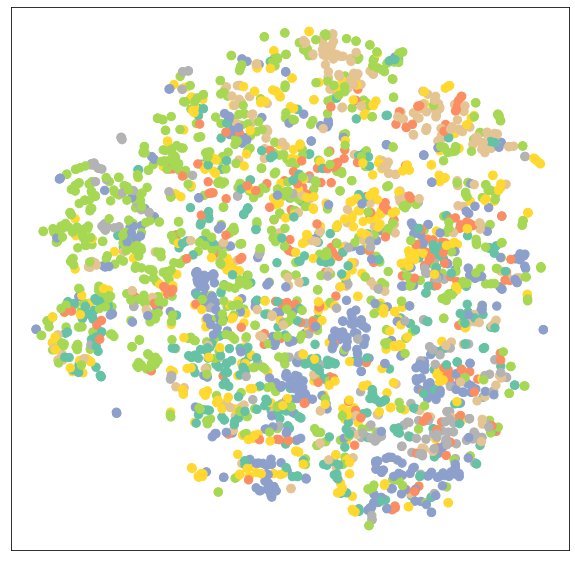
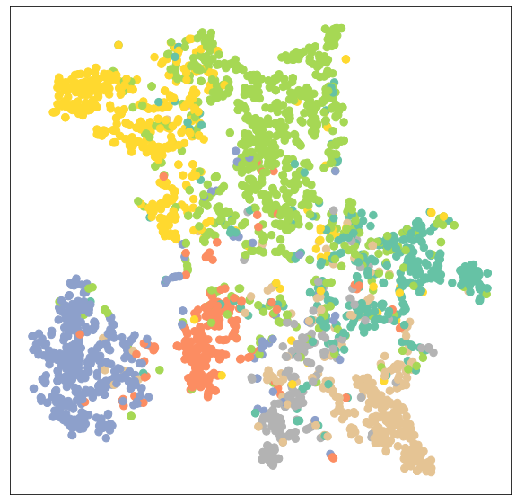

# Task03 基于图神经网络的节点表征学习

## 1 知识梳理

### 1.1 卷积图神经网络（GCN）
- 向量定义：$\displaystyle \mathbf{X}^{\prime} = \mathbf{\hat{D}}^{-1/2} \mathbf{\hat{A}}
\mathbf{\hat{D}}^{-1/2} \mathbf{X} \mathbf{\Theta}$
- 公式定义：$\displaystyle \mathbf{x}^{\prime}_i = \mathbf{\Theta} \sum_{j \in \mathcal{N}(v) \cup
\{ i \}} \frac{e_{j,i}}{\sqrt{\hat{d}_j \hat{d}_i}} \mathbf{x}_j$

### 1.2 图注意力神经网络（GAT）
- 公式定义：$\displaystyle \mathbf{x}^{\prime}_i = \alpha_{i,i}\mathbf{\Theta}\mathbf{x}_{i} +
\sum_{j \in \mathcal{N}(i)} \alpha_{i,j}\mathbf{\Theta}\mathbf{x}_{j}$  
  其中$\displaystyle \alpha_{i,j} =
\frac{
\exp\left(\mathrm{LeakyReLU}\left(\mathbf{a}^{T}
[\mathbf{\Theta}\mathbf{x}_i \, \Vert \, \mathbf{\Theta}\mathbf{x}_j]
\right)\right)}
{\displaystyle \sum_{k \in \mathcal{N}(i) \cup \{ i \}}
\exp\left(\mathrm{LeakyReLU}\left(\mathbf{a}^{T}
[\mathbf{\Theta}\mathbf{x}_i \, \Vert \, \mathbf{\Theta}\mathbf{x}_k]
\right)\right)}$

### 1.3 MLP、GCN和GAT训练的比较
- 训练效果比较：  
（1）MLP效果最差，由于只考虑了节点自身属性，忽略了节点之间的连接关系  
（2）GCN和GAT效果比较好，同时考虑了节点自身信息与邻接节点的信息
- GCN与GAT的共同点：  
（1）遵循消息传递范式  
（2）邻接节点变换时，对邻接节点做归一化和线性变换  
（3）邻接节点聚合时，对变换后的邻接节点做`sum`聚合  
（4）中心节点变换时，返回邻接节点聚合阶段的聚合结果  
- GCN与GAT的区别（归一化方法）：  
（1）GCN根据中心节点与邻接节点的度计算归一化系数，GAT根据中心节点与邻接节点的相似度计算归一化系数  
（2）GCN归一化依赖图的拓扑结构，GAT归一化依赖中心节点与邻接节点的相似度

## 2 实战练习

### 2.1 MLP、GCN、GAT在节点分类任务的比较

#### 2.1.1 获取并分析数据集Cora

该Cora是一个论文引用网络，节点代表论文，各节点的属性都是一个1433维的词包特征向量，预测目标是各篇论文的类别（共7类）。


```python
from torch_geometric.datasets import Planetoid
from torch_geometric.transforms import NormalizeFeatures

dataset = Planetoid(root='dataset/Cora', name='Cora',
                    transform=NormalizeFeatures())

print(f'Dataset: {dataset}:')
print('======================')
print(f'Number of graphs: {len(dataset)}')
print(f'Number of features: {dataset.num_features}')
print(f'Number of classes: {dataset.num_classes}')

data = dataset[0]  # Get the first graph object.

print()
print(data)
print('======================')

# Gather some statistics about the graph.
print(f'Number of nodes: {data.num_nodes}')
print(f'Number of edges: {data.num_edges}')
print(f'Average node degree: {data.num_edges / data.num_nodes:.2f}')
print(f'Number of training nodes: {data.train_mask.sum()}')
print(
    f'Training node label rate: {int(data.train_mask.sum()) / data.num_nodes:.2f}')
print(f'Contains isolated nodes: {data.contains_isolated_nodes()}')
print(f'Contains self-loops: {data.contains_self_loops()}')
print(f'Is undirected: {data.is_undirected()}')
```

    Dataset: Cora():
    ======================
    Number of graphs: 1
    Number of features: 1433
    Number of classes: 7
    
    Data(edge_index=[2, 10556], test_mask=[2708], train_mask=[2708], val_mask=[2708], x=[2708, 1433], y=[2708])
    ======================
    Number of nodes: 2708
    Number of edges: 10556
    Average node degree: 3.90
    Number of training nodes: 140
    Training node label rate: 0.05
    Contains isolated nodes: False
    Contains self-loops: False
    Is undirected: True
    

#### 2.1.2 节点表征的分布可视化展示


```python
import matplotlib.pyplot as plt
from sklearn.manifold import TSNE
%matplotlib inline

def visualize(h, color):
    # 使用TSNE方法将高维的节点表征映射到二维平面
    z = TSNE(n_components=2).fit_transform(out.detach().cpu().numpy())
    plt.figure(figsize=(10,10))
    plt.xticks([])
    plt.yticks([])

    plt.scatter(z[:, 0], z[:, 1], s=70, c=color, cmap="Set2")
    plt.show()
```

#### 2.1.3 使用MLP（多层感知机）神经网络进行节点分类


```python
import torch
from torch.nn import Linear
import torch.nn.functional as F

# 构造MLP神经网络
class MLP(torch.nn.Module):
    def __init__(self, hidden_channels):
        super(MLP, self).__init__()
        torch.manual_seed(12345)
        self.lin1 = Linear(dataset.num_features, hidden_channels)
        self.lin2 = Linear(hidden_channels, dataset.num_classes)

    def forward(self, x):
        # 两个
        x = self.lin1(x)
        x = x.relu()
        x = F.dropout(x, p=0.5, training=self.training)
        x = self.lin2(x)
        return x

model = MLP(hidden_channels=16)
print(model)
```

    MLP(
      (lin1): Linear(in_features=1433, out_features=16, bias=True)
      (lin2): Linear(in_features=16, out_features=7, bias=True)
    )
    


```python
model = MLP(hidden_channels=16)
# 定义损失函数
criterion = torch.nn.CrossEntropyLoss()
# 定义Adam优化器
optimizer = torch.optim.Adam(model.parameters(), lr=0.01, weight_decay=5e-4)


def train():
    model.train()
    # 清理梯度
    optimizer.zero_grad()
    # 设置前向传播
    out = model(data.x)
    # 仅根据训练节点计算损失
    loss = criterion(out[data.train_mask], data.y[data.train_mask])
    # 导出梯度
    loss.backward()
    # 更新参数
    optimizer.step()
    return loss


for epoch in range(1, 201):
    loss = train()
    if epoch % 10 == 0:
        print(f'Epoch: {epoch:03d}, Loss: {loss:.4f}')
```

    Epoch: 010, Loss: 1.8849
    Epoch: 020, Loss: 1.7383
    Epoch: 030, Loss: 1.5396
    Epoch: 040, Loss: 1.3391
    Epoch: 050, Loss: 1.1060
    Epoch: 060, Loss: 0.9173
    Epoch: 070, Loss: 0.7889
    Epoch: 080, Loss: 0.6899
    Epoch: 090, Loss: 0.6685
    Epoch: 100, Loss: 0.6106
    Epoch: 110, Loss: 0.5888
    Epoch: 120, Loss: 0.5277
    Epoch: 130, Loss: 0.5053
    Epoch: 140, Loss: 0.5623
    Epoch: 150, Loss: 0.4934
    Epoch: 160, Loss: 0.4170
    Epoch: 170, Loss: 0.4678
    Epoch: 180, Loss: 0.4808
    Epoch: 190, Loss: 0.4602
    Epoch: 200, Loss: 0.4827
    


```python
def test():
    model.eval()
    out = model(data.x)
    # 输出每一类的概率最大的类别
    pred = out.argmax(dim=1)
    # 检查测试结果
    test_correct = pred[data.test_mask] == data.y[data.test_mask]
    # 计算查准率
    test_acc = int(test_correct.sum()) / int(data.test_mask.sum())
    return test_acc


test_acc = test()
print(f'Test Accuracy: {test_acc:.4f}')
```

    Test Accuracy: 0.5740
    

#### 2.1.4 使用GCN图神经网络进行分类


```python
from torch_geometric.nn import GCNConv

# 构建GCN
class GCN(torch.nn.Module):
    def __init__(self, hidden_channels):
        super(GCN, self).__init__()
        torch.manual_seed(12345)
        self.conv1 = GCNConv(dataset.num_features, hidden_channels)
        self.conv2 = GCNConv(hidden_channels, dataset.num_classes)

    def forward(self, x, edge_index):
        x = self.conv1(x, edge_index)
        x = x.relu()
        x = F.dropout(x, p=0.5, training=self.training)
        x = self.conv2(x, edge_index)
        return x


model = GCN(hidden_channels=16)
print(model)
```

    GCN(
      (conv1): GCNConv(1433, 16)
      (conv2): GCNConv(16, 7)
    )
    


```python
# 用于在测试时添加
model.eval()

out = model(data.x, data.edge_index)
visualize(out, color=data.y)
```





```python
# GCN图神经网络的训练
model = GCN(hidden_channels=16)
optimizer = torch.optim.Adam(model.parameters(), lr=0.01, weight_decay=5e-4)
criterion = torch.nn.CrossEntropyLoss()


def train():
    model.train()
    optimizer.zero_grad()
    out = model(data.x, data.edge_index)
    loss = criterion(out[data.train_mask], data.y[data.train_mask])
    loss.backward()
    optimizer.step()
    return loss


for epoch in range(1, 201):
    if epoch % 10 == 0:
        loss = train()
        print(f'Epoch: {epoch:03d}, Loss: {loss:.4f}')
```

    Epoch: 010, Loss: 1.9453
    Epoch: 020, Loss: 1.9402
    Epoch: 030, Loss: 1.9321
    Epoch: 040, Loss: 1.9193
    Epoch: 050, Loss: 1.9082
    Epoch: 060, Loss: 1.8984
    Epoch: 070, Loss: 1.8883
    Epoch: 080, Loss: 1.8742
    Epoch: 090, Loss: 1.8610
    Epoch: 100, Loss: 1.8508
    Epoch: 110, Loss: 1.8311
    Epoch: 120, Loss: 1.8133
    Epoch: 130, Loss: 1.8065
    Epoch: 140, Loss: 1.7859
    Epoch: 150, Loss: 1.7749
    Epoch: 160, Loss: 1.7635
    Epoch: 170, Loss: 1.7387
    Epoch: 180, Loss: 1.7295
    Epoch: 190, Loss: 1.7086
    Epoch: 200, Loss: 1.6866
    


```python
# GCN图神经网络的测试
def test():
    model.eval()
    out = model(data.x, data.edge_index)
    pred = out.argmax(dim=1)
    test_correct = pred[data.test_mask] == data.y[data.test_mask]
    test_acc = int(test_correct.sum()) / int(data.test_mask.sum())
    return test_acc

test_acc = test()
print(f'Test Accuracy: {test_acc:.4f}')
```

    Test Accuracy: 0.7510
    


```python
# 展示训练之后的GCN图神经网络生成的节点表征
model.eval()

out = model(data.x, data.edge_index)
visualize(out, color=data.y)
```





#### 2.1.5 使用GAT图神经网络进行分类


```python
import torch
from torch.nn import Linear
import torch.nn.functional as F

from torch_geometric.nn import GATConv

# 构建GAT
class GAT(torch.nn.Module):
    def __init__(self, hidden_channels):
        super(GAT, self).__init__()
        torch.manual_seed(12345)
        self.conv1 = GATConv(dataset.num_features, hidden_channels)
        self.conv2 = GATConv(hidden_channels, dataset.num_classes)

    def forward(self, x, edge_index):
        x = self.conv1(x, edge_index)
        x = x.relu()
        x = F.dropout(x, p=0.5, training=self.training)
        x = self.conv2(x, edge_index)
        return x
```


```python
# GAT图神经网络的训练
model = GAT(hidden_channels=16)
optimizer = torch.optim.Adam(model.parameters(), lr=0.01, weight_decay=5e-4)
criterion = torch.nn.CrossEntropyLoss()


def train():
    model.train()
    optimizer.zero_grad()
    out = model(data.x, data.edge_index)
    loss = criterion(out[data.train_mask], data.y[data.train_mask])
    loss.backward()
    optimizer.step()
    return loss


for epoch in range(1, 201):
    if epoch % 10 == 0:
        loss = train()
        print(f'Epoch: {epoch:03d}, Loss: {loss:.4f}')
```

    Epoch: 010, Loss: 1.9455
    Epoch: 020, Loss: 1.9407
    Epoch: 030, Loss: 1.9357
    Epoch: 040, Loss: 1.9260
    Epoch: 050, Loss: 1.9167
    Epoch: 060, Loss: 1.9112
    Epoch: 070, Loss: 1.9004
    Epoch: 080, Loss: 1.8935
    Epoch: 090, Loss: 1.8808
    Epoch: 100, Loss: 1.8671
    Epoch: 110, Loss: 1.8570
    Epoch: 120, Loss: 1.8444
    Epoch: 130, Loss: 1.8195
    Epoch: 140, Loss: 1.8223
    Epoch: 150, Loss: 1.8023
    Epoch: 160, Loss: 1.7829
    Epoch: 170, Loss: 1.7824
    Epoch: 180, Loss: 1.7629
    Epoch: 190, Loss: 1.7486
    Epoch: 200, Loss: 1.7181
    


```python
# GAT图神经网络的测试
def test():
    model.eval()
    out = model(data.x, data.edge_index)
    pred = out.argmax(dim=1)
    test_correct = pred[data.test_mask] == data.y[data.test_mask]
    test_acc = int(test_correct.sum()) / int(data.test_mask.sum())
    return test_acc

test_acc = test()
print(f'Test Accuracy: {test_acc:.4f}')
```

    Test Accuracy: 0.7660
    

### 2.2 习题
使用PyG中不同的图卷积模块在不同的内置数据集上实现节点分类或回归任务。
