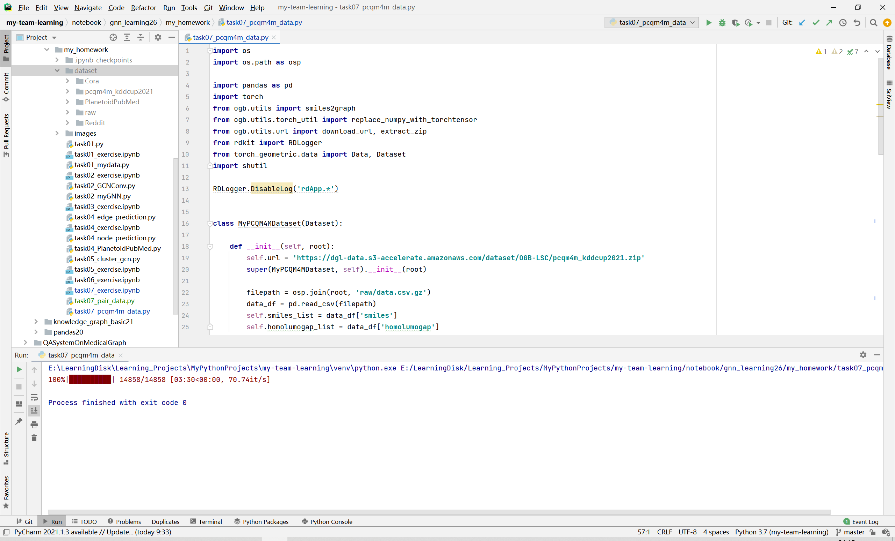
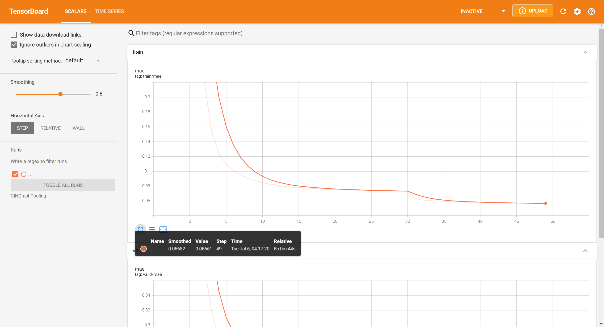

# Task07 图预测任务实践

## 1 知识梳理

### 1.1 Dataset基类
- 继承时需实现的方法：`raw_file_names()`、`processed_file_names()`、`download()`、`process()`
- 额外需要实现的方法：`len()`获取数据集中样本数量，`get()`实现加载单个图的操作

### 1.2 图样本封装成batch和DataLoader类
- 基本思路：将小图的邻接矩阵存储在大图邻接矩阵的对角线上
- 优势：
  1. 不需要修改GNN算法
  2. 没有额外计算或内存开销

### 1.3 小图的属性增值与拼接
- 节点序号增值：修改`__inc__()`和`__cat_dim__()`函数
- 图的匹配：使用一个Data对象存储多个图，并使用follow_batch参数指定要维护batch信息的属性
- 二部图：不同类型的节点数量不一致，edge_index边的源节点与目标节点进行增值操作不同
- 新维度的拼接：图级别属性或预测目标，通过`__cat_dim__()`返回`None`的连接维度实现

## 2 实战练习


```python
import torch
from torch_geometric.data import Data, DataLoader

import logging  
logger = logging.getLogger()
logger.setLevel(logging.ERROR) 
```

### 2.1 图的匹配


```python
class PairData(Data):
    def __init__(self, edge_index_s, x_s, edge_index_t, x_t):
        super(PairData, self).__init__()
        self.edge_index_s = edge_index_s
        self.x_s = x_s
        self.edge_index_t = edge_index_t
        self.x_t = x_t

    def __inc__(self, key, value):
        if key == 'edge_index_s':
            return self.x_s.size(0)
        if key == 'edge_index_t':
            return self.x_t.size(0)
        else:
            return super().__inc__(key, value)
```


```python
edge_index_s = torch.tensor([
    [0, 0, 0, 0],
    [1, 2, 3, 4],
])
x_s = torch.randn(5, 16)  # 5 nodes.
edge_index_t = torch.tensor([
    [0, 0, 0],
    [1, 2, 3],
])
x_t = torch.randn(4, 16)  # 4 nodes.

data = PairData(edge_index_s, x_s, edge_index_t, x_t)
data_list = [data, data]
loader = DataLoader(data_list, batch_size=2)
batch = next(iter(loader))

print(batch)
print(batch.edge_index_s)
print(batch.edge_index_t)
```

    Batch(edge_index_s=[2, 8], edge_index_t=[2, 6], x_s=[10, 16], x_t=[8, 16])
    tensor([[0, 0, 0, 0, 5, 5, 5, 5],
            [1, 2, 3, 4, 6, 7, 8, 9]])
    tensor([[0, 0, 0, 4, 4, 4],
            [1, 2, 3, 5, 6, 7]])
    


```python
# 为节点特征x_s和x_t创建了batch对象
loader = DataLoader(data_list, batch_size=2, follow_batch=['x_s', 'x_t'])
batch = next(iter(loader))

print(batch)
print(batch.x_s_batch)
print(batch.x_t_batch)
```

    Batch(edge_index_s=[2, 8], edge_index_t=[2, 6], x_s=[10, 16], x_s_batch=[10], x_t=[8, 16], x_t_batch=[8])
    tensor([0, 0, 0, 0, 0, 1, 1, 1, 1, 1])
    tensor([0, 0, 0, 0, 1, 1, 1, 1])
    

### 2.2 二部图


```python
class BipartiteData(Data):
    def __init__(self, edge_index, x_s, x_t):
        super(BipartiteData, self).__init__()
        self.edge_index = edge_index
        self.x_s = x_s
        self.x_t = x_t
        
    def __inc__(self, key, value):
        if key == 'edge_index':
            return torch.tensor([[self.x_s.size(0)], [self.x_t.size(0)]])
        else:
            return super().__inc__(key, value)
```


```python
edge_index = torch.tensor([
    [0, 0, 1, 1],
    [0, 1, 1, 2],
])
x_s = torch.randn(2, 16)  # 2 nodes.
x_t = torch.randn(3, 16)  # 3 nodes.

data = BipartiteData(edge_index, x_s, x_t)
data_list = [data, data]
loader = DataLoader(data_list, batch_size=2)
batch = next(iter(loader))

print(batch)
print(batch.edge_index)
```

    Batch(batch=[6], edge_index=[2, 8], ptr=[3], x_s=[4, 16], x_t=[6, 16])
    tensor([[0, 0, 1, 1, 2, 2, 3, 3],
            [0, 1, 1, 2, 3, 4, 4, 5]])
    

### 2.3 在新维度进行拼接


```python
class MyData(Data):
    def __cat_dim__(self, key, item):
        if key == 'foo':
            return None
        else:
            return super().__cat_dim__(key, item)

edge_index = torch.tensor([
   [0, 1, 1, 2],
   [1, 0, 2, 1],
])
foo = torch.randn(16)

data = MyData(edge_index=edge_index, foo=foo)
data_list = [data, data]
loader = DataLoader(data_list, batch_size=2)
batch = next(iter(loader))

print(batch)
```

    Batch(batch=[6], edge_index=[2, 8], foo=[2, 16], ptr=[3])
    

### 2.4 创建超大规模数据集类


```python
import os
import os.path as osp

import pandas as pd
import torch
from ogb.utils import smiles2graph
from ogb.utils.torch_util import replace_numpy_with_torchtensor
from ogb.utils.url import download_url, extract_zip
from rdkit import RDLogger
from torch_geometric.data import Data, Dataset
import shutil

RDLogger.DisableLog('rdApp.*')


class MyPCQM4MDataset(Dataset):

    def __init__(self, root):
        self.url = 'https://dgl-data.s3-accelerate.amazonaws.com/dataset/OGB-LSC/pcqm4m_kddcup2021.zip'
        super(MyPCQM4MDataset, self).__init__(root)

        filepath = osp.join(root, 'raw/data.csv.gz')
        data_df = pd.read_csv(filepath)
        self.smiles_list = data_df['smiles']
        self.homolumogap_list = data_df['homolumogap']

    @property
    def raw_file_names(self):
        return 'data.csv.gz'

    def download(self):
        path = download_url(self.url, self.root)
        extract_zip(path, self.root)
        os.unlink(path)
        shutil.move(osp.join(self.root, 'pcqm4m_kddcup2021/raw/data.csv.gz'),
                    osp.join(self.root, 'raw/data.csv.gz'))

    def len(self):
        return len(self.smiles_list)

    def get(self, idx):
        smiles, homolumogap = self.smiles_list[idx], self.homolumogap_list[idx]
        graph = smiles2graph(smiles)
        assert (len(graph['edge_feat']) == graph['edge_index'].shape[1])
        assert (len(graph['node_feat']) == graph['num_nodes'])

        x = torch.from_numpy(graph['node_feat']).to(torch.int64)
        edge_index = torch.from_numpy(graph['edge_index']).to(torch.int64)
        edge_attr = torch.from_numpy(graph['edge_feat']).to(torch.int64)
        y = torch.Tensor([homolumogap])
        num_nodes = int(graph['num_nodes'])
        data = Data(x, edge_index, edge_attr, y, num_nodes=num_nodes)
        return data

    def get_idx_split(self):
        split_dict = replace_numpy_with_torchtensor(torch.load(
            osp.join(self.root, 'pcqm4m_kddcup2021/split_dict.pt')))
        return split_dict
```


```python
dataset = MyPCQM4MDataset('dataset')
from torch_geometric.data import DataLoader
from tqdm import tqdm

dataloader = DataLoader(dataset, batch_size=256, shuffle=True, num_workers=16)
# for batch in tqdm(dataloader):
#     pass
```



### 2.5 图预测任务实践



使用教程中的代码需要注意：
1. 虚拟内存需要128G，需要GPU运行
2. 使用教程中的参数，需要运行49个epoch，16个num_workders，每个epoch运行时间大概为3~4分钟，整体运行需要至少5个小时左右
3. 运行结果可使用tensorboard查看
运行命令：tensorboard --logdir=GINGraphPooling
4. 完整代码见`task06_gin_regression.py`
