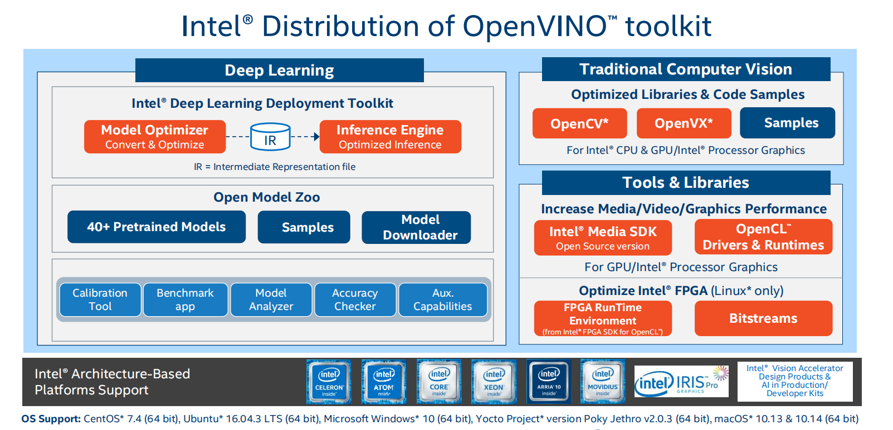

# Task01 初识人工智能及视觉应用

## 1 我们为什么需要人工智能？

### 1.1 课程介绍

- 课程目标：了解人工智能和OpenVINO的工具套件，为AI应用选择最佳的Inter平台，并使用Inter产品构建AI应用
- 课程内容：
  1. 初级课程：从零开始讲解所有AI的应备知识、相关技术、Inter为每种应用场景推荐的平台和软件工具
  2. 中级课程：深入了解OpenVINO的工具套件，讲解演示OpenVINO，练习所有的可用的工具
  3. 高级课程：介绍使用Inter平台和工具，在系统层面构建实际可扩展的AI产品

### 1.2 初级课程安排

&emsp;&emsp;总共分为10节课程，内容如下：
- 介绍需要人工智能的原因和需要哪些技术
- 介绍计算机视觉和AI，
- 讲解现在的电脑如何高效地执行AI
- 演示通过Inter OpenVINO工具套件能够完成的多项工作
- 概述设计AI应用的完整流程

### 1.3 OpenVINO套件简述

&emsp;&emsp;OpenVINO套件，开放视觉推理和神经网络优化的工具集，全称`Open Visual inference and neural netwaork Optimization`，是一整套面向AI应用的Inter解决方案，本课程内容主要对组件进行概括性介绍，演示运行相关组件；它是一款免费软件，提供大量的开源资源，包括应用示例和场景演示等。

### 1.4 总结

- AI是我们管理物联网收集的海量数据的唯一方法
- AI将彻底改变我们的未来，可能是构建智能系统的最佳方法
- AI包含广泛的功能，在本次课程中，主要讲述视觉应用方面
- 构建AI应用时，可能会遇到许多挑战
- OpenVINO是Inter提供构建AI应用的工具套件，具有开源版本、免费、易使用，提供多种资源帮助使用

## 2 什么是计算机视觉？如何使用计算机来处理视频？

### 2.1 视频与图像

- 视频中的大数据：每天全球会有5亿人观看1部网络视频，80%的流量被视频占据，视频中包含了大量的数据，视频由连续的图像构成，只要这些图像的移动速度足够快，会让我们产生物体连续运动的错觉
- 图像的表示：每个图像由像素构成，每个像素都由一个值表示。在灰度图中，每个像素由0~255表示，255表示白色，0表示黑色。在彩色图像中，像素由三个个基本色RBG值组合而成

### 2.2 图像处理

- 模糊：把每个像素的值，替换为周围8个像素的平均值，得到更模糊的图像
- 锐化：反向扩大像素点与周围像素点的差异，得到更锐利的图像。继续进行锐化，图像将仅保留像素值的显著差异，只能看到图像中物体的边缘，可用于检测图像的角、边缘、线等

### 2.3 OpenCV简介

- 简述：OpenCV是一款面向计算机视觉的开源库，最常用的工具库，使用多种编程语言（C、C++、Python）编写，可在Inter硬件上加速，使用Inter芯片上特定的加速单元，加快视觉程序的运行速度，并兼容多种操作系统和平台，具有计算机视觉所需的大多数功能
- 基本功能：图像的旋转、缩放、调整、过滤，查找边缘等操作
- 高级功能：面部检测、特征识别等

### 2.4 总结

- 视频占互联网流量的80%
- 视频是一系列连续的图像，这些图像的移动速度足够快，让我们的眼睛看到了平滑连续的视觉效果
- 图像是多个像素组成的阵列，每个像素都有强度级或由RGB共同组成
- 可以操控像素来模糊、锐化图像或执行其他任务
- 可以检测图像中的特征，查找图像中的边缘、线、角，并由此查找真实图像
- OpenCV是一款用于加速计算机视觉的Inter软件，是视觉领域最常用的库，并可以轻松地在Inter硬件上加速
- OpenCV已包含在OpenVINO中

## 3 如何加速视频处理进程

### 3.1 视频的数据量

- 1帧包括1920*1080个像素点，
- 每个像素由RGB组成，约占3bytes，1帧图像的大小为6.2MB
- 假设每秒25帧，每秒需要155MB的数据存储，1分钟的视频需要存储9.3GB的数据
- 使用视频压缩技术，如YouTube视频，1分钟仅需要71.9MB的数据

### 3.2 视频压缩技术

- 空间冗余：例如图像中的天空区域，所有像素都是相同的颜色，只需要存储所有像素的平均值，可应用于整个天空区域
- 时间冗余：图像局部区域是一样的，但在屏幕中的位置不断变化，可以仅存储第一张图像的区域像素值，后面几张图像可以重复使用
- 帧值处理：假设有一个新帧图像，记作`I`帧，在两个`I`帧之间存在`P`帧，记录两帧之间的差异，数据量通常只有`I`帧的1/2；在`I`帧和`P`帧之间是`B`帧，`B`帧是帧与帧之间的插值，数据只有`I`帧的1/4，它们之间的变化可以自动生成

### 3.3 编解码器与视频加速处理

- 使用编解码器，对视频进行压缩和解压缩，目前常用的编解码器有h.264或AVC，h.265或HEVC，通常需要3倍的资源进行解码
- 视频文件：是一个可以容纳其他文件的文件容器，例如mp4文件包括带显示的视频流h.264、带播放的视频mp3、元数据等
- 视频处理任务：存储在大型的缓冲区中，并逐帧进行处理，对两帧进行对比，查看发生的变化
- 硬件：Inter CPU能够处理编解码任务，使用Inter Quick Sync Video Technology，快速视频同步技术；Inter核心显卡包括两大核心模块，EU和QSVT，EU用于处理图像视频渲染，QSVT包括加速视频处理、解码、编码等等，集成GPU可以在睿频模式下运行，
- 软件：驱动程序在集成GPU的上层，在驱动程序之上是VAAPI-Libva，上层封装了Media-SDK，提供C++/Python语言的API接口，可使用OpenCV、FFMPEG、Gstreamer直接访问该API，OpenVINO包含了Media-SDK

### 3.4 总结

- 视频流传输是一项繁重的任务，数据量庞大
- 视频压缩利用图像和不同帧的冗余性，通过较少的数据表示相同数据的信息
- 介绍编解码器、视频容器文件等内容
- 通过软件在CPU上执行视频处理，但Inter集成GPU也能提供专业硬件单元用于视频处理
- Media-SDK可以利用Inter快速视频同步技术进行视频处理
- 可以通过OpenCV、FFMPEG、Gstreamer使用Media-SDK
- Media-SDK是OpenVINO的一部分

## 4 如何给视觉应用中的神经网络加速

### 4.1 视觉图像识别的应用

- 特征：通过图像锐化，得到图像边缘特征，观察特定像素的排列，这些角、线、圆等组成元素称为特征
- 猫的检测：检测对象是否有4条腿、尾巴、颜色、大小等，将所有输入特征放入函数中，如果组合正确，就可以判断是猫

### 4.2 神经网络模型构建

- 前向操作，进行分类，图像和网络相乘，计算误差
- 反向操作，更改神经网络的权重，将结果错误率降到最低
- 反复上述操作，获取特定权重的神经网络，进行迭代训练

### 4.3 模型类别

在图像识别、语音识别领域，使用很多模型进行处理，比如：
- 分类模型：图像包含特定对象的概率
- 检测模型：检测图像中目标物体的边界框
- 分割模型：对图像中的物体进行分类，并判断是否为特定对象

### 4.4 DLDT简介

- DLDT：深度学习部署套件（Deep Learning Deployment Toolkit）是属于OpenVINO的核心组件，包含构建AI的解决方案、可随时使用的示例、程序和模型下载器等
- 运行方式：
  1. 使用预训练模型（可支持TensorFlow、Caffe、Mxnet、ONNX）
  2. 使用模型优化器转换成中间表示成IR（更改权重格式、优化拓扑）
  3. 使用推理引擎读取IR文件，推理引擎的代码可重复使用，只需要进行非常小的修改，可以在Inter多种硬件上进行推理

### 4.5 总结

- 基于深度学习的神经网络是一种各种视觉相关任务的可靠方法
- 为了获得可以正常运行的网络模型，在训练流程中处理了大量的数据 
- 推理是网络的正向路径，输出结果，计算误差，并执行反向路径，更新权重
- 深度学习模型可用于分类、检测、分割和其他任务
- Inter平台可执行神经网络，并提供卓越的性能
- DLDT是一款用于加速深度学习推理的Inter软件工具，是OpenVINO的组成部分

## 5 视频分析处理的完整流程

### 5.1 视频分析流程

1. 解码：解码多个视频流，每个视频流具有不同的分辨率和格式
2. 预处理：通过锐化、亮度调整、可缩小图像、裁剪图像中感兴趣的区域，选择跳过帧或尝试推理所有帧等操作
3. 推理：使用深度学习模型进行推理，如进行对象检测、分类对象
4. 发送处理：可在被检测对象周围绘制边界框
5. 编码：压缩视频，用于发送或存储视频

### 5.2 各种组件在流程中的应用

- Media-SDK，用于处理编解码和预处理
- DLDT，基于深度学习的推理加速
- OpenCV，基本上能完成整个流程

### 5.3 OpenVINO的架构

- 支持多个Inter架构基础平台
- 使用OpenCV处理计算机视觉
- 使用Media-SDK进行视频编解码与处理
- 使用DLDT进行推理

### 5.4 总结

- 视频分析：视频处理、计算机视觉和AI推理
- 视频分析流程是多种视觉应用最常用的工具负载
- 视频分析流程包括多项操作，但是消耗资源最大的操作在每一帧上都需要执行
- OpenVINO具有构建视频分析流程和AI应用的所需要的软件工具
- OpenVINO支持多个Inter平台和多种操作系统，免费开放使用，拥有所有必要的工具

## 6 任务总结

&emsp;&emsp;本次任务，主要介绍了人工智能、计算机视觉和OpenVINO的各组件：
  1. OpenVINO是Inter提供构建AI应用的工具套件，具有开源版本、免费、易使用，提供多种资源帮助使用
  2. OpenCV是一款用于加速计算机视觉的Inter软件，是视觉领域最常用的库，并可以轻松地在Inter硬件上加速
  3. Media-SDK可以利用Inter快速视频同步技术进行视频处理
  4. DLDT是一款用于加速深度学习推理的Inter软件工具，是OpenVINO的组成部分
  5. 视频分析流程包括解码、预处理、推理、发送处理和编码等环节
  6. OpenVINO具有构建视频分析流程和AI应用的所需要的软件工具
