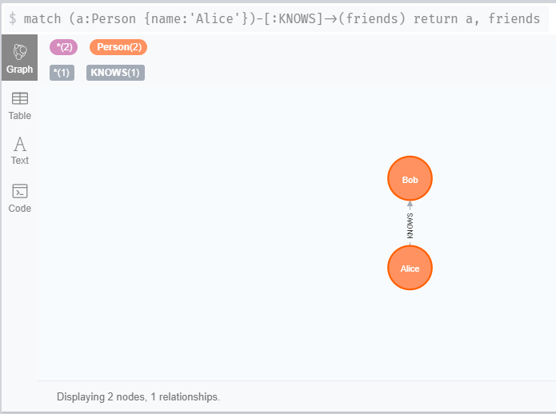

# Task01 知识图谱介绍 {docsify-ignore-all}

## 1 知识梳理

### 1.1 知识图谱简介
- 概念：知识图谱本质上是语义网络（Semantic Network）的知识库”。但这有点抽象，所以换个角度，从实际应用的角度出发其实可以简单地把知识图谱理解成多关系图（Multi-relational Graph）
- 图：图（Graph）是由节点（Vertex）和边（Edge）来构成
- Schema：知识图谱数据的格式（即数据模型）

### 1.2 构建知识图谱
- 数据来源：业务数据和来自爬取的数据
- 信息抽取的方式：主要是自然语言处理技术
- 具体构建技术：实体命名识别、关系抽取、实体统一、指代消解 

### 1.3 知识图谱的存储
- RDF存储：RDF为资源描述框架(Resource Description Framework，英文简写RDF)
- 图数据库存储：目前采用Neo4j图数据库

|RDF| 图数据库|
|:---|:---|
| 存储三元组 | 节点和关系可以带有属性 |
| 标准的推理引擎 | 没有标准的推理引擎 |
| W3C标准 | 图的遍历效率高 |
| 易于发布数据 | 事务管理 |
| 多数为学术界场景 | 基本为工业界场景 |

## 2 实战练习

### 2.1 使用`neo4j`模块执行`CQL`语句


```python
# step 1：导入 Neo4j 驱动包
from neo4j import GraphDatabase
# step 2：连接 Neo4j 图数据库
user_name = 'neo4j'
password = 'hun1988'
driver = GraphDatabase.driver("bolt://localhost:7687", auth=(user_name, password))
```


```python
# 添加关系
def add_friend(tx, name, friend_name):
    tx.run("MERGE (a:Person {name: $name}) "
           "MERGE (a)-[:KNOWS]->(friend:Person {name: $friend_name})",
            name=name, friend_name=friend_name)
```


```python
# 定义关系
def print_friends(tx, name):
    for record in tx.run("MATCH (a:Person)-[:KNOWS]->(friend) WHERE a.name = $name "
                          "RETURN friend.name ORDER BY friend.name", name=name):
        print(record["friend.name"])
```


```python
# step 3：运行
with driver.session() as session:
    session.write_transaction(add_friend, "Arthur", "Guinevere")
    session.write_transaction(add_friend, "Arthur", "Lancelot")
    session.write_transaction(add_friend, "Arthur", "Merlin")
    session.read_transaction(print_friends, "Arthur")
```

    Guinevere
    Lancelot
    Merlin
    


### 2.2 使用`py2neo`模块，操作`neo4j`图数据库


```python
# step 1：导包
from py2neo import Graph, Node, Relationship
```


```python
# step 2：构建图
user_name = 'neo4j'
password = 'hun1988'
g = Graph("bolt://localhost:7687", auth=(user_name, password))
```


```python
# step 3：创建节点
tx = g.begin()
a = Node("Person", name="Alice")
tx.create(a)
b = Node("Person", name="Bob")
# step 4：创建边
ab = Relationship(a, "KNOWS", b)
# step 5：运行
tx.create(ab)
tx.commit()
```


    <Bookmark 'neo4j:bookmark:v1:tx84'>




## 3 练一练

使用`py2neo`模块，完成教程第5节的内容


```python
from py2neo import Graph, Node, Relationship, Subgraph

# 连接图数据库
user_name = 'neo4j'
password = 'hun1988'
g = Graph("bolt://localhost:7687", auth=(user_name, password))
```


```python
# 删除数据库中以前的图
g.delete_all()
```


```python
# 创建人物节点
# CREATE (n:Person {name:'John'}) RETURN n
# CREATE (n:Person {name:'Sally'}) RETURN n
# CREATE (n:Person {name:'Steve'}) RETURN n
# CREATE (n:Person {name:'Mike'}) RETURN n
# CREATE (n:Person {name:'Liz'}) RETURN n
# CREATE (n:Person {name:'Shawn'}) RETURN n
tx = g.begin()
names = ['John', 'Sally', 'Steve', 'Mike', 'Liz', 'Shawn']
for p_name in names:
    p_node = Node("Person", name=p_name)
    tx.create(p_node)
tx.commit()
```


    <Bookmark 'neo4j:bookmark:v1:tx86'>


```python
# 创建地区节点
# CREATE (n:Location {city:'Miami', state:'FL'})
# CREATE (n:Location {city:'Boston', state:'MA'})
# CREATE (n:Location {city:'Lynn', state:'MA'})
# CREATE (n:Location {city:'Portland', state:'ME'})
# CREATE (n:Location {city:'San Francisco', state:'CA'})
tx = g.begin()
locations = [{'city':'Miami', 'state':'FL'}, {'city':'Boston', 'state':'MA'}, {'city':'Lynn', 'state':'MA'}, 
             {'city':'Portland', 'state':'ME'}, {'city':'San Francisco', 'state':'CA'}]
for location in locations:
    l_node = Node("Location", city=location['city'], state=location['state'])
    tx.create(l_node)
tx.commit()
```


    <Bookmark 'neo4j:bookmark:v1:tx87'>


```python
# 创建朋友关系
# MATCH (a:Person {name:'Liz'}), (b:Person {name:'Mike'})
# MERGE (a)-[:FRIENDS]->(b)
tx = g.begin()
a = tx.graph.nodes.match("Person", name='Liz').first()
b = tx.graph.nodes.match("Person", name='Mike').first()
ab = Relationship(a, "FRIENDS", b)
tx.create(ab)
tx.commit()
```


    <Bookmark 'neo4j:bookmark:v1:tx88'>


```python
# 关系增加属性
# MATCH (a:Person {name:'Shawn'}), (b:Person {name:'Sally'})
# MERGE (a)-[:FRIENDS {since:2001}]->(b)
tx = g.begin()
a = tx.graph.nodes.match("Person", name='Shawn').first()
b = tx.graph.nodes.match("Person", name='Sally').first()
ab = Relationship(a, "FRIENDS", b, since=2001)
tx.create(ab)
tx.commit()
```


    <Bookmark 'neo4j:bookmark:v1:tx89'>


```python
# 创建更多朋友关系
# MATCH (a:Person {name:'Shawn'}), (b:Person {name:'John'}) MERGE (a)-[:FRIENDS {since:2012}]->(b)
# MATCH (a:Person {name:'Mike'}), (b:Person {name:'Shawn'}) MERGE (a)-[:FRIENDS {since:2006}]->(b)
# MATCH (a:Person {name:'Sally'}), (b:Person {name:'Steve'}) MERGE (a)-[:FRIENDS {since:2006}]->(b)
# MATCH (a:Person {name:'Liz'}), (b:Person {name:'John'}) MERGE (a)-[:MARRIED {since:1998}]->(b)
tx = g.begin()
a = tx.graph.nodes.match("Person", name='Shawn').first()
b = tx.graph.nodes.match("Person", name='John').first()
c = tx.graph.nodes.match("Person", name='Mike').first()
d = tx.graph.nodes.match("Person", name='Sally').first()
e = tx.graph.nodes.match("Person", name='Steve').first()
f = tx.graph.nodes.match("Person", name='Liz').first()
ab = Relationship(a, "FRIENDS", b, since=2012)
ca = Relationship(c, "FRIENDS", a, since=2006)
de = Relationship(d, "FRIENDS", e, since=2006)
fb = Relationship(f, "MARRIED", b, since=1998)
A = Subgraph(relationships=[ab, ca, de, fb])   
tx.create(A)
tx.commit()
```


    <Bookmark 'neo4j:bookmark:v1:tx90'>


```python
# 建立不同类型节点之间的关系-人物和地点的关系
# MATCH (a:Person {name:'John'}), (b:Location {city:'Boston'}) MERGE (a)-[:BORN_IN {year:1978}]->(b)
# MATCH (a:Person {name:'Liz'}), (b:Location {city:'Boston'}) MERGE (a)-[:BORN_IN {year:1981}]->(b)
# MATCH (a:Person {name:'Mike'}), (b:Location {city:'San Francisco'}) MERGE (a)-[:BORN_IN {year:1960}]->(b)
# MATCH (a:Person {name:'Shawn'}), (b:Location {city:'Miami'}) MERGE (a)-[:BORN_IN {year:1960}]->(b)
# MATCH (a:Person {name:'Steve'}), (b:Location {city:'Lynn'}) MERGE (a)-[:BORN_IN{year:1970}]->(b)
tx = g.begin()
p_John = tx.graph.nodes.match("Person", name='John').first()
p_Liz = tx.graph.nodes.match("Person", name='Liz').first()
p_Mike = tx.graph.nodes.match("Person", name='Mike').first()
p_Shawn = tx.graph.nodes.match("Person", name='Shawn').first()
p_Steve = tx.graph.nodes.match("Person", name='Steve').first()

l_Boston = tx.graph.nodes.match("Location", city='Boston').first()
l_Francisco = tx.graph.nodes.match("Location", city='San Francisco').first()
l_Miami = tx.graph.nodes.match("Location", city='Miami').first()
l_Lynn = tx.graph.nodes.match("Location", city='Lynn').first()

p_l_1 =  Relationship(p_John, "BORN_IN", l_Boston, year=1978)
p_l_2 =  Relationship(p_Liz, "BORN_IN", l_Boston, year=1981)
p_l_3 =  Relationship(p_Mike, "BORN_IN", l_Francisco, year=1960)
p_l_4 =  Relationship(p_Shawn, "BORN_IN", l_Miami, year=1960)
p_l_5 =  Relationship(p_Steve, "BORN_IN", l_Lynn, year=1970)
A = Subgraph(relationships=[p_l_1, p_l_2, p_l_3, p_l_4, p_l_5])   
tx.create(A)
tx.commit()
```


    <Bookmark 'neo4j:bookmark:v1:tx91'>


```python
# 查询下所有在Boston出生的人物
# MATCH (a:Person)-[:BORN_IN]->(b:Location {city:'Boston'}) RETURN a,b
b = g.nodes.match("Location", city="Boston").first()
r1 = g.relationships.match({b}, 'BORN_IN').all()
print(r1)
```

    [BORN_IN(Node('Person', name='Liz'), Node('Location', city='Boston', state='MA'), year=1981), BORN_IN(Node('Person', name='John'), Node('Location', city='Boston', state='MA'), year=1978)]
    
