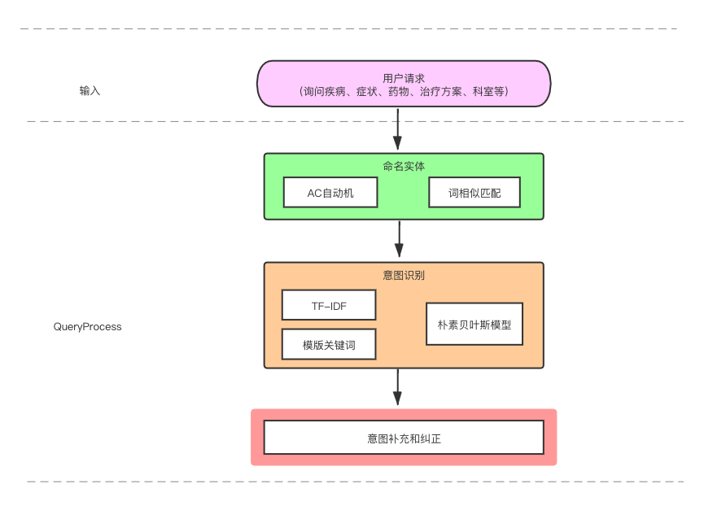

# Task04 用户输入->知识库的查询语句 {docsify-ignore-all}
## 1 知识梳理

### 1.1 问答系统
- 问答系统概念：用来回答用户提出的自然语言问题的系统
- 类型：  
从知识领域划分：封闭领域、开放领域  
从实现方式划分：基于流水线（pipeline）实现、基于端到端（end-to-end）实现  
从答案来源划分：知识库问答（KB-QA）、常见问题问答、行为问答、网际网路问答
- 知识库问答流程：  
问句->语义解析->语义表达->语义匹配、查询、推理<->知识库

### 1.2 Query理解
- 概念：从词法、句法、语义三个层面对Query进行结构化解析
- 意图识别：检测用户当前输入的（文本/图片/语音）意图，所用方法包括基于词典模板的规则分类、传统的机器学习模型（文本特征工程+分类器）、深度学习模型
- 槽值填充：通过既定的字段，将用户输入的信息与字段对应的部分提取出来
- 序列标注的任务常用模型：词典匹配、BILSTM+CRF、IDCNN、BERT等

### 1.3 基于知识图谱的问答系统框架



## 2 代码详解
主要详解主体类`EntityExtractor`代码（entity_extractor.py），主要用于命名实体识别、意图识别以及意图补充和纠正

### 2.1 命名实体识别
整体思路：
1. 根据用户的输入语句，使用预先构建的`AC Tree`(疾病、疾病别名、并发症和症状)进行匹配
2. 如果匹配不到上述实体、使用`jieba`词库进行文本切分
3. 将文本切分后的每一个词与词库（疾病、疾病别名、并发症和症状）中的词计算文本相似度得分（使用overlap score、余弦相似度和编辑距离计算平均得分），如果得分超过0.7，则该词属于相关类的实体
4. 排序选取相关性得分最高的词作为实体


```python
from py2neo import Graph
graph = Graph("http://localhost:7474", username="neo4j", password="hun1988")
```


```python
node_labes = list(graph.schema.node_labels)
node_labes
```


    ['Complication', 'Alias', 'Drug', 'Symptom', 'Part', 'Department', 'Disease']


```python
import pandas as pd

columns = ['EntityType', 'Numbers', 'Examples']
df = pd.DataFrame(columns=columns)

for label in node_labes:
    node_matcher = graph.nodes.match(label)
    count = node_matcher.count()
    example = ', '.join([node['name'] for node in node_matcher.all()[:2]])
    df = pd.concat([df, pd.DataFrame(data=[[label, count, example]], columns=columns)])
    
df = pd.concat([df, pd.DataFrame(data=[["Total", df.Numbers.sum(), ""]], columns=columns)]).reset_index(drop=True)
```


```python
df
```


<div>
<style scoped>
    .dataframe tbody tr th:only-of-type {
        vertical-align: middle;
    }

    .dataframe tbody tr th {
        vertical-align: top;
    }

    .dataframe thead th {
        text-align: right;
    }
</style>
<table border="0" class="dataframe">
  <thead>
    <tr style="text-align: right;">
      <th></th>
      <th>EntityType</th>
      <th>Numbers</th>
      <th>Examples</th>
    </tr>
  </thead>
  <tbody>
    <tr>
      <th>0</th>
      <td>Complication</td>
      <td>3201</td>
      <td>幼年型慢性粒细胞白血病, 子宫内膜间质肉瘤</td>
    </tr>
    <tr>
      <th>1</th>
      <td>Alias</td>
      <td>8877</td>
      <td>梅毒合并艾滋病, 黏液黏稠病</td>
    </tr>
    <tr>
      <th>2</th>
      <td>Drug</td>
      <td>4625</td>
      <td>天麻素胶囊, 丙酸睾酮</td>
    </tr>
    <tr>
      <th>3</th>
      <td>Symptom</td>
      <td>5622</td>
      <td>心境不良, 耳廓腹侧面局限性囊肿</td>
    </tr>
    <tr>
      <th>4</th>
      <td>Part</td>
      <td>82</td>
      <td>盆腔, 下肢</td>
    </tr>
    <tr>
      <th>5</th>
      <td>Department</td>
      <td>82</td>
      <td>消化内科, 成瘾医学科</td>
    </tr>
    <tr>
      <th>6</th>
      <td>Disease</td>
      <td>14336</td>
      <td>海鱼分枝杆菌感染, 妊娠呕吐</td>
    </tr>
    <tr>
      <th>7</th>
      <td>Total</td>
      <td>36825</td>
      <td></td>
    </tr>
  </tbody>
</table>
</div>


#### 2.1.1 AC Tree创建
`pyahocorasick`模块的作用是字符串匹配，比如现在有个数据量很大的列表，根据用户输入一句话，从大列表中匹配出字符串


```python
def build_actree(self, wordlist):
    """
    Step1: 构造actree，加速过滤
    :param wordlist:
    :return:
    """
    actree = ahocorasick.Automaton()
    # 向树中添加单词
    for index, word in enumerate(wordlist):
        actree.add_word(word, (index, word))
    actree.make_automaton()
    return actree
```


```python
def __init__(self):
    cur_dir = '/'.join(os.path.abspath(__file__).split('/')[:-1])
    # 路径
    self.stopwords_path = os.path.join(cur_dir, 'data/stop_words.utf8')
    # self.same_words_path = os.path.join(cur_dir, 'DATA/同义词林.txt')
    self.stopwords = [w.strip() for w in open(self.stopwords_path, 'r', encoding='utf8') if w.strip()]

    data_dir = os.path.join(cur_dir, 'data/')
    self.disease_path = data_dir + 'disease_vocab.txt'
    self.symptom_path = data_dir + 'symptom_vocab.txt'
    self.alias_path = data_dir + 'alias_vocab.txt'
    self.complication_path = data_dir + 'complications_vocab.txt'

    self.disease_entities = [w.strip() for w in open(self.disease_path, encoding='utf8') if w.strip()]
    self.symptom_entities = [w.strip() for w in open(self.symptom_path, encoding='utf8') if w.strip()]
    self.alias_entities = [w.strip() for w in open(self.alias_path, encoding='utf8') if w.strip()]
    self.complication_entities = [w.strip() for w in open(self.complication_path, encoding='utf8') if w.strip()]

    self.region_words = list(set(self.disease_entities + self.alias_entities + self.symptom_entities))

    # 构造领域actree
    self.disease_tree = self.build_actree(list(set(self.disease_entities)))
    self.alias_tree = self.build_actree(list(set(self.alias_entities)))
    self.symptom_tree = self.build_actree(list(set(self.symptom_entities)))
    self.complication_tree = self.build_actree(list(set(self.complication_entities)))
```

使用`self.disease_tree.iter(question)`可进行快速匹配出结果


```python
def entity_reg(self, question):
    """
    模式匹配, 得到匹配的词和类型。如疾病，疾病别名，并发症，症状
    :param question:str
    :return:
    """
    self.result = {}

    for i in self.disease_tree.iter(question):
        word = i[1][1]
        if "Disease" not in self.result:
            self.result["Disease"] = [word]
        else:
            self.result["Disease"].append(word)
```

#### 2.1.2 使用相似度进行实体匹配


```python
def find_sim_words(self, question):
    """
    当全匹配失败时，就采用相似度计算找出相似的词
    :param question:
    :return:
    """
    import re
    import string
    from gensim.models import KeyedVectors

    # 使用jieba加载自定义词典
    jieba.load_userdict(self.vocab_path)
    # 加载词向量
    self.model = KeyedVectors.load_word2vec_format(self.word2vec_path, binary=False)

    # 去除一些特殊符号
    sentence = re.sub("[{}]", re.escape(string.punctuation), question)
    sentence = re.sub("[，。‘’；：？、！【】]", " ", sentence)
    sentence = sentence.strip()

    # Step2: 使用jieba分词
    words = [w.strip() for w in jieba.cut(sentence) if w.strip() not in self.stopwords and len(w.strip()) >= 2]

    alist = []

    # Step3: 对每个词与词库进行相似度得分计算
    for word in words:
        temp = [self.disease_entities, self.alias_entities, self.symptom_entities, self.complication_entities]
        for i in range(len(temp)):
            flag = ''
            if i == 0:
                flag = "Disease"
            elif i == 1:
                flag = "Alias"
            elif i == 2:
                flag = "Symptom"
            else:
                flag = "Complication"
            # 计算相似度
            scores = self.simCal(word, temp[i], flag)
            alist.extend(scores)
    
    # 取分数最高的实体和所属的实体类型
    temp1 = sorted(alist, key=lambda k: k[1], reverse=True)
    if temp1:
        self.result[temp1[0][2]] = [temp1[0][0]]
```

### 2.2 意图识别

整体思路：
1. 利用`TF-IDF`表征文本特征，并构建人工特征（每一类意图常见词在句子中出现的频数）
2. 使用朴素贝叶斯模型进行意图识别
3. 使用实体信息进行意图的纠正和补充

#### 2.2.1 特征构建
主要包括`TF-IDF`特征和人工特征的构建


```python
def tfidf_features(self, text, vectorizer):
    """
    提取问题的TF-IDF特征
    :param text:
    :param vectorizer:
    :return:
    """
    # 加载自定义字典
    jieba.load_userdict(self.vocab_path)
    # 进行分词
    words = [w.strip() for w in jieba.cut(text) if w.strip() and w.strip() not in self.stopwords]
    sents = [' '.join(words)]
    
    # 计算TF-IDF特征值
    tfidf = vectorizer.transform(sents).toarray()
    return tfidf

def other_features(self, text):
    """
    提取问题的关键词特征
    :param text:
    :return:
    """
    features = [0] * 7
    for d in self.disase_qwds:
        if d in text:
            features[0] += 1

    for s in self.symptom_qwds:
        if s in text:
            features[1] += 1

    for c in self.cureway_qwds:
        if c in text:
            features[2] += 1

    for c in self.check_qwds:
        if c in text:
            features[3] += 1
    for p in self.lasttime_qwds:
        if p in text:
            features[4] += 1

    for r in self.cureprob_qwds:
        if r in text:
            features[5] += 1

    for d in self.belong_qwds:
        if d in text:
            features[6] += 1

    m = max(features)
    n = min(features)
    normed_features = []
    if m == n:
        normed_features = features
    else:
        for i in features:
            j = (i - n) / (m - n)
            normed_features.append(j)

    return np.array(normed_features)
```

#### 2.2.2 使用朴素贝叶斯进行意图识别（文本分类） 


```python
# 意图预测
def extractor(self, question):
    # TF-IDF特征
    tfidf_feature = self.tfidf_features(question, self.tfidf_model)
    # 人工特征
    other_feature = self.other_features(question)
    m = other_feature.shape
    other_feature = np.reshape(other_feature, (1, m[0]))
    
    feature = np.concatenate((tfidf_feature, other_feature), axis=1)
    # 进行预测，得到分类类别
    predicted = self.model_predict(feature, self.nb_model)
    intentions.append(predicted[0])
```

#### 2.2.3 纠正和补充意图
- 已知疾病，查询症状
- 已知疾病或症状，查询治疗方法
- 已知疾病或症状，查询治疗周期
- 已知疾病，查询治愈率
- 已知疾病，查询检查项目
- 查询科室
- 已知症状，查询疾病
- 若没有检测到意图，且已知疾病，则返回疾病的描述
- 若是疾病和症状同时出现，且出现了查询疾病的特征词，则意图为查询疾病
- 若没有识别出实体或意图则调用其它方法

## 3 总结
1. 整个意图识别的过程很清晰，通过使用`AC Tree`和词相似度匹配的方法，得到命名实体，然后根据命名实体，采用`TF-IDF`进行特征提取，再利用已经训练好的朴素贝叶斯模型，进行文本分类预测，即意图识别。
2. 通过代码的`Debug`可以看到最后得到的意图，例如“乙肝怎么治”，得到的文本分类为`{'Disease': ['乙肝'], 'intentions': ['query_cureway']}`，表示疾病为乙肝，意图是已知疾病或症状，查询治疗方法

