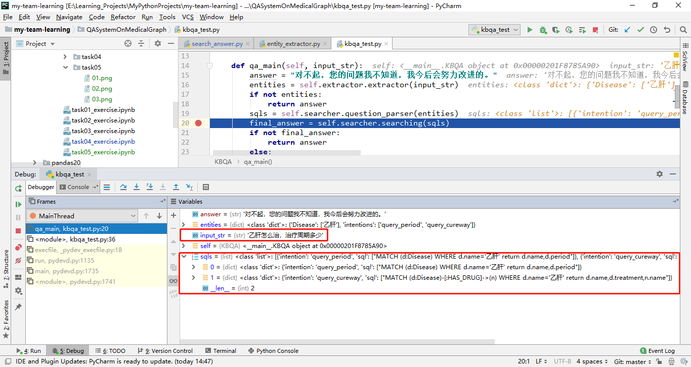
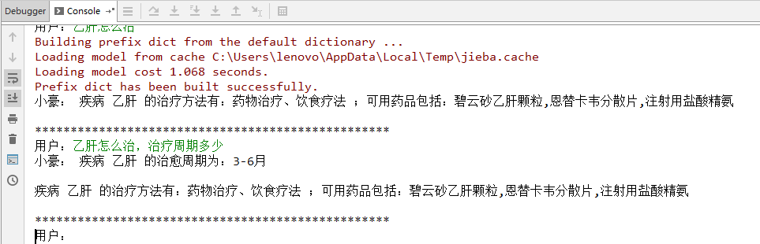

# Task05 Neo4j 图数据库查询 {docsify-ignore-all}

## 1 知识梳理
- `Neo4j`图数据库由`Java`编写，数据保存形式为节点及节点的关系，节点和边都能够包含保存值的属性
- `Cypher`查询语言：适合在数据库中进行点对点模式（ad-hoc）查询，采用声明式，其所表达的是从图中如何查询，而不是如何去做，用户不需要去关心如何优化查询
- 查询操作
1. 连接`Neo4j`查看数据


2. 查询症状  
执行CQL语句：`MATCH (d:Disease)-[:HAS_SYMPTOM]->(s) WHERE d.name='糖尿病' RETURN d.name,s.name`


## 2 代码详解
主要详解主体类`AnswerSearching`代码（search_answer.py），主要用于构造CQL语句、执行cypher查询返回结果

### 2.1 构造CQL语句
主要功能：根据不同的实体和意图构造CQL语句  
整体思路：
1. 根据不同的意图（例如“乙肝怎么治”，得到的文本分类为`{'Disease': ['乙肝'], 'intentions': ['query_cureway']}`，表示疾病为乙肝，意图是已知疾病或症状，查询治疗方法）执行对应分类的CQL语句构建
2. 将意图转变为具体的CQL语句


```python
def question_parser(self, data):
    """
    主要是根据不同的实体和意图构造cypher查询语句
    :param data: {"Disease":[], "Alias":[], "Symptom":[], "Complication":[]}
    :return:
    """
    sqls = []
    if data:
        for intent in data["intentions"]:
            sql_ = dict(intention=intent)
            sql = []
            if data.get("Disease"):
                # 将意图转换为具体的CQL语句
                sql = self.transfor_to_sql("Disease", data["Disease"], intent)
            elif data.get("Alias"):
                sql = self.transfor_to_sql("Alias", data["Alias"], intent)
            elif data.get("Symptom"):
                sql = self.transfor_to_sql("Symptom", data["Symptom"], intent)
            elif data.get("Complication"):
                sql = self.transfor_to_sql("Complication", data["Complication"], intent)

            if sql:
                sql_['sql'] = sql
                # 用数组存储多个CQL语句
                sqls.append(sql_)
    return sqls
```

根据`entity_extractor.py`中定义的如下分类，进行CQL语句构建
- 已知疾病，查询症状：`query_symptom`
- 已知疾病或症状，查询治疗方法：`query_cureway`
- 已知疾病或症状，查询治疗周期：`query_period`
- 已知疾病，查询治愈率：`query_rate`
- 已知疾病，查询检查项目：`query_checklist`
- 查询科室：`query_department`
- 已知症状，查询疾病：`query_disease`
- 若没有检测到意图，且已知疾病，则返回疾病的描述：`disease_describe`
- 若是疾病和症状同时出现，且出现了查询疾病的特征词，则意图为查询疾病：`query_disease`
- 若没有识别出实体或意图则调用其它方法：`QA_matching`

### 2.2 执行cypher查询返回结果
根据不同的意图，返回不同的答案模板


```python
def searching(self, sqls):
    """
    执行cypher查询，返回结果
    :param sqls:
    :return:str
    """
    final_answers = []
    for sql_ in sqls:
        intent = sql_['intention']
        queries = sql_['sql']
        answers = []
        for query in queries:
            ress = self.graph.run(query).data()
            answers += ress
        # 将多个查询结果和意图分类生成答案
        final_answer = self.answer_template(intent, answers)
        if final_answer:
            final_answers.append(final_answer)
    return final_answers
```




## 3 总结
1. 通过问题查询答案结果，主要是利用上一个过程的意图识别得到的意图分类，将意图构造CQL语言，然后执行得到结果，将结果按照意图分类得到不同意图的模板答案
2. 改进：可根据问题的形式（即描述风格，语句的断句）动态构造答案模板，而不是通过意图进行模板答案的内容填写，可支持智能化的回答形式
