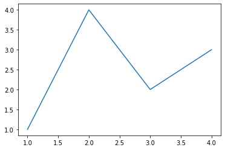
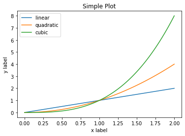

# Task01 Matplotlib初相识

## 1 知识梳理

**Matplotlib官网地址：**  
https://matplotlib.org/tutorials/introductory/usage.html#sphx-glr-tutorials-introductory-usage-py

### 1.1 Matplotlib介绍  
- 一个Python 2D绘图库
- 兼容性：多种硬拷贝格式和跨平台的交互式环境生成出版物质量的图形
- 主要功能：绘制各种静态、动态、交互式的图表

### 1.2 使用范围
- Python脚本
- Python
- IPython Shell
- Jupyter notebook
- Web应用程序服务器

### 1.3 高级封装
- pandas的绘图接口封装
- seaborn的绘图接口封装

### 1.4 Figure组成
- 4个层级：  
（1）Figure：顶层，容纳所有绘图元素  
（2）Axes：子图层，通过大量元素构造子图  
（3）Axis：axes的下层，处理所有和坐标轴，网格有关的元素  
（4）Tick：axis的下层，处理所有和刻度有关的元素
- 操作：通过各种命令方法操纵Figure中的每一个元素，达到数据可视化的最终效果

## 2 实战练习

### 2.1 简单绘图


```python
# 引入依赖包
import matplotlib.pyplot as plt
import numpy as np
```


```python
# 创建一个包含一个axes的figure
fig, ax = plt.subplots()  
# 绘制折线图
ax.plot([1, 2, 3, 4], [1, 4, 2, 3])
```


    [<matplotlib.lines.Line2D at 0x2488dcc0688>]


    

    


```python
# 如果未指定axes，会自动创建一个
plt.plot([1, 2, 3, 4], [1, 4, 2, 3])
```


    [<matplotlib.lines.Line2D at 0x2488ddd3f88>]


    

    


### 2.2 OO模式

绘图接口说明：显式创建figure和axes


```python
# 构成直线的数据
x = np.linspace(0, 2, 100)

# 显示创建figure和axes
fig, ax = plt.subplots()
# 绘制折线图
ax.plot(x, x, label='linear')  
ax.plot(x, x**2, label='quadratic')  
ax.plot(x, x**3, label='cubic')
# 设置标签
ax.set_xlabel('x label') 
ax.set_ylabel('y label') 
# 设置标题
ax.set_title("Simple Plot")
# 设置图例
ax.legend() 
```


    <matplotlib.legend.Legend at 0x2488de7de08>


    

    


### 2.3 依赖pyplot自动创建


```python
# 构成直线的数据
x = np.linspace(0, 2, 100)

# 绘制折线图
plt.plot(x, x, label='linear') 
plt.plot(x, x**2, label='quadratic')  
plt.plot(x, x**3, label='cubic')
# 设置标签
plt.xlabel('x label')
plt.ylabel('y label')
# 设置标题
plt.title("Simple Plot")
# 设置图例
plt.legend()
```


    <matplotlib.legend.Legend at 0x2488defbb48>


    

    


## 3 总结

&emsp;&emsp;本次任务，主要对Matplotlib进行了基本介绍，Matplotlib是一个Python 2D绘图库，用于绘制各种静态、动态和交互式的图表，通过Figure展示，总共有4个图层用于控制不同的绘图元素，通过各种命令方法处理图表的每个元素，从而达到数据可视化的最终效果。
