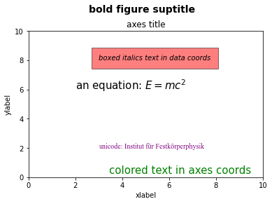
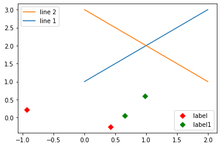

# Task04 文字图例尽眉目

## 1 知识梳理

### 1.1 Figure和Axes上的文本

1. text方法
   - pyplot API：matplotlib.pyplot.text(x, y, s, fontdict=None, \*\*kwargs)  
   - OO API：Axes.text(self, x, y, s, fontdict=None, \*\*kwargs)
   - 相关参数：
      - s：此参数是要添加的文本。  
      - xy：此参数是放置文本的点(x，y)。  
      - fontdict：此参数是一个可选参数，并且是一个覆盖默认文本属性的字典。如果fontdict为None，则由rcParams确定默认值。

2. title和set_title方法
   - pyplot API：matplotlib.pyplot.title(label, fontdict=None, loc=None, pad=None, \*, y=None, \*\*kwargs)  
   - OO API：Axes.set_title(self, label, fontdict=None, loc=None, pad=None, \*, y=None, \*\*kwargs)
   - 相关参数：
      - label：str，此参数是要添加的文本  
      - fontdict：dict，此参数是控制title文本的外观，默认fontdict如下：
          ```python
          {'fontsize': rcParams['axes.titlesize'],
          'fontweight': rcParams['axes.titleweight'],
          'color': rcParams['axes.titlecolor'],
          'verticalalignment': 'baseline',
          'horizontalalignment': loc}
          ```
      - loc：str，{'center', 'left', 'right'}默认为center  
      - pad：float，该参数是指标题偏离图表顶部的距离，默认为6。  
      - y：float，该参数是title所在axes垂向的位置。默认值为1，即title位于axes的顶部。  
      - kwargs：该参数是指可以设置的一些奇特文本的属性。

3. figtext方法
   - pyplot API：matplotlib.pyplot.figtext(x, y, s, fontdict=None, \*\*kwargs)  
   - OO API：text(self, x, y, s, fontdict=None,\*\*kwargs)
   - 相关参数：
      - x,y：float，此参数是指在figure中放置文本的位置。一般取值是在$[0,1]$范围内。使用transform关键字可以更改坐标系。  
      - s：str，此参数是指文本  
      - fontdict：dict，此参数是一个可选参数，并且是一个覆盖默认文本属性的字典。如果fontdict为None，则由rcParams确定默认值。

4. suptitle方法
   - pyplot API：matplotlib.pyplot.suptitle(t, \*\*kwargs)  
   - OO API：suptitle(self, t, \*\*kwargs)
   - 相关参数：
      - t：str，标题的文本  
      - x：float，默认值是0.5。该参数是指文本在figure坐标系下的x坐标  
      - y：float，默认值是0.95。该参数是指文本在figure坐标系下的y坐标  
      - horizontalalignment, ha：该参数是指选择文本水平对齐方式，有三种选择{'center', 'left', right'}，默认值是 'center'  
      - verticalalignment, va：该参数是指选择文本垂直对齐方式，有四种选择{'top', 'center', 'bottom', 'baseline'}，默认值是 'top'  
      - fontsize, size：该参数是指文本的大小，默认值是依据rcParams的设置：rcParams["figure.titlesize"] (default: 'large')  
      - fontweight, weight：该参数是用来设置字重。默认值是依据rcParams的设置：rcParams["figure.titleweight"] (default: 'normal')  
      - [fontproperties](https://matplotlib.org/api/font_manager_api.html#matplotlib.font_manager.FontProperties)：None or dict，该参数是可选参数，如果该参数被指定，字体的大小将从该参数的默认值中提取。

5. xlabel和ylabel
   - yplot API：  
    matplotlib.pyplot.xlabel(xlabel, fontdict=None, labelpad=None, \*, loc=None, \*\*kwargs)  
    matplotlib.pyplot.ylabel(ylabel, fontdict=None, labelpad=None, \*, loc=None, \*\*kwargs) 
   - OO API：   
    Axes.set_xlabel(self, xlabel, fontdict=None, labelpad=None, \*, loc=None, \*\*kwargs)   
    Axes.set_ylabel(self, ylabel, fontdict=None, labelpad=None, \*, loc=None, \*\*kwargs) 
   - 相关参数：
       - xlabel或者ylabel：label的文本  
       - labelpad：设置label距离轴(axis)的距离  
       - loc：{'left', 'center', 'right'},默认为center  
       - \*\*kwargs：[文本](https://matplotlib.org/api/text_api.html#matplotlib.text.Text)属性

6. 字体属性的设置
   - 全局字体设置：使用`plt.rcParams`进行设置
   - 局部字体设置：在方法中直接使用`fontproperties`进行设置

### 1.2 Tick上的文本

1. 简单模式
   - 使用axis的`set_ticks`方法设置标签位置
   - 使用axis的`set_ticklabels`方法设置标签格式
   - 使用axis的`set_ticks_position`方法设置刻度所在位置

2. Tick Formatters
   - 使用axis实例的`set_major_formatter`和`set_minor_formatter`方法设置标签格式
      - 字符串格式：`matplotlib.ticker.StrMethodFormatter`
      - 函数参数：`matplotlib.ticker.FuncFormatter`    

3. Tick Locators
  - 使用axis实例的`set_major_locator`和`set_minor_locator`方法设置标签位置
  - 设置locator类型：
    ```python
    locator=plt.MaxNLocator(nbins=7)  
    # 直接指定刻度所在的位置  
    locator=plt.FixedLocator(locs=[0,0.5,1.5,2.5,3.5,4.5,5.5,6])
    # 自动分配刻度值的位置
    locator=plt.AutoLocator()
    # 面元间距是1，从0.5开始
    locator=plt.IndexLocator(offset=0.5, base=1)
    # 将刻度的标签设置为1.5的倍数
    locator=plt.MultipleLocator(1.5)  
    # 线性划分5等分，4个刻度
    locator=plt.LinearLocator(numticks=5)  
    ```

### 1.3 legend（图例）

常用的几个参数：

1. 设置图列位置

plt.legend(loc='upper center') 等同于plt.legend(loc=9)

|  |
| --- |
| 0: ‘best' |
| 1: ‘upper right' |  
| 2: ‘upper left' |  
| 3: ‘lower left' |   
| 4: ‘lower right' | 
| 5: ‘right' | 
| 6: ‘center left' |                                          |    
| 7: ‘center right' | 
| 8: ‘lower center'  |
| 9: ‘upper center'  |
| 10: ‘center' |  

2. 设置图例字体大小  
fontsize : int or float or {‘xx-small’, ‘x-small’, ‘small’, ‘medium’, ‘large’, ‘x-large’, ‘xx-large’}

3. 设置图例边框及背景  
plt.legend(loc='best',frameon=False) #去掉图例边框  
plt.legend(loc='best',edgecolor='blue') #设置图例边框颜色  
plt.legend(loc='best',facecolor='blue') #设置图例背景颜色,若无边框,参数无效

4. 设置图例标题  
legend = plt.legend(["CH", "US"], title='China VS Us')

5. 设置图例名字及对应关系  
legend = plt.legend([p1, p2], ["CH", "US"])

## 2 实战练习

### 2.1 Figure和Axes上的文本应用


```python
import matplotlib
import matplotlib.pyplot as plt

fig = plt.figure()
ax = fig.add_subplot(111)
fig.subplots_adjust(top=0.85)

# 分别在figure和subplot上设置title
fig.suptitle('bold figure suptitle', fontsize=14, fontweight='bold')
ax.set_title('axes title')

ax.set_xlabel('xlabel')
ax.set_ylabel('ylabel')

# 设置x-axis和y-axis的范围都是[0, 10]
ax.axis([0, 10, 0, 10])

ax.text(3, 8, 'boxed italics text in data coords', style='italic',
        bbox={'facecolor': 'red', 'alpha': 0.5, 'pad': 10})

ax.text(2, 6, r'an equation: $E=mc^2$', fontsize=15)
font1 = {'family': 'Times New Roman',
        'color':  'purple',
        'weight': 'normal',
        'size': 10,
        }
ax.text(3, 2, 'unicode: Institut für Festkörperphysik',fontdict=font1)
ax.text(0.95, 0.01, 'colored text in axes coords',
        verticalalignment='bottom', horizontalalignment='right',
        transform=ax.transAxes,
        color='green', fontsize=15)

plt.show()
```


    

    


### 2.2 Tick上的文本应用


```python
import matplotlib.pyplot as plt
import numpy as np

x = np.linspace(-3, 3, 50)
y1 = 2*x+1
y2 = x**2
plt.figure()

# 绘制y2
plt.plot(x, y2)
# 绘制y1，红色，线宽为1，虚线
plt.plot(x, y1, color='red', linewidth=1.0, linestyle='--')
# 设置横纵轴的范围
plt.xlim((-3, 5))
plt.ylim((-3, 5))
# 设置标签
plt.xlabel('x')
plt.ylabel('y')

# 设置新刻度
new_ticks1 = np.linspace(-3, 5, 5)
plt.xticks(new_ticks1)
plt.yticks([-2, 0, 2, 5], [r'$one\ shu$', r'$\alpha$', r'$three$', r'four'])
'''
上一行代码是将y轴上的小标改成文字,其中，空格需要增加\，即'\ ',$可将格式更改成数字模式，如果需要输入数学形式的α，则需要用\转换，即\alpha
如果使用面向对象的命令进行画图，那么下面两行代码可以实现与 plt.yticks([-2,0,2,5],[r'$one\ shu$',r'$\alpha$',r'$three$',r'four']) 同样的功能
axs.set_yticks([-2,0,2,5])
axs.set_yticklabels([r'$one\ shu$',r'$\alpha$',r'$three$',r'four'])
'''

# gca = 'get current axes' 获取现在的轴
ax = plt.gca()  
'''
ax = plt.gca()是获取当前的axes，其中gca代表的是get current axes。
fig=plt.gcf是获取当前的figure，其中gcf代表的是get current figure。

许多函数都是对当前的Figure或Axes对象进行处理，
例如plt.plot()实际上会通过plt.gca()获得当前的Axes对象ax，然后再调用ax.plot()方法实现真正的绘图。
'''

'''
而在本例中则可以通过ax.spines方法获得当前顶部和右边的轴并将其颜色设置为不可见
然后将左边轴和底部的轴所在的位置重新设置
最后再通过set_ticks_position方法设置ticks在x轴或y轴的位置，本示例中因所设置的bottom和left是ticks在x轴或y轴的默认值，所以这两行的代码也可以不写
'''
ax.spines['top'].set_color('none')
ax.spines['right'].set_color('none')
ax.spines['left'].set_position(('data', 0))
ax.spines['bottom'].set_position(('data', 0))  # axes 百分比
ax.xaxis.set_ticks_position('bottom')  # 设置ticks在x轴的位置
ax.yaxis.set_ticks_position('left')  # 设置ticks在y轴的位置
plt.show()
```


    

    


### 2.3 多图例应用


```python
import matplotlib.pyplot as plt
import numpy as np

x = np.random.uniform(-1, 1, 4)
y = np.random.uniform(-1, 1, 4)
# 绘制直线p1
p1, = plt.plot([1, 2, 3])
# 绘制直线p2
p2, = plt.plot([3, 2, 1])
# 绘制图例
l1 = plt.legend([p2, p1], ["line 2", "line 1"], loc='upper left')

# 绘制散点图p3
p3 = plt.scatter(x[0:2], y[0:2], marker='D', color='r')
# 绘制散点图p4
p4 = plt.scatter(x[2:], y[2:], marker='D', color='g')
# 添加了新的legend，将l1从legend中给移除
plt.legend([p3, p4], ['label', 'label1'], loc='lower right', scatterpoints=1)
# 为了保留之前的l1这个legend，必须要通过plt.gca()获得当前的axes，
# 然后将l1作为单独的artist
plt.gca().add_artist(l1)
```


    <matplotlib.legend.Legend at 0x17662530288>


    

    


## 3 总结

&emsp;&emsp;本次任务，主要介绍了Figure、Axes和Tick上的文本应用，以及legend图例的使用。详细讲解了`text`、`title`、`set_title`、`figtext`、`subtitle`、`xlabel`、`ylabel`和字体的属性设置；Tick上的文本主要分为Locators（标签位置）和Formatters（标签格式化）的应用；通过讲解legend（图例）的常用参数，展示了多图例的使用方式。
