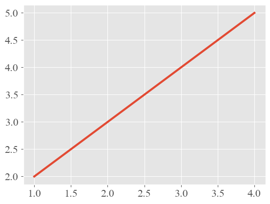
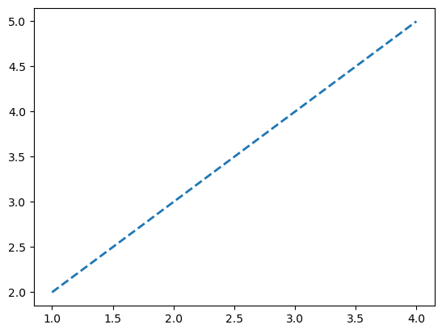
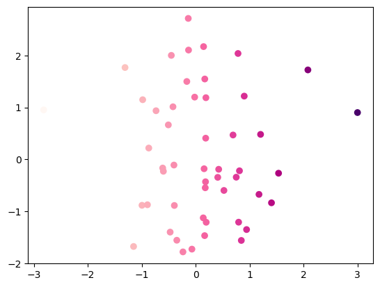
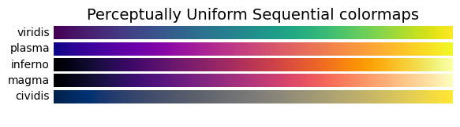
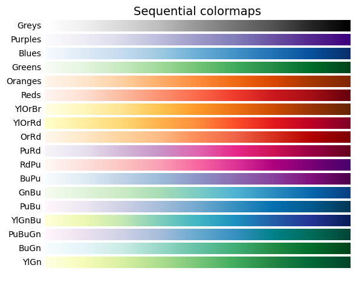
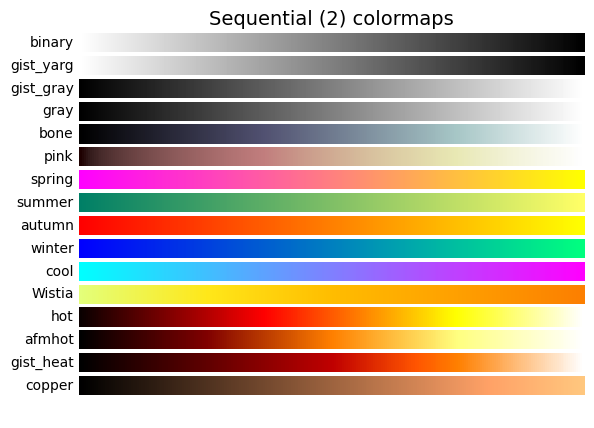
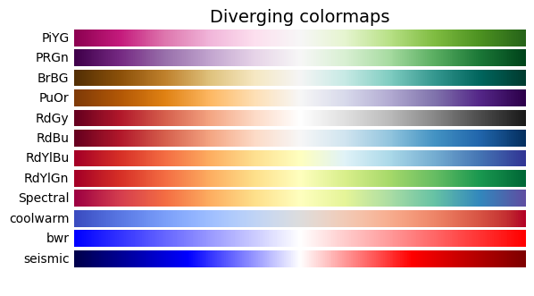
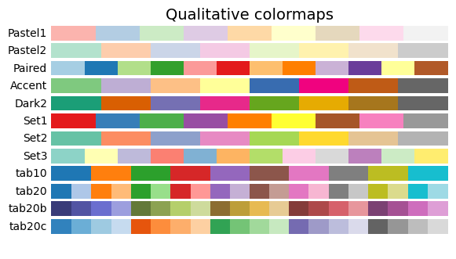
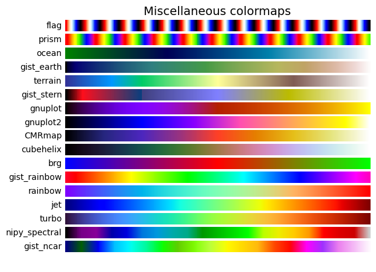

# Task05 样式色彩秀芳华


```python
import matplotlib as mpl
import matplotlib.pyplot as plt
import numpy as np
```

## 1 知识梳理

### 1.1 绘图样式

1. 预定义样式
    - 使用`plt.style.use(style_name)`调用不同内置样式
    - 总共有26种丰富的样式


```python
print(plt.style.available)
```

    ['Solarize_Light2', '_classic_test_patch', 'bmh', 'classic', 'dark_background', 'fast', 'fivethirtyeight', 'ggplot', 'grayscale', 'seaborn', 'seaborn-bright', 'seaborn-colorblind', 'seaborn-dark', 'seaborn-dark-palette', 'seaborn-darkgrid', 'seaborn-deep', 'seaborn-muted', 'seaborn-notebook', 'seaborn-paper', 'seaborn-pastel', 'seaborn-poster', 'seaborn-talk', 'seaborn-ticks', 'seaborn-white', 'seaborn-whitegrid', 'tableau-colorblind10']
    

2. 用户自定义样式
    - 创建一个后缀名为mplstyle的样式
    - 引用该自定义的样式

3. 设置rcParams
    - 通过修改默认rc设置改变样式
    - 使用`mpl.rcParams[style_name]`

4. 修改matplotlibrc文件
    - 通过`mpl.matplotlib_fname()`查看文件路径
    - 编辑样式文件

### 1.2 颜色设置

- 可将颜色分为色相、亮度和饱和度三个视觉通道
- 色相：没有明显的顺序性、一般不用来表达数据量的高低，而是用来表达数据列的类别
- 亮度和饱和度：在视觉上很容易区分出优先级的高低、被用作表达顺序或者表达数据量视觉通道
- 配色参考：[学会这6个可视化配色基本技巧，还原数据本身的意义](https://zhuanlan.zhihu.com/p/88892542)

1. RGB或RGBA：表示red、green、blue、alpha，其中alpha表示透明度
2. HEX RGB或HEX RGBA：用十六进制颜色码表示，最后两位表示透明度
3. 灰度色阶：只有一个位于[0,1]的值时，表示灰度色阶
4. 单字符基本颜色：共有8个基本颜色，分别是'b', 'g', 'r', 'c', 'm', 'y', 'k', 'w'，对应的是blue, green, red, cyan, magenta, yellow, black, white的英文缩写
5. 颜色名称：颜色对照表，可查询颜色对应的名称


6. 使用colormap设置一组颜色
    - 顺序（Sequential）：通常使用单一色调，逐渐改变亮度和颜色渐渐增加，用于表示有顺序的信息
    - 发散（Diverging）：改变两种不同颜色的亮度和饱和度，这些颜色在中间以不饱和的颜色相遇；当绘制的信息具有关键中间值（例如地形）或数据偏离零时，应使用此值
    - 循环（Cyclic）：改变两种不同颜色的亮度，在中间和开始/结束时以不饱和的颜色相遇。用于在端点处环绕的值，例如相角，风向或一天中的时间
    - 定性（Qualitative）：常用杂色，用来表示没有排序或关系的信息
    - 杂色（Miscellaneous）：一些在特定场景使用的杂色组合，如彩虹，海洋，地形等

## 2 实战练习

### 2.1 设置用户自定义样式


```python
plt.style.use(['default', 'ggplot', '../file/presentation.mplstyle'])

plt.rcParams['font.sans-serif'] = ['Times New Roman']
plt.plot([1,2,3,4], [2,3,4,5])
```


    [<matplotlib.lines.Line2D at 0x1c6fc81c6c8>]


    

    


### 2.2 设置rcParams


```python
 # 恢复到默认样式
plt.style.use('default')

# 设置线宽
mpl.rcParams['lines.linewidth'] = 2
# 设置虚线
mpl.rcParams['lines.linestyle'] = '--'
plt.plot([1,2,3,4],[2,3,4,5])
```


    [<matplotlib.lines.Line2D at 0x1c6fc89f588>]


    

    


```python
# 设置线宽为4，设置线样式
mpl.rc('lines', linewidth=4, linestyle='-.')

plt.plot([1,2,3,4],[2,3,4,5])
```


    [<matplotlib.lines.Line2D at 0x1c6fc915d08>]


    

    


### 2.3 使用colormap设置一组颜色


```python
x = np.random.randn(50)
y = np.random.randn(50)

# 设置从红到紫的渐变色组
plt.scatter(x,y,c=x,cmap='RdPu')
```


    <matplotlib.collections.PathCollection at 0x1c6fc987688>


    

    


## 3 课后习题

### 3.1 习题1

&emsp;&emsp;查阅matplotlib官网，列举出Sequential，Diverging，Cyclic，Qualitative，Miscellaneous分别有哪些内置的colormap，并以`代码绘图`的形式展现出来

**解答：**

**第1步：查询5种颜色分类**

根据官网页面可以查询[五种colormap的字符串表示和颜色图的对应关系](https://matplotlib.org/stable/tutorials/colors/colormaps.html)，各分类的颜色如下：


```python
import numpy as np
import matplotlib as mpl
import matplotlib.pyplot as plt
from matplotlib import cm
from collections import OrderedDict

cmaps = OrderedDict()

mpl.style.use('default')
```


```python
cmaps['Perceptually Uniform Sequential'] = [
    'viridis', 'plasma', 'inferno', 'magma', 'cividis']

cmaps['Sequential'] = [
    'Greys', 'Purples', 'Blues', 'Greens', 'Oranges', 'Reds',
    'YlOrBr', 'YlOrRd', 'OrRd', 'PuRd', 'RdPu', 'BuPu',
    'GnBu', 'PuBu', 'YlGnBu', 'PuBuGn', 'BuGn', 'YlGn']

cmaps['Sequential (2)'] = [
    'binary', 'gist_yarg', 'gist_gray', 'gray', 'bone', 'pink',
    'spring', 'summer', 'autumn', 'winter', 'cool', 'Wistia',
    'hot', 'afmhot', 'gist_heat', 'copper']
```


```python
cmaps['Diverging'] = [
    'PiYG', 'PRGn', 'BrBG', 'PuOr', 'RdGy', 'RdBu',
    'RdYlBu', 'RdYlGn', 'Spectral', 'coolwarm', 'bwr', 'seismic']
```


```python
cmaps['Cyclic'] = ['twilight', 'twilight_shifted', 'hsv']
```


```python
cmaps['Qualitative'] = ['Pastel1', 'Pastel2', 'Paired', 'Accent',
                        'Dark2', 'Set1', 'Set2', 'Set3',
                        'tab10', 'tab20', 'tab20b', 'tab20c']
```


```python
cmaps['Miscellaneous'] = [
            'flag', 'prism', 'ocean', 'gist_earth', 'terrain', 'gist_stern',
            'gnuplot', 'gnuplot2', 'CMRmap', 'cubehelix', 'brg',
            'gist_rainbow', 'rainbow', 'jet', 'turbo', 'nipy_spectral',
            'gist_ncar']
```

**第2步：绘制颜色条形图**


```python
gradient = np.linspace(0, 1, 256)
gradient = np.vstack((gradient, gradient))
```


```python
def plot_color_gradients(cmap_category, cmap_list):
    # Create figure and adjust figure height to number of colormaps
    nrows = len(cmap_list)
    # 设置figure的高度，根据该类的颜色个数调整
    figh = 0.35 + 0.15 + (nrows + (nrows - 1) * 0.1) * 0.22
    # 包括标题行，共nrows+1行
    fig, axs = plt.subplots(nrows=nrows + 1, figsize=(6.4, figh))
    # 调整figure
    fig.subplots_adjust(top=1 - 0.35 / figh, bottom=0.15 / figh,
                        left=0.2, right=0.99)
    # 设置标题
    axs[0].set_title(cmap_category + ' colormaps', fontsize=14)

    # 绘制颜色条形图
    for ax, name in zip(axs, cmap_list):
        ax.imshow(gradient, aspect='auto', cmap=plt.get_cmap(name))
        ax.text(-0.01, 0.5, name, va='center', ha='right', fontsize=10,
                transform=ax.transAxes)

    # Turn off *all* ticks & spines, not just the ones with colormaps.
    for ax in axs:
        ax.set_axis_off()


for cmap_category, cmap_list in cmaps.items():
    plot_color_gradients(cmap_category, cmap_list)

plt.show()
```


    

    


    

    


    

    


    

    


    

    


    

    


    

    


## 4 总结

&emsp;&emsp;本次任务，主要介绍了matplotlib的绘图样式和颜色设置，其中绘图样式主要讲解了内置样式、自定义样式、设置rcParams和修改matplitlibrc文件，颜色设置主要包括RGB/RGBA、HEX RGB/HEX RGBA、灰度色阶、单字符基本颜色（共8个），以及通过使用colormap设置一组颜色，从而进行各种颜色组合。
