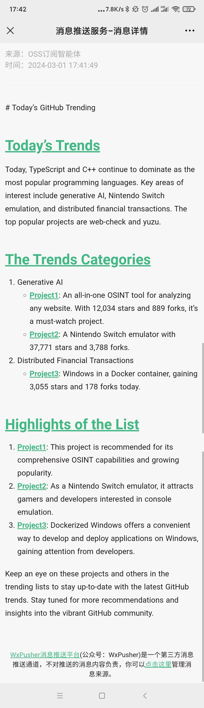

# Task04 复现OSS-订阅智能体

## 1 基本介绍

- 订阅智能体：让Agent为我们关注某些想关注的信息，当有我们关注的事件发生时，Agent获取信息并进行处理，然后通过一些如邮件、微信、discord等通知渠道将处理后的信息发送给我们。
- 需求分析：基于Agent的Role，配置一个资讯订阅员，主要包含两种工作：从外界信息源中搜集信息和对搜集得到的信息进行总结。

## 2 实现方案

1. 实现一个OSSWatcher的Role：帮我们关注并分析热门的开源项目，当有相关信息时将信息推送给我们，这里需要确定让OSS从哪个网页获取信息。
2. 触发Trigger：指这个OSSWatcher角色运行的触发条件，可以是定时触发或者是某个网站有更新时触发。
3. 结果Callback：处理OSSWatcher角色运行生成的信息，将数据发送到微信或者discord。

## 3 实现OSSWatcher的Role

- 分析思路：从GitHub Trending网页爬取热门开源项目信息，再从编程语言优势、项目类型和用途、社区活跃度、新兴技术和工具等方面分析热门开源项目。


```python
import asyncio
import os
from typing import Any
from typing import Optional

import aiohttp
import fire
from aiocron import crontab
from bs4 import BeautifulSoup
from metagpt.actions.action import Action
from metagpt.environment import Environment
from metagpt.logs import logger
from metagpt.roles import Role
from metagpt.schema import Message
from metagpt.subscription import SubscriptionRunner
from pytz import BaseTzInfo, timezone
```

从`https://github.com/trending`中爬取项目链接、项目描述、编写语言、star数、fork数、今日star数。


```python
class CrawlOSSTrending(Action):

    async def run(self, url: str = "https://github.com/trending"):
        async with aiohttp.ClientSession() as client:
            async with client.get(url) as response:
                response.raise_for_status()
                html = await response.text()
 
        soup = BeautifulSoup(html, 'html.parser')
    
        repositories = []
    
        for article in soup.select('article.Box-row'):
            repo_info = {}
            
            repo_info['name'] = article.select_one('h2 a').text.strip().replace("\n", "").replace(" ", "")
            repo_info['url'] = "https://github.com" + article.select_one('h2 a')['href'].strip()
    
            # Description
            description_element = article.select_one('p')
            repo_info['description'] = description_element.text.strip() if description_element else None
    
            # Language
            language_element = article.select_one('span[itemprop="programmingLanguage"]')
            repo_info['language'] = language_element.text.strip() if language_element else None
    
            # Stars and Forks
            stars_element = article.select('a.Link--muted')[0]
            forks_element = article.select('a.Link--muted')[1]
            repo_info['stars'] = stars_element.text.strip()
            repo_info['forks'] = forks_element.text.strip()
    
            # Today's Stars
            today_stars_element = article.select_one('span.d-inline-block.float-sm-right')
            repo_info['today_stars'] = today_stars_element.text.strip() if today_stars_element else None
    
            repositories.append(repo_info)
    
        return repositories
```

从以下几个角度分析，并按照一定的格式输出：
- 今天榜单的整体趋势，例如哪几个编程语言比较热门、最热门的项目是哪些、主要集中在哪些领域。
- 榜单的仓库分类。
- 推荐进一步关注哪些仓库，推荐原因是什么。


```python
TRENDING_ANALYSIS_PROMPT = """# Requirements
You are a GitHub Trending Analyst, aiming to provide users with insightful and personalized recommendations based on the latest
GitHub Trends. Based on the context, fill in the following missing information, generate engaging and informative titles, 
ensuring users discover repositories aligned with their interests.

# The title about Today's GitHub Trending
## Today's Trends: Uncover the Hottest GitHub Projects Today! Explore the trending programming languages and discover key domains capturing developers' attention. From ** to **, witness the top projects like never before.
## The Trends Categories: Dive into Today's GitHub Trending Domains! Explore featured projects in domains such as ** and **. Get a quick overview of each project, including programming languages, stars, and more.
## Highlights of the List: Spotlight noteworthy projects on GitHub Trending, including new tools, innovative projects, and rapidly gaining popularity, focusing on delivering distinctive and attention-grabbing content for users.
---
# Format Example

# [Title]

## Today's Trends
Today, ** and ** continue to dominate as the most popular programming languages. Key areas of interest include **, ** and **.
The top popular projects are Project1 and Project2.

## The Trends Categories
1. Generative AI
    - [Project1](https://github/xx/project1): [detail of the project, such as star total and today, language, ...]
    - [Project2](https://github/xx/project2): ...
...

## Highlights of the List
1. [Project1](https://github/xx/project1): [provide specific reasons why this project is recommended].
...

---
# Github Trending
{trending}
"""

class AnalysisOSSTrending(Action):

    async def run(
        self,
        trending: Any
    ):
        return await self._aask(TRENDING_ANALYSIS_PROMPT.format(trending=trending))
```


```python
class OssWatcher(Role):
    def __init__(
            self,
            name="Codey",
            profile="OssWatcher",
            goal="Generate an insightful GitHub Trending analysis report.",
            constraints="Only analyze based on the provided GitHub Trending data.",
    ):
        super().__init__(name=name, profile=profile, goal=goal, constraints=constraints)
        self._init_actions([CrawlOSSTrending, AnalysisOSSTrending])
        self._set_react_mode(react_mode="by_order")

    async def _act(self) -> Message:
        logger.info(f"{self._setting}: ready to {self.rc.todo}")
        # By choosing the Action by order under the hood
        # todo will be first SimpleWriteCode() then SimpleRunCode()
        todo = self.rc.todo

        msg = self.get_memories(k=1)[0]  # find the most k recent messages
        result = await todo.run(msg.content)

        msg = Message(content=str(result), role=self.profile, cause_by=type(todo))
        self.rc.memory.add(msg)
        return msg
```

## 4 实现Trigger

实现触发器`Trigger`，按照设定的时间，触发执行动作。


```python
class GithubTrendingCronTrigger:
    def __init__(
        self,
        spec: str,
        tz: Optional[BaseTzInfo] = None,
        url: str = "https://github.com/trending",
    ) -> None:
        self.crontab = crontab(spec, tz=tz)
        self.url = url

    def __aiter__(self):
        return self

    async def __anext__(self):
        await self.crontab.next()
        return Message(content=self.url)
```

## 5 实现Callback

- Callback：定义如何处理智能体生成的信息。
- 实现目标：基于[WxPusher微信推送服务](https://wxpusher.zjiecode.com/docs/#/?id=%e8%8e%b7%e5%8f%96apptoken)将智能体产生的数据发送到微信。


```python
class WxPusherClient:
    def __init__(self, token: Optional[str] = None, base_url: str = "http://wxpusher.zjiecode.com"):
        self.base_url = base_url
        self.token = token or os.environ["WXPUSHER_TOKEN"]

    async def send_message(
        self,
        content,
        summary: Optional[str] = None,
        content_type: int = 1,
        topic_ids: Optional[list[int]] = None,
        uids: Optional[list[int]] = None,
        verify: bool = False,
        url: Optional[str] = None,
    ):
        payload = {
            "appToken": self.token,
            "content": content,
            "summary": summary,
            "contentType": content_type,
            "topicIds": topic_ids or [],
            "uids": uids or os.environ["WXPUSHER_UIDS"].split(","),
            "verifyPay": verify,
            "url": url,
        }
        url = f"{self.base_url}/api/send/message"
        return await self._request("POST", url, json=payload)

    async def _request(self, method, url, **kwargs):
        async with aiohttp.ClientSession() as session:
            async with session.request(method, url, **kwargs) as response:
                response.raise_for_status()
                return await response.json()
```


```python
async def wxpusher_callback(msg: Message):
    client = WxPusherClient()
    await client.send_message(msg.content, content_type=3)
```

## 6 运行代码

配置系统环境变量`WXPUSHER_TOKEN`、`WXPUSHER_UIDS`。


```python
async def main(spec: str = "42 17 * * *", wxpusher: bool = True):
    callbacks = []
    if wxpusher:
        callbacks.append(wxpusher_callback)

    if not callbacks:
        async def _print(msg: Message):
            print(msg.content)

        callbacks.append(_print)

    async def callback(msg):
        await asyncio.gather(*(call(msg) for call in callbacks))

    runner = SubscriptionRunner()
    await runner.subscribe(OssWatcher(), GithubTrendingCronTrigger(spec), callback)
    await runner.run()
```


```python
await main()
```

    2024-03-01 17:41:13.126 | INFO     | metagpt.config:get_default_llm_provider_enum:126 - API: LLMProviderEnum.ZHIPUAI
    2024-03-01 17:42:00.001 | INFO     | __main__:_act:14 - Codey(OssWatcher): ready to CrawlOSSTrending
    E:\LearningDisk\Learning_Projects\MyPythonProjects\my-team-learning\venv\lib\site-packages\bs4\builder\__init__.py:314: RuntimeWarning: coroutine 'main' was never awaited
      for attr in list(attrs.keys()):
    RuntimeWarning: Enable tracemalloc to get the object allocation traceback
    2024-03-01 17:42:00.911 | INFO     | __main__:_act:14 - Codey(OssWatcher): ready to AnalysisOSSTrending
    

     # Today's GitHub Trending
    
    ## Today's Trends
    Today, TypeScript and C++ continue to dominate as the most popular programming languages. Key areas of interest include generative AI, Nintendo Switch emulation, and distributed financial transactions. The top popular projects are web-check and yuzu.
    
    ## The Trends Categories
    1. Generative AI
        - [Project1](https://github.com/Lissy93/web-check): An all-in-one OSINT tool for analyzing any website. With 12,034 stars and 889 forks, it's a must-watch project.
        - [Project2](https://github.com/yuzu-emu/yuzu): A Nintendo Switch emulator with 37,771 stars and 3,788 forks.
    2. Distributed Financial Transactions
        - [Project3](https://github.com/dockur/windows): Windows in a Docker container, gaining 3,055 stars and 178 forks today.
    
    ## Highlights of the List
    1. [Project1](https://github.com/Lissy93/web-check): This project is recommended for its comprehensive OSINT capabilities and growing popularity.
    2. [Project2](https://github.com/yuzu-emu/yuzu): As a Nintendo Switch emulator, it attracts gamers and developers interested in console emulation.
    3. [Project3](https://github.com/dockur/windows): Dockerized Windows offers a convenient way to develop and deploy applications on Windows, gaining attention from developers.
    
    Keep an eye on these projects and others in the trending lists to stay up-to-date with the latest GitHub trends. Stay tuned for more recommendations and insights into the vibrant GitHub community.

    2024-03-01 17:42:26.476 | INFO     | metagpt.utils.cost_manager:update_cost:48 - Total running cost: $0.000 | Max budget: $10.000 | Current cost: $0.000, prompt_tokens: 2872, completion_tokens: 411
    


设置定时时间，当时间触发之后，可以在推送平台上收到消息。


消息详情：


