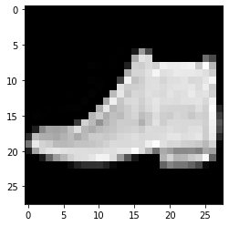

# Task03 基础实战（FashionMNIST时装分类）

## 1 导入包


```python
import os
import numpy as np
import pandas as pd
import torch
import torch.nn as nn
import torch.optim as optim
from torch.utils.data import Dataset, DataLoader
```

## 2 配置训练环境和超参数


```python
# 使用GPU环境
device = torch.device("cuda:1" if torch.cuda.is_available() else "cpu")
```


```python
# 配置其他超参数
batch_size = 256
# 在Windows环境下，需要将num_workers改为0，否则会存在多线程问题
num_workers = 0
lr = 1e-4
epochs = 20
```

## 3 数据读取和加载


```python
from torchvision import transforms

# 设置数据变换
image_size = 28
data_transform = transforms.Compose([
    transforms.ToPILImage(),   # 这一步取决于后续的数据读取方式，如果使用内置数据集则不需要
    transforms.Resize(image_size),
    transforms.ToTensor()
])
```


```python
# 自定义数据集
# csv数据下载链接：https://www.kaggle.com/zalando-research/fashionmnist
class FMDataset(Dataset):
    def __init__(self, df, transform=None):
        self.df = df
        self.transform = transform
        self.images = df.iloc[:,1:].values.astype(np.uint8)
        self.labels = df.iloc[:, 0].values
        
    def __len__(self):
        return len(self.images)
    
    def __getitem__(self, idx):
        image = self.images[idx].reshape(28,28,1)
        label = int(self.labels[idx])
        if self.transform is not None:
            image = self.transform(image)
        else:
            image = torch.tensor(image/255., dtype=torch.float)
        label = torch.tensor(label, dtype=torch.long)
        return image, label
```


```python
train_df = pd.read_csv("./FashionMNIST/fashion-mnist_train.csv")
test_df = pd.read_csv("./FashionMNIST/fashion-mnist_test.csv")
```


```python
train_data = FMDataset(train_df, data_transform)
test_data = FMDataset(test_df, data_transform)
```


```python
# 使用DataLoader类加载数据
train_loader = DataLoader(train_data, batch_size=batch_size, shuffle=True, num_workers=num_workers, drop_last=True)
test_loader = DataLoader(test_data, batch_size=batch_size, shuffle=False, num_workers=num_workers)
```


```python
import matplotlib.pyplot as plt
image, label = next(iter(train_loader))
print(image.shape, label.shape)
plt.imshow(image[0][0], cmap="gray")
```

    torch.Size([256, 1, 28, 28]) torch.Size([256])
    <matplotlib.image.AxesImage at 0x1b39b49fcc8>

    

    


## 4 模型设计


```python
# 使用CNN
class Net(nn.Module):
    def __init__(self):
        super(Net, self).__init__()
        self.conv = nn.Sequential(
            nn.Conv2d(1, 32, 5),
            nn.ReLU(),
            nn.MaxPool2d(2, stride=2),
            nn.Dropout(0.3),
            nn.Conv2d(32, 64, 5),
            nn.ReLU(),
            nn.MaxPool2d(2, stride=2),
            nn.Dropout(0.3)
        )
        self.fc = nn.Sequential(
            nn.Linear(64*4*4, 512),
            nn.ReLU(),
            nn.Linear(512, 10)
        )
        
    def forward(self, x):
        x = self.conv(x)
        x = x.view(-1, 64*4*4)
        x = self.fc(x)
        # x = nn.functional.normalize(x)
        return x
```


```python
model = Net()
model = model.cuda()
```

## 5 设置损失函数和优化器


```python
# 使用交叉熵损失函数
criterion = nn.CrossEntropyLoss()
```


```python
# 使用Adam优化器
optimizer = optim.Adam(model.parameters(), lr=0.001)
```

## 6 训练和验证


```python
def train(epoch):
    # 设置训练状态
    model.train()
    train_loss = 0
    # 循环读取DataLoader中的全部数据
    for data, label in train_loader:
        # 将数据放到GPU用于后续计算
        data, label = data.cuda(), label.cuda()
        # 将优化器的梯度清0
        optimizer.zero_grad()
        # 将数据输入给模型
        output = model(data)
        # 设置损失函数
        loss = criterion(output, label)
        # 将loss反向传播给网络
        loss.backward()
        # 使用优化器更新模型参数
        optimizer.step()
        # 累加训练损失
        train_loss += loss.item() * data.size(0)
    train_loss = train_loss/len(train_loader.dataset)
    print('Epoch: {} \tTraining Loss: {:.6f}'.format(epoch, train_loss))
```


```python
def val(epoch): 
    # 设置验证状态
    model.eval()
    val_loss = 0
    gt_labels = []
    pred_labels = []
    # 不设置梯度
    with torch.no_grad():
        for data, label in test_loader:
            data, label = data.cuda(), label.cuda()
            output = model(data)
            preds = torch.argmax(output, 1)
            gt_labels.append(label.cpu().data.numpy())
            pred_labels.append(preds.cpu().data.numpy())
            loss = criterion(output, label)
            val_loss += loss.item()*data.size(0)
    # 计算验证集的平均损失
    val_loss = val_loss/len(test_loader.dataset)
    gt_labels, pred_labels = np.concatenate(gt_labels), np.concatenate(pred_labels)
    # 计算准确率
    acc = np.sum(gt_labels==pred_labels)/len(pred_labels)
    print('Epoch: {} \tValidation Loss: {:.6f}, Accuracy: {:6f}'.format(epoch, val_loss, acc))
```


```python
for epoch in range(1, epochs+1):
    train(epoch)
    val(epoch)
```

    Epoch: 1 	Training Loss: 0.664049
    Epoch: 1 	Validation Loss: 0.421500, Accuracy: 0.852400
    Epoch: 2 	Training Loss: 0.417311
    Epoch: 2 	Validation Loss: 0.349790, Accuracy: 0.871200
    Epoch: 3 	Training Loss: 0.355448
    Epoch: 3 	Validation Loss: 0.318987, Accuracy: 0.879500
    Epoch: 4 	Training Loss: 0.323644
    Epoch: 4 	Validation Loss: 0.290521, Accuracy: 0.893800
    Epoch: 5 	Training Loss: 0.301900
    Epoch: 5 	Validation Loss: 0.266420, Accuracy: 0.901300
    Epoch: 6 	Training Loss: 0.286696
    Epoch: 6 	Validation Loss: 0.246448, Accuracy: 0.909700
    Epoch: 7 	Training Loss: 0.271441
    Epoch: 7 	Validation Loss: 0.241845, Accuracy: 0.911200
    Epoch: 8 	Training Loss: 0.260185
    Epoch: 8 	Validation Loss: 0.243311, Accuracy: 0.910800
    Epoch: 9 	Training Loss: 0.247986
    Epoch: 9 	Validation Loss: 0.225896, Accuracy: 0.916200
    Epoch: 10 	Training Loss: 0.240718
    Epoch: 10 	Validation Loss: 0.227848, Accuracy: 0.914700
    Epoch: 11 	Training Loss: 0.232358
    Epoch: 11 	Validation Loss: 0.220180, Accuracy: 0.917500
    Epoch: 12 	Training Loss: 0.223933
    Epoch: 12 	Validation Loss: 0.215308, Accuracy: 0.919400
    Epoch: 13 	Training Loss: 0.218354
    Epoch: 13 	Validation Loss: 0.211890, Accuracy: 0.919300
    Epoch: 14 	Training Loss: 0.210027
    Epoch: 14 	Validation Loss: 0.209707, Accuracy: 0.922700
    Epoch: 15 	Training Loss: 0.203024
    Epoch: 15 	Validation Loss: 0.208233, Accuracy: 0.925600
    Epoch: 16 	Training Loss: 0.196965
    Epoch: 16 	Validation Loss: 0.208209, Accuracy: 0.921900
    Epoch: 17 	Training Loss: 0.193155
    Epoch: 17 	Validation Loss: 0.200000, Accuracy: 0.926100
    Epoch: 18 	Training Loss: 0.184376
    Epoch: 18 	Validation Loss: 0.197259, Accuracy: 0.926200
    Epoch: 19 	Training Loss: 0.184272
    Epoch: 19 	Validation Loss: 0.200259, Accuracy: 0.926000
    Epoch: 20 	Training Loss: 0.172641
    Epoch: 20 	Validation Loss: 0.200177, Accuracy: 0.927100
    

## 7 模型保存


```python
save_path = "./FahionModel.pkl"
torch.save(model, save_path)
```
