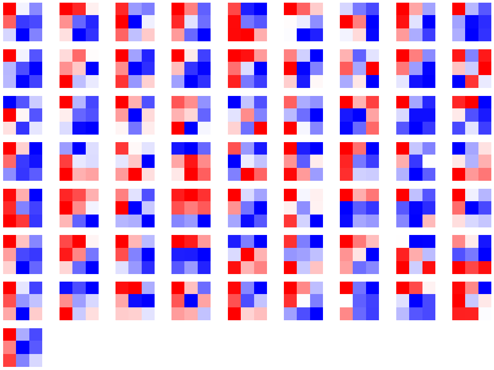

# Task06 PyTorch可视化

## 1 可视化网络结构

- 打印模型基础信息：使用`print()`函数，只能打印出基础构件的信息，不能显示每一层的shape和对应参数量的大小


```python
import torchvision.models as models

model = models.resnet18()
```


```python
print(model)
```

    ResNet(
      (conv1): Conv2d(3, 64, kernel_size=(7, 7), stride=(2, 2), padding=(3, 3), bias=False)
      (bn1): BatchNorm2d(64, eps=1e-05, momentum=0.1, affine=True, track_running_stats=True)
      (relu): ReLU(inplace=True)
      (maxpool): MaxPool2d(kernel_size=3, stride=2, padding=1, dilation=1, ceil_mode=False)
      (layer1): Sequential(
        (0): BasicBlock(
          (conv1): Conv2d(64, 64, kernel_size=(3, 3), stride=(1, 1), padding=(1, 1), bias=False)
          (bn1): BatchNorm2d(64, eps=1e-05, momentum=0.1, affine=True, track_running_stats=True)
          (relu): ReLU(inplace=True)
          (conv2): Conv2d(64, 64, kernel_size=(3, 3), stride=(1, 1), padding=(1, 1), bias=False)
          (bn2): BatchNorm2d(64, eps=1e-05, momentum=0.1, affine=True, track_running_stats=True)
        )
        (1): BasicBlock(
          (conv1): Conv2d(64, 64, kernel_size=(3, 3), stride=(1, 1), padding=(1, 1), bias=False)
          (bn1): BatchNorm2d(64, eps=1e-05, momentum=0.1, affine=True, track_running_stats=True)
          (relu): ReLU(inplace=True)
          (conv2): Conv2d(64, 64, kernel_size=(3, 3), stride=(1, 1), padding=(1, 1), bias=False)
          (bn2): BatchNorm2d(64, eps=1e-05, momentum=0.1, affine=True, track_running_stats=True)
        )
      )
      (layer2): Sequential(
        (0): BasicBlock(
          (conv1): Conv2d(64, 128, kernel_size=(3, 3), stride=(2, 2), padding=(1, 1), bias=False)
          (bn1): BatchNorm2d(128, eps=1e-05, momentum=0.1, affine=True, track_running_stats=True)
          (relu): ReLU(inplace=True)
          (conv2): Conv2d(128, 128, kernel_size=(3, 3), stride=(1, 1), padding=(1, 1), bias=False)
          (bn2): BatchNorm2d(128, eps=1e-05, momentum=0.1, affine=True, track_running_stats=True)
          (downsample): Sequential(
            (0): Conv2d(64, 128, kernel_size=(1, 1), stride=(2, 2), bias=False)
            (1): BatchNorm2d(128, eps=1e-05, momentum=0.1, affine=True, track_running_stats=True)
          )
        )
        (1): BasicBlock(
          (conv1): Conv2d(128, 128, kernel_size=(3, 3), stride=(1, 1), padding=(1, 1), bias=False)
          (bn1): BatchNorm2d(128, eps=1e-05, momentum=0.1, affine=True, track_running_stats=True)
          (relu): ReLU(inplace=True)
          (conv2): Conv2d(128, 128, kernel_size=(3, 3), stride=(1, 1), padding=(1, 1), bias=False)
          (bn2): BatchNorm2d(128, eps=1e-05, momentum=0.1, affine=True, track_running_stats=True)
        )
      )
      (layer3): Sequential(
        (0): BasicBlock(
          (conv1): Conv2d(128, 256, kernel_size=(3, 3), stride=(2, 2), padding=(1, 1), bias=False)
          (bn1): BatchNorm2d(256, eps=1e-05, momentum=0.1, affine=True, track_running_stats=True)
          (relu): ReLU(inplace=True)
          (conv2): Conv2d(256, 256, kernel_size=(3, 3), stride=(1, 1), padding=(1, 1), bias=False)
          (bn2): BatchNorm2d(256, eps=1e-05, momentum=0.1, affine=True, track_running_stats=True)
          (downsample): Sequential(
            (0): Conv2d(128, 256, kernel_size=(1, 1), stride=(2, 2), bias=False)
            (1): BatchNorm2d(256, eps=1e-05, momentum=0.1, affine=True, track_running_stats=True)
          )
        )
        (1): BasicBlock(
          (conv1): Conv2d(256, 256, kernel_size=(3, 3), stride=(1, 1), padding=(1, 1), bias=False)
          (bn1): BatchNorm2d(256, eps=1e-05, momentum=0.1, affine=True, track_running_stats=True)
          (relu): ReLU(inplace=True)
          (conv2): Conv2d(256, 256, kernel_size=(3, 3), stride=(1, 1), padding=(1, 1), bias=False)
          (bn2): BatchNorm2d(256, eps=1e-05, momentum=0.1, affine=True, track_running_stats=True)
        )
      )
      (layer4): Sequential(
        (0): BasicBlock(
          (conv1): Conv2d(256, 512, kernel_size=(3, 3), stride=(2, 2), padding=(1, 1), bias=False)
          (bn1): BatchNorm2d(512, eps=1e-05, momentum=0.1, affine=True, track_running_stats=True)
          (relu): ReLU(inplace=True)
          (conv2): Conv2d(512, 512, kernel_size=(3, 3), stride=(1, 1), padding=(1, 1), bias=False)
          (bn2): BatchNorm2d(512, eps=1e-05, momentum=0.1, affine=True, track_running_stats=True)
          (downsample): Sequential(
            (0): Conv2d(256, 512, kernel_size=(1, 1), stride=(2, 2), bias=False)
            (1): BatchNorm2d(512, eps=1e-05, momentum=0.1, affine=True, track_running_stats=True)
          )
        )
        (1): BasicBlock(
          (conv1): Conv2d(512, 512, kernel_size=(3, 3), stride=(1, 1), padding=(1, 1), bias=False)
          (bn1): BatchNorm2d(512, eps=1e-05, momentum=0.1, affine=True, track_running_stats=True)
          (relu): ReLU(inplace=True)
          (conv2): Conv2d(512, 512, kernel_size=(3, 3), stride=(1, 1), padding=(1, 1), bias=False)
          (bn2): BatchNorm2d(512, eps=1e-05, momentum=0.1, affine=True, track_running_stats=True)
        )
      )
      (avgpool): AdaptiveAvgPool2d(output_size=(1, 1))
      (fc): Linear(in_features=512, out_features=1000, bias=True)
    )
    

- 可视化网络结构：使用`torchinfo`库进行模型网络的结构输出，可以得到更加详细的信息，包括模块信息（每一层的类型、输出shape和参数量）、模型整体的参数量、模型大小、一次前向或者反向传播需要的内存大小等


```python
import torchvision.models as models
from torchinfo import summary

resnet18 = models.resnet18() # 实例化模型
# 其中batch_size为1，图片的通道数为3，图片的高宽为224
summary(model, (1, 3, 224, 224))
```

    
    ==========================================================================================
    Layer (type:depth-idx)                   Output Shape              Param #
    ==========================================================================================
    ResNet                                   --                        --
    ├─Conv2d: 1-1                            [1, 64, 112, 112]         9,408
    ├─BatchNorm2d: 1-2                       [1, 64, 112, 112]         128
    ├─ReLU: 1-3                              [1, 64, 112, 112]         --
    ├─MaxPool2d: 1-4                         [1, 64, 56, 56]           --
    ├─Sequential: 1-5                        [1, 64, 56, 56]           --
    │    └─BasicBlock: 2-1                   [1, 64, 56, 56]           --
    │    │    └─Conv2d: 3-1                  [1, 64, 56, 56]           36,864
    │    │    └─BatchNorm2d: 3-2             [1, 64, 56, 56]           128
    │    │    └─ReLU: 3-3                    [1, 64, 56, 56]           --
    │    │    └─Conv2d: 3-4                  [1, 64, 56, 56]           36,864
    │    │    └─BatchNorm2d: 3-5             [1, 64, 56, 56]           128
    │    │    └─ReLU: 3-6                    [1, 64, 56, 56]           --
    │    └─BasicBlock: 2-2                   [1, 64, 56, 56]           --
    │    │    └─Conv2d: 3-7                  [1, 64, 56, 56]           36,864
    │    │    └─BatchNorm2d: 3-8             [1, 64, 56, 56]           128
    │    │    └─ReLU: 3-9                    [1, 64, 56, 56]           --
    │    │    └─Conv2d: 3-10                 [1, 64, 56, 56]           36,864
    │    │    └─BatchNorm2d: 3-11            [1, 64, 56, 56]           128
    │    │    └─ReLU: 3-12                   [1, 64, 56, 56]           --
    ├─Sequential: 1-6                        [1, 128, 28, 28]          --
    │    └─BasicBlock: 2-3                   [1, 128, 28, 28]          --
    │    │    └─Conv2d: 3-13                 [1, 128, 28, 28]          73,728
    │    │    └─BatchNorm2d: 3-14            [1, 128, 28, 28]          256
    │    │    └─ReLU: 3-15                   [1, 128, 28, 28]          --
    │    │    └─Conv2d: 3-16                 [1, 128, 28, 28]          147,456
    │    │    └─BatchNorm2d: 3-17            [1, 128, 28, 28]          256
    │    │    └─Sequential: 3-18             [1, 128, 28, 28]          8,448
    │    │    └─ReLU: 3-19                   [1, 128, 28, 28]          --
    │    └─BasicBlock: 2-4                   [1, 128, 28, 28]          --
    │    │    └─Conv2d: 3-20                 [1, 128, 28, 28]          147,456
    │    │    └─BatchNorm2d: 3-21            [1, 128, 28, 28]          256
    │    │    └─ReLU: 3-22                   [1, 128, 28, 28]          --
    │    │    └─Conv2d: 3-23                 [1, 128, 28, 28]          147,456
    │    │    └─BatchNorm2d: 3-24            [1, 128, 28, 28]          256
    │    │    └─ReLU: 3-25                   [1, 128, 28, 28]          --
    ├─Sequential: 1-7                        [1, 256, 14, 14]          --
    │    └─BasicBlock: 2-5                   [1, 256, 14, 14]          --
    │    │    └─Conv2d: 3-26                 [1, 256, 14, 14]          294,912
    │    │    └─BatchNorm2d: 3-27            [1, 256, 14, 14]          512
    │    │    └─ReLU: 3-28                   [1, 256, 14, 14]          --
    │    │    └─Conv2d: 3-29                 [1, 256, 14, 14]          589,824
    │    │    └─BatchNorm2d: 3-30            [1, 256, 14, 14]          512
    │    │    └─Sequential: 3-31             [1, 256, 14, 14]          33,280
    │    │    └─ReLU: 3-32                   [1, 256, 14, 14]          --
    │    └─BasicBlock: 2-6                   [1, 256, 14, 14]          --
    │    │    └─Conv2d: 3-33                 [1, 256, 14, 14]          589,824
    │    │    └─BatchNorm2d: 3-34            [1, 256, 14, 14]          512
    │    │    └─ReLU: 3-35                   [1, 256, 14, 14]          --
    │    │    └─Conv2d: 3-36                 [1, 256, 14, 14]          589,824
    │    │    └─BatchNorm2d: 3-37            [1, 256, 14, 14]          512
    │    │    └─ReLU: 3-38                   [1, 256, 14, 14]          --
    ├─Sequential: 1-8                        [1, 512, 7, 7]            --
    │    └─BasicBlock: 2-7                   [1, 512, 7, 7]            --
    │    │    └─Conv2d: 3-39                 [1, 512, 7, 7]            1,179,648
    │    │    └─BatchNorm2d: 3-40            [1, 512, 7, 7]            1,024
    │    │    └─ReLU: 3-41                   [1, 512, 7, 7]            --
    │    │    └─Conv2d: 3-42                 [1, 512, 7, 7]            2,359,296
    │    │    └─BatchNorm2d: 3-43            [1, 512, 7, 7]            1,024
    │    │    └─Sequential: 3-44             [1, 512, 7, 7]            132,096
    │    │    └─ReLU: 3-45                   [1, 512, 7, 7]            --
    │    └─BasicBlock: 2-8                   [1, 512, 7, 7]            --
    │    │    └─Conv2d: 3-46                 [1, 512, 7, 7]            2,359,296
    │    │    └─BatchNorm2d: 3-47            [1, 512, 7, 7]            1,024
    │    │    └─ReLU: 3-48                   [1, 512, 7, 7]            --
    │    │    └─Conv2d: 3-49                 [1, 512, 7, 7]            2,359,296
    │    │    └─BatchNorm2d: 3-50            [1, 512, 7, 7]            1,024
    │    │    └─ReLU: 3-51                   [1, 512, 7, 7]            --
    ├─AdaptiveAvgPool2d: 1-9                 [1, 512, 1, 1]            --
    ├─Linear: 1-10                           [1, 1000]                 513,000
    ==========================================================================================
    Total params: 11,689,512
    Trainable params: 11,689,512
    Non-trainable params: 0
    Total mult-adds (G): 1.81
    ==========================================================================================
    Input size (MB): 0.60
    Forward/backward pass size (MB): 39.75
    Params size (MB): 46.76
    Estimated Total Size (MB): 87.11
    ==========================================================================================


## 2 CNN可视化

- CNN卷积核可视化


```python
model = models.vgg11(pretrained=True)
dict(model.features.named_children())
```


    {'0': Conv2d(3, 64, kernel_size=(3, 3), stride=(1, 1), padding=(1, 1)),
     '1': ReLU(inplace=True),
     '2': MaxPool2d(kernel_size=2, stride=2, padding=0, dilation=1, ceil_mode=False),
     '3': Conv2d(64, 128, kernel_size=(3, 3), stride=(1, 1), padding=(1, 1)),
     '4': ReLU(inplace=True),
     '5': MaxPool2d(kernel_size=2, stride=2, padding=0, dilation=1, ceil_mode=False),
     '6': Conv2d(128, 256, kernel_size=(3, 3), stride=(1, 1), padding=(1, 1)),
     '7': ReLU(inplace=True),
     '8': Conv2d(256, 256, kernel_size=(3, 3), stride=(1, 1), padding=(1, 1)),
     '9': ReLU(inplace=True),
     '10': MaxPool2d(kernel_size=2, stride=2, padding=0, dilation=1, ceil_mode=False),
     '11': Conv2d(256, 512, kernel_size=(3, 3), stride=(1, 1), padding=(1, 1)),
     '12': ReLU(inplace=True),
     '13': Conv2d(512, 512, kernel_size=(3, 3), stride=(1, 1), padding=(1, 1)),
     '14': ReLU(inplace=True),
     '15': MaxPool2d(kernel_size=2, stride=2, padding=0, dilation=1, ceil_mode=False),
     '16': Conv2d(512, 512, kernel_size=(3, 3), stride=(1, 1), padding=(1, 1)),
     '17': ReLU(inplace=True),
     '18': Conv2d(512, 512, kernel_size=(3, 3), stride=(1, 1), padding=(1, 1)),
     '19': ReLU(inplace=True),
     '20': MaxPool2d(kernel_size=2, stride=2, padding=0, dilation=1, ceil_mode=False)}


```python
import matplotlib.pyplot as plt

conv1 = dict(model.features.named_children())['3']
# 得到第3层的卷积层参数
kernel_set = conv1.weight.detach()
num = len(conv1.weight.detach())
print(kernel_set.shape)
# 该代码仅可视化其中一个维度的卷积核，第3层的卷积核有128*64个
for i in range(0, 1):
    i_kernel = kernel_set[i]
    plt.figure(figsize=(20, 17))
    if (len(i_kernel)) > 1:
        for idx, filer in enumerate(i_kernel):
            plt.subplot(9, 9, idx+1) 
            plt.axis('off')
            plt.imshow(filer[ :, :].detach(),cmap='bwr')
```

    torch.Size([128, 64, 3, 3])
    


    

    


- CNN特征图可视化：使用PyTorch提供的hook结构，得到网络在前向传播过程中的特征图。

- CNN class activation map可视化：用于在CNN可视化场景下，判断图像中哪些像素点对预测结果是重要的，可使用`grad-cam`库进行操作

- 使用FlashTorch快速实现CNDD可视化：可以使用`flashtorch`库，可视化梯度和卷积核

## 3 使用TensorBoard可视化训练过程

- 可视化基本逻辑：TensorBoard记录模型每一层的feature map、权重和训练loss等，并保存在用户指定的文件夹中，通过网页形式进行可视化展示

- 模型结构可视化：使用`add_graph`方法，在TensorBoard下展示模型结构


```python
import torch.nn as nn

class Net(nn.Module):
    def __init__(self):
        super(Net, self).__init__()
        self.conv1 = nn.Conv2d(in_channels=3,out_channels=32,kernel_size = 3)
        self.pool = nn.MaxPool2d(kernel_size = 2,stride = 2)
        self.conv2 = nn.Conv2d(in_channels=32,out_channels=64,kernel_size = 5)
        self.adaptive_pool = nn.AdaptiveMaxPool2d((1,1))
        self.flatten = nn.Flatten()
        self.linear1 = nn.Linear(64,32)
        self.relu = nn.ReLU()
        self.linear2 = nn.Linear(32,1)
        self.sigmoid = nn.Sigmoid()

    def forward(self,x):
        x = self.conv1(x)
        x = self.pool(x)
        x = self.conv2(x)
        x = self.pool(x)
        x = self.adaptive_pool(x)
        x = self.flatten(x)
        x = self.linear1(x)
        x = self.relu(x)
        x = self.linear2(x)
        y = self.sigmoid(x)
        return y
```


```python
model = Net()
print(model)
```

    Net(
      (conv1): Conv2d(3, 32, kernel_size=(3, 3), stride=(1, 1))
      (pool): MaxPool2d(kernel_size=2, stride=2, padding=0, dilation=1, ceil_mode=False)
      (conv2): Conv2d(32, 64, kernel_size=(5, 5), stride=(1, 1))
      (adaptive_pool): AdaptiveMaxPool2d(output_size=(1, 1))
      (flatten): Flatten(start_dim=1, end_dim=-1)
      (linear1): Linear(in_features=64, out_features=32, bias=True)
      (relu): ReLU()
      (linear2): Linear(in_features=32, out_features=1, bias=True)
      (sigmoid): Sigmoid()
    )
    


```python
from torch.utils.tensorboard import SummaryWriter

writer = SummaryWriter('./runs')
writer.add_graph(model, input_to_model = torch.rand(1, 3, 224, 224))
writer.close()
```

在当前目录下，执行`tensorboard --logdir=./runs`命令，打开TensorBoard可视化页面，看到模型网络结构。


- 图像可视化：
  - 对于单张图片的显示使用`add_image`
  - 对于多张图片的显示使用`add_images`
  - 有时需要使用`torchvision.utils.make_grid`将多张图片拼成一张图片后，用`writer.add_image`显示

- 连续变量可视化：使用`add_scalar`方法，对连续变量（或时序变量）的变化过程进行可视化展示


```python
for i in range(500):
    x = i
    y = x ** 2
    writer.add_scalar("x", x, i) #日志中记录x在第step i 的值
    writer.add_scalar("y", y, i) #日志中记录y在第step i 的值
writer.close()
```

- 参数分布可视化：使用`add_histogram`方法，对参数（或变量）的分布进行可视化展示


```python
import numpy as np

# 创建正态分布的张量模拟参数矩阵
def norm(mean, std):
    t = std * torch.randn((100, 20)) + mean
    return t

for step, mean in enumerate(range(-10, 10, 1)):
    w = norm(mean, 1)
    writer.add_histogram("w", w, step)
    writer.flush()
writer.close()
```

## 4 总结

&emsp;&emsp;本次任务，主要介绍了PyTorch可视化，包括可视化网络结构、CNN卷积层可视化和使用TensorBoard可视化训练过程。
1. 使用`torchinfo`库，可视化模型网络结构，展示模块信息（每一层的类型、输出shape和参数量）、模型整体的参数量、模型大小、一次前向或者反向传播需要的内存大小等。
2. 使用`grad-cam`库，可视化重要像素点，能够快速确定重要区域，进行可解释性分析或模型优化改进。
3. 通过`TensorBoard`工具，调用相关方法创建训练记录，可视化模型结构、图像、连续变量和参数分布等。
