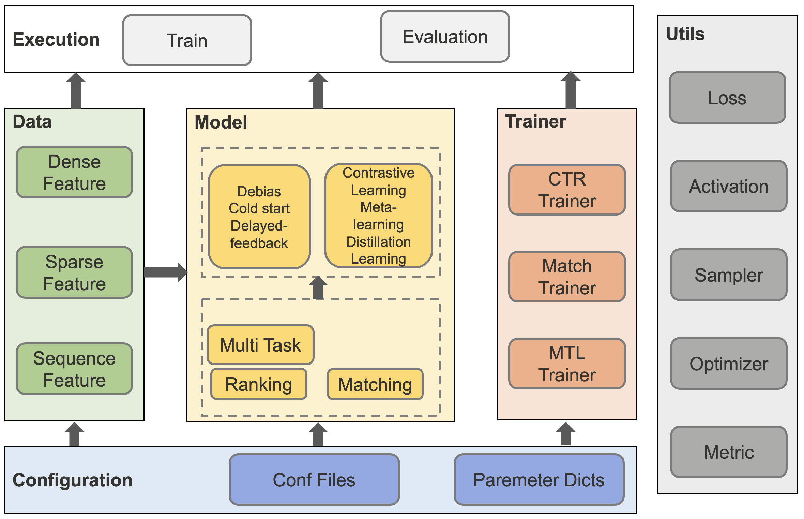

# Task01 熟悉Torch-RecHub框架设计与使用方法

## 1 Torch-RecHub框架

### 1.1 框架概述

- 核心定位：易使用易扩展、可复现业界实用的推荐模型、聚焦泛生态化的模型复现研究
- 工程设计：基于PyTorch原生的类和函数，模型训练与模型定义解耦，无basemodel，在符合论文思想的基础上，使同学快速上手
- 学习参考：参考`DeepCTR`、`FuxiCTR`等优秀开源框架的特性

### 1.2 主要特性

- `scikit-learn`风格易用的API（`fit`、`predict`），开箱即用
- 模型训练与模型定义解耦，易拓展，可针对不同类型的模型设置不同的训练机制
- 支持`pandas`的`DataFrame`、`Dict`等数据类型的输入，降低上手成本
- 高度模块化，支持常见`Layer`，容易调用组装形成新的模型
  - LR、MLP、FM、FFM、CIN
  - target-attention、self-attention、transformer
- 支持常见排序模型
  - WideDeep、DeepFM、DIN、DCN、xDeepFM等
- 支持常见召回模型
  - DSSM、YoutubeDNN、YoutubeDSSM、FacebookEBR、MIND等
- 丰富的多任务学习支持
  - SharedBottom、ESMM、MMOE、PLE、AITM等模型
  - GradNorm、UWL、MetaBanlance等动态loss加权机制
- 聚焦更生态化的推荐场景
- 支持丰富的训练机制

### 1.3 架构设计



&emsp;&emsp;Torch-RecHub主要由数据处理模块、模型层模块和训练器模块组成：

1. 数据处理模块
  - 特征处理：DenseFeature（用于构建数值型特征）、SparseFeature（用于处理类别型特征）、SequenceFeature（用于处理序列特征）
  - 数据构造：DataGenerator（数据生成器，用于创建三大数据集）

2. 模型层模块
  - 排序模型：WideDeep、DeepFM、DCN、xDeepFM、DIN、DIEN、SIM
  - 召回模型：DSSM、YoutubeDNN、YoutubeSBC、FaceBookDSSM、Gru4Rec、MIND、SASRec、ComiRec
  - 多任务模型：SharedBottom、ESMM、MMOE、PLE、AITM

3. 训练器模块
  - CTRTrainer：用于精排模型训练与评估
  - MTLTrainer：用于多任务排序模型训练与评估
  - MatchTrainer：用于召回模型训练与评估

## 2 Torch-RecHub的使用

&emsp;&emsp;以下采用小样本的criteo数据集，仅有115条数据。该数据集是`Criteo Labs`发布的在线广告数据集。它包含数百万个展示广告的点击反馈记录，该数据可作为点击率（CTR）预测的基准。数据集具有40个特征，第1列是标签，其中值1表示已点击广告，而值0表示未点击广告。其他特征包含13个dense特征和26个sparse特征。


```python
import numpy as np
import pandas as pd
import torch
from tqdm import tqdm
from sklearn.preprocessing import MinMaxScaler, LabelEncoder
from torch_rechub.basic.features import DenseFeature, SparseFeature
from torch_rechub.utils.data import DataGenerator
from torch_rechub.trainers import CTRTrainer
from torch_rechub.models.ranking import WideDeep
```


```python
data_path = './data/criteo/criteo_sample.csv'
# 导入数据集
data = pd.read_csv(data_path)
data.head()
```


<div>
<style scoped>
    .dataframe tbody tr th:only-of-type {
        vertical-align: middle;
    }

    .dataframe tbody tr th {
        vertical-align: top;
    }

    .dataframe thead th {
        text-align: right;
    }
</style>
<table border="1" class="dataframe">
  <thead>
    <tr style="text-align: right;">
      <th></th>
      <th>label</th>
      <th>I1</th>
      <th>I2</th>
      <th>I3</th>
      <th>I4</th>
      <th>I5</th>
      <th>I6</th>
      <th>I7</th>
      <th>I8</th>
      <th>I9</th>
      <th>...</th>
      <th>C17</th>
      <th>C18</th>
      <th>C19</th>
      <th>C20</th>
      <th>C21</th>
      <th>C22</th>
      <th>C23</th>
      <th>C24</th>
      <th>C25</th>
      <th>C26</th>
    </tr>
  </thead>
  <tbody>
    <tr>
      <th>0</th>
      <td>0</td>
      <td>0.0</td>
      <td>0</td>
      <td>104.0</td>
      <td>27.0</td>
      <td>1990.0</td>
      <td>142.0</td>
      <td>4.0</td>
      <td>32.0</td>
      <td>37.0</td>
      <td>...</td>
      <td>e5ba7672</td>
      <td>25c88e42</td>
      <td>21ddcdc9</td>
      <td>b1252a9d</td>
      <td>0e8585d2</td>
      <td>NaN</td>
      <td>32c7478e</td>
      <td>0d4a6d1a</td>
      <td>001f3601</td>
      <td>92c878de</td>
    </tr>
    <tr>
      <th>1</th>
      <td>0</td>
      <td>0.0</td>
      <td>-1</td>
      <td>63.0</td>
      <td>40.0</td>
      <td>1470.0</td>
      <td>61.0</td>
      <td>4.0</td>
      <td>37.0</td>
      <td>46.0</td>
      <td>...</td>
      <td>e5ba7672</td>
      <td>d3303ea5</td>
      <td>21ddcdc9</td>
      <td>b1252a9d</td>
      <td>7633c7c8</td>
      <td>NaN</td>
      <td>32c7478e</td>
      <td>17f458f7</td>
      <td>001f3601</td>
      <td>71236095</td>
    </tr>
    <tr>
      <th>2</th>
      <td>0</td>
      <td>0.0</td>
      <td>370</td>
      <td>4.0</td>
      <td>1.0</td>
      <td>1787.0</td>
      <td>65.0</td>
      <td>14.0</td>
      <td>25.0</td>
      <td>489.0</td>
      <td>...</td>
      <td>3486227d</td>
      <td>642f2610</td>
      <td>55dd3565</td>
      <td>b1252a9d</td>
      <td>5c8dc711</td>
      <td>NaN</td>
      <td>423fab69</td>
      <td>45ab94c8</td>
      <td>2bf691b1</td>
      <td>c84c4aec</td>
    </tr>
    <tr>
      <th>3</th>
      <td>1</td>
      <td>19.0</td>
      <td>10</td>
      <td>30.0</td>
      <td>10.0</td>
      <td>1.0</td>
      <td>3.0</td>
      <td>33.0</td>
      <td>47.0</td>
      <td>126.0</td>
      <td>...</td>
      <td>e5ba7672</td>
      <td>a78bd508</td>
      <td>21ddcdc9</td>
      <td>5840adea</td>
      <td>c2a93b37</td>
      <td>NaN</td>
      <td>32c7478e</td>
      <td>1793a828</td>
      <td>e8b83407</td>
      <td>2fede552</td>
    </tr>
    <tr>
      <th>4</th>
      <td>0</td>
      <td>0.0</td>
      <td>0</td>
      <td>36.0</td>
      <td>22.0</td>
      <td>4684.0</td>
      <td>217.0</td>
      <td>9.0</td>
      <td>35.0</td>
      <td>135.0</td>
      <td>...</td>
      <td>e5ba7672</td>
      <td>7ce63c71</td>
      <td>NaN</td>
      <td>NaN</td>
      <td>af5dc647</td>
      <td>NaN</td>
      <td>dbb486d7</td>
      <td>1793a828</td>
      <td>NaN</td>
      <td>NaN</td>
    </tr>
  </tbody>
</table>
<p>5 rows × 40 columns</p>
</div>


```python
dense_features = [f for f in data.columns.tolist() if f[0] == "I"]
sparse_features = [f for f in data.columns.tolist() if f[0] == "C"]
# 数据NaN值填充，对sparse特征的NaN数据填充字符串为-996，对dense特征的NaN数据填充0
data[sparse_features] = data[sparse_features].fillna('-996',)
data[dense_features] = data[dense_features].fillna(0,)
```


```python
def convert_numeric_feature(val):
    v = int(val)
    if v > 2:
        return int(np.log(v)**2)
    else:
        return v - 2
```


```python
# 进行归一化
for feat in dense_features:
    sparse_features.append(feat + "_cat")
    data[feat + "_cat"] = data[feat].apply(lambda x: convert_numeric_feature(x))

sca = MinMaxScaler()  #scaler dense feature
data[dense_features] = sca.fit_transform(data[dense_features])
```


```python
# 处理sparse特征数据
for feat in sparse_features:
    lbe = LabelEncoder()
    data[feat] = lbe.fit_transform(data[feat])
```


```python
# 得到最终的数据
dense_feas = [DenseFeature(feature_name) for feature_name in dense_features]
sparse_feas = [SparseFeature(feature_name, vocab_size=data[feature_name].nunique(), embed_dim=16) for feature_name in sparse_features]
y = data["label"]
del data["label"]
x = data
```


```python
# 构造数据生成器
data_generator = DataGenerator(x, y)
```


```python
batch_size = 2048

# 将数据集分隔成训练集70%、验证集10%和测试集20%
train_dataloader, val_dataloader, test_dataloader = data_generator.generate_dataloader(split_ratio=[0.7, 0.1], batch_size=batch_size)
```

    the samples of train : val : test are  80 : 11 : 24
    


```python
# 配置多层感知器模块的参数
mlp_params={
    "dims": [256, 128], 
    "dropout": 0.2, 
    "activation": "relu"}

# 构建WideDeep模型
model = WideDeep(wide_features=dense_feas, deep_features=sparse_feas, mlp_params=mlp_params)
```


```python
learning_rate = 1e-3
weight_decay = 1e-3

device = 'cuda:0'
save_dir = './models/'
epoch = 2

optimizer_params={
    "lr": learning_rate, 
    "weight_decay": weight_decay}

# 构建训练器
ctr_trainer = CTRTrainer(model, optimizer_params=optimizer_params, n_epoch=epoch, earlystop_patience=10, 
                         device=device, model_path=save_dir)
```


```python
# 模型训练
ctr_trainer.fit(train_dataloader, val_dataloader)
```

    epoch: 0
    

    train: 100%|███████████████████████████████████████████████████████████████████████████████████████████████████████████████████████████████████████████████████████████████████| 1/1 [00:12<00:00, 12.33s/it]
    validation: 100%|██████████████████████████████████████████████████████████████████████████████████████████████████████████████████████████████████████████████████████████████| 1/1 [00:10<00:00, 10.66s/it]
    

    epoch: 0 validation: auc: 0.35
    epoch: 1
    

    train: 100%|███████████████████████████████████████████████████████████████████████████████████████████████████████████████████████████████████████████████████████████████████| 1/1 [00:10<00:00, 10.71s/it]
    validation: 100%|██████████████████████████████████████████████████████████████████████████████████████████████████████████████████████████████████████████████████████████████| 1/1 [00:10<00:00, 10.69s/it]

    epoch: 1 validation: auc: 0.35
    

    
    


```python
# 模型评估
auc = ctr_trainer.evaluate(ctr_trainer.model, test_dataloader)
print(f'test auc: {auc}')
```

    validation: 100%|██████████████████████████████████████████████████████████████████████████████████████████████████████████████████████████████████████████████████████████████| 1/1 [00:10<00:00, 10.60s/it]

    test auc: 0.6203703703703703
    

    
    

## 3 总结

&emsp;&emsp;本次任务，主要介绍了Torch-RecHub框架和基本的使用方法：
1. Torch-RecHub框架主要基于PyTorch和sklearn，易使用易扩展、可复现业界实用的推荐模型，高度模块化，支持常见Layer，支持常见排序模型、召回模型、多任务学习；
2. 使用方法：使用DataGenerator构建数据加载器，通过构建轻量级的模型，并基于统一的训练器进行模型训练，最后完成模型评估。
