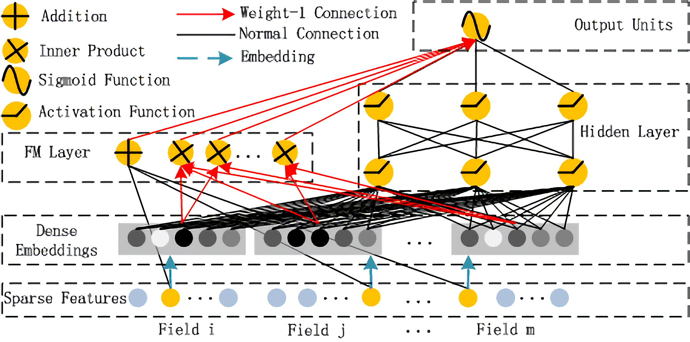
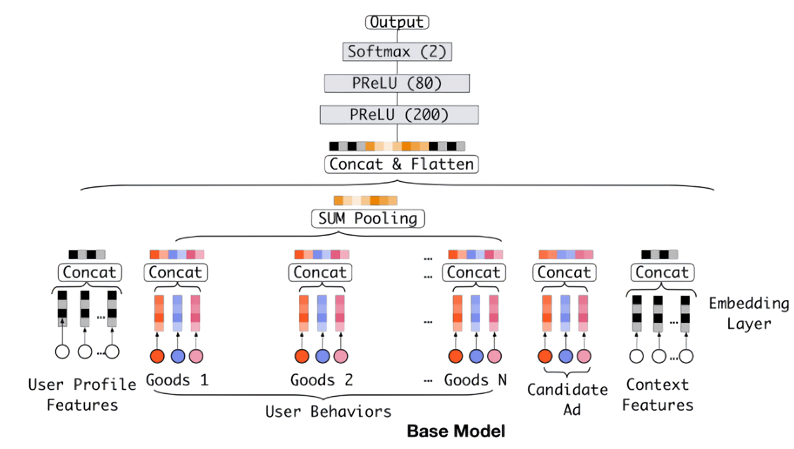

# Task02 精排模型：DeepFM、DIN

## 1 DeepFM（Wide&Deep系列）

### 1.1 DeepFM产生背景

- 解决DNN局限性：网络参数过大，将One Hot特征转换为Dense Vector
- FNN和PNN：使用预训练好的FM模块，连接到DNN上形成FNN模型，后又在Embedding layer和hidden layer1之间增加一个product层，使用product layer替换FM预训练层，形成PNN模型
- 低阶组合特征学习问题：由于FM和DNN的串行方式导致，学习到的低阶组合特征比较少

### 1.2 DeepFM模型



#### 1.2.1 FM部分

- FM Layer主要是由一阶特征和二阶特征组合，再经过Sigmoid得到logits
- 模型公式：
$$\hat{y}_{FM}(x) = w_0 + \sum_{i=1}^N w_i x_i + \sum_{i=1}^N \sum_{j=i+1}^N v_i^T v_j x_i x_j$$
FM的模型公式是一个通用的拟合方程，可以采用不同的损失函数用于解决regression、classification等问题，FM可以在线性时间对新样本作出预测

- 优点：
    1. 通过向量内积作为交叉特征的权重，可以在数据非常稀疏的情况下，有效地训练出交叉特征的权重（因为不需要两个特征同时不为零）
    2. 可以通过公式上的优化，得到$O(nk)$的计算复杂度，计算效率非常高
    3. 尽管推荐场景下的总体特征空间非常大，但是FM的训练和预测只需要处理样本中的非零特征，这也提升了模型训练和线上预测的速度
    4. 由于模型的计算效率高，并且在稀疏场景下可以自动挖掘长尾低频物料，可适用于召回、粗排和精排三个阶段。应用在不同阶段时，样本构造、拟合目标及线上服务都有所不同“

- 缺点：只能显示的做特征的二阶交叉，对于更高阶的交叉无能为力。

#### 1.2.2 Deep部分

- 模型构成：
    1. 使用全连接的方式将Dense Embedding输入到Hidden Layer，解决DNN中的参数爆炸问题
    2. Embedding层的输出是将所有id类特征对应的embedding向量连接到一起，并输入到DNN中
- 模型公式：
$$y_{DNN} = \sigma(W^L a^L + b^L)$$

### 1.3 DeepFM模型代码实现


```python
from torch_rechub.basic.layers import FM, MLP, LR, EmbeddingLayer
from tqdm import tqdm
import torch
```


```python
class DeepFM(torch.nn.Module):
    def __init__(self, deep_features, fm_features, mlp_params):
        """
        Deep和FM分别处理deep_features和fm_features两个不同的特征
        mlp_params表示MLP多层感知机的参数
        """
        super().__init__()
        self.deep_features = deep_features
        self.fm_features = fm_features
        self.deep_dims = sum([fea.embed_dim for fea in deep_features])
        self.fm_dims = sum([fea.embed_dim for fea in fm_features])
        # LR建模一阶特征交互
        self.linear = LR(self.fm_dims)
        # FM建模二阶特征交互
        self.fm = FM(reduce_sum=True)
        # 对特征做嵌入表征
        self.embedding = EmbeddingLayer(deep_features + fm_features)
        # 设置MLP多层感知机
        self.mlp = MLP(self.deep_dims, **mlp_params)

    def forward(self, x):
        # Dense Embeddings
        input_deep = self.embedding(x, self.deep_features, squeeze_dim=True) 
        input_fm = self.embedding(x, self.fm_features, squeeze_dim=False)
        
        y_linear = self.linear(input_fm.flatten(start_dim=1))
        y_fm = self.fm(input_fm)
        y_deep = self.mlp(input_deep)
        # 最终的预测值为一阶特征交互，二阶特征交互，以及深层模型的组合
        y = y_linear + y_fm + y_deep
        # 利用sigmoid将预测得分规整到0,1区间内
        return torch.sigmoid(y.squeeze(1))
```

## 2 DIN（序列模型）

### 2.1 DIN产生背景

- 创新点：基于用户的大量历史行为（历史购买过的商品或者类别信息），使用注意力机制对用户的兴趣动态模拟
- 解决个性化电商广告推荐业务场景下，广告点击预测任务无法表达用户广泛兴趣
- 解决因历史行为特征带来的特征维度规模过大的问题

### 2.2 DIN模型


#### 2.2.1 特征表达

&emsp;&emsp;基于multi-hot编码的用户历史行为特征的特征表示，由于特征没有交互组合，需要由神经网络学习得到。

#### 2.2.2 基线模型



- Embedding Layer：将高维稀疏的输入转成低维稠密向量
- Pooling Layer and Concat Layer：将用户的历史行为的上述Embedding结果变成一个定长的向量，并进行拼接作为MLP的输入
- MLP：全连接层，学习特征的各种交互
- Loss：使用如下公式计算损失
$$
L=-\frac{1}{N} \sum_{(\boldsymbol{x}, y) \in \mathcal{S}}(y \log p(\boldsymbol{x})+(1-y) \log (1-p(\boldsymbol{x})))
$$

#### 2.2.3 DIN的注意力单元

- 在当前候选广告和用户的历史行为之间引入注意力的机制，与当前商品更加相关的历史行为更能促进用户的点击行为
- 通过给定一个候选广告，新增对该广告相关的局部兴趣的注意力表示模拟，通过考虑用户历史行为的相关性来自适应地计算用户兴趣的表示向量，即`local activation unit`

- 用户兴趣表示
$$
\boldsymbol{v}_{U}(A)=f\left(\boldsymbol{v}_{A}, \boldsymbol{e}_{1}, \boldsymbol{e}_{2}, \ldots, \boldsymbol{e}_{H}\right)=\sum_{j=1}^{H} a\left(\boldsymbol{e}_{j}, \boldsymbol{v}_{A}\right) \boldsymbol{e}_{j}=\sum_{j=1}^{H} \boldsymbol{w}_{j} \boldsymbol{e}_{j}
$$
其中，$\boldsymbol{v}_{U}(A)$表示用户兴趣，$\{\boldsymbol{v}_{A}, \boldsymbol{e}_{1}, \boldsymbol{e}_{2}, \ldots, \boldsymbol{e}_{H}\}$是用户$U$的历史行为特征embedding， $v_{A}$表示的是候选广告$A$的embedding向量， $a(e_j, v_A)=w_j$表示权重或者历史行为商品与当前广告$A$的相关性程度。$a(\cdot)$表示前馈神经网络，也就是注意力机制

### 2.3 DIN模型代码实现


```python
class ActivationUnit(torch.nn.Module):
    def __init__(self, emb_dim, dims=[36], activation="dice", use_softmax=False):
        super(ActivationUnit, self).__init__()
        self.emb_dim = emb_dim
        self.use_softmax = use_softmax
        # Dice(36)
        self.attention = MLP(4 * self.emb_dim, dims=dims, activation=activation)

    def forward(self, history, target):
        seq_length = history.size(1)
        target = target.unsqueeze(1).expand(-1, seq_length, -1)
        # Concat
        att_input = torch.cat([target, history, target - history, target * history], dim=-1)  
        # Dice(36)
        att_weight = self.attention(att_input.view(-1, 4 * self.emb_dim))  
        # Linear(1)
        att_weight = att_weight.view(-1, seq_length)
        if self.use_softmax:
            att_weight = att_weight.softmax(dim=-1)
        # (batch_size,emb_dim)
        output = (att_weight.unsqueeze(-1) * history).sum(dim=1)
        return output
```


```python
class DIN(torch.nn.Module):
    def __init__(self, features, history_features, target_features, mlp_params, attention_mlp_params):
        super().__init__()
        self.features = features
        self.history_features = history_features
        self.target_features = target_features
        # 历史行为特征个数
        self.num_history_features = len(history_features)
        # 计算所有的dim
        self.all_dims = sum([fea.embed_dim for fea in features + history_features + target_features])
        
        # 构建Embeding层
        self.embedding = EmbeddingLayer(features + history_features + target_features)
        # 构建注意力层
        self.attention_layers = nn.ModuleList(
            [ActivationUnit(fea.embed_dim, **attention_mlp_params) for fea in self.history_features])
        self.mlp = MLP(self.all_dims, activation="dice", **mlp_params)

    def forward(self, x):
        embed_x_features = self.embedding(x, self.features)
        embed_x_history = self.embedding(x, self.history_features)
        embed_x_target = self.embedding(x, self.target_features)
        attention_pooling = []
        for i in range(self.num_history_features):
            attention_seq = self.attention_layers[i](embed_x_history[:, i, :, :], embed_x_target[:, i, :])
            attention_pooling.append(attention_seq.unsqueeze(1)) 
        # SUM Pooling
        attention_pooling = torch.cat(attention_pooling, dim=1)
        # Concat & Flatten
        mlp_in = torch.cat([
            attention_pooling.flatten(start_dim=1),
            embed_x_target.flatten(start_dim=1),
            embed_x_features.flatten(start_dim=1)
        ], dim=1)
        
        # 可传入[80, 200]
        y = self.mlp(mlp_in)
        
        # 代码中使用的是sigmoid(1)+BCELoss，效果和论文中的DIN模型softmax(2)+CELoss类似
        return torch.sigmoid(y.squeeze(1))
```

## 3 总结

&emsp;&emsp;本次任务，主要介绍了DeepFM和DIN的模型原理和代码实践：
1. DeepFM主要在FNN和PNN的基础上，采用并行方式，结合FM Layer和Deep Layer，提高模型计算效率；
2. DIN主要在Base Model的基础上，解决个性化电商广告推荐业务场景下，广告点击预测任务无法表达用户广泛兴趣，加入了注意力机制，对用户的兴趣进行动态模拟，提高推荐的准确率。
