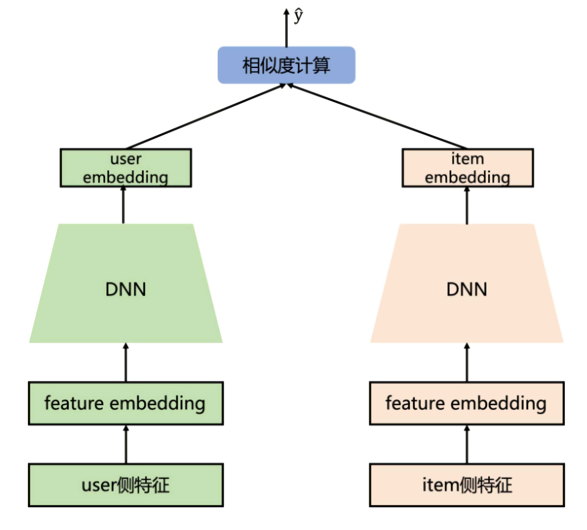
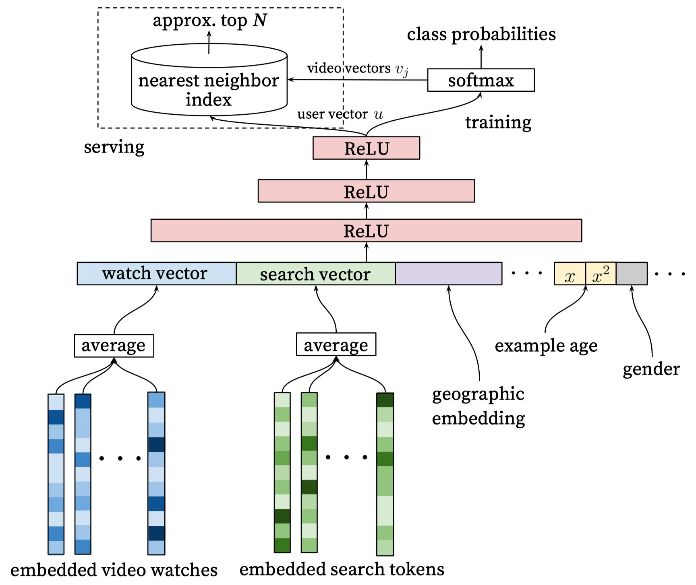

# Task03 召回模型：YoutubeDNN、DSSM

## 1 DSSM

### 1.1 DSSM模型原理

&emsp;&emsp;根据用户搜索行为中`query`（文本搜索）和`doc`（要匹配的文本）的日志数据，使用深度学习网络将`query`和`doc`映射到相同维度的语义空间中，基于最大化`query`和`doc`语义向量之间的余弦相似度，训练得到隐含语义模型，即`query`侧特征的embedding和`doc`侧特征的embedding，从而得到语句的低维语义向量表达`sentence embedding`，用于预测两句话的语义相似度。

&emsp;&emsp;上述内容主要有以下3个步骤：
1. 获取输入数据：用户搜索行为中`query`（文本搜索）和`doc`（要匹配的文本）的日志  
2. 同维度映射：使用深度学习网络，将`query`和`doc`映射到相同维度的语义空间  
3. 训练模型：基于最大化`query`和`doc`语义向量之间的余弦相似度，得到隐含语义模型

### 1.2 推荐系统中的双塔模型理解



- 模型结构：`user`侧塔和`item`侧塔分别经过各自的DNN得到embedding，再计算两者之间的相似度
- 特点：
  1. `user`和`item`两侧最终得到的embedding维度需要保持一致
  2. 对物料库中所有`item`计算相似度时，使用负采样进行近似计算
  3. 在海量的候选数据进行召回的场景下，速度很快
- 缺点：双塔的结构无法考虑两侧特征之间的交互信息，在一定程度上牺牲掉模型的部分精准性

### 1.3 负样本采样

- 全局随机采样：从全局候选`item`里面随机抽取一定数量作为召回模型的负样本，但可能会导致长尾现象
- 全局随机采样+热门打压：对一些热门`item`进行适当的过采样，提高模型对相似`item`的区分能力
- Hard Negative增强样本：选取一部分匹配度适中的`item`，增加模型在训练时的难度
- Batch内随机选择：利用其他样本的正样本在batch内随机采样作为自己的负样本

### 1.4 DSSM模型代码实现


```python
class DSSM(torch.nn.Module):    
    def __init__(self, user_features, item_features, user_params, item_params, temperature=1.0):
        super().__init__()
        self.user_features = user_features
        self.item_features = item_features
        self.temperature = temperature
        self.user_dims = sum([fea.embed_dim for fea in user_features])
        self.item_dims = sum([fea.embed_dim for fea in item_features])

        self.embedding = EmbeddingLayer(user_features + item_features)
        self.user_mlp = MLP(self.user_dims, output_layer=False, **user_params)
        self.item_mlp = MLP(self.item_dims, output_layer=False, **item_params)
        self.mode = None

    def forward(self, x):
        user_embedding = self.user_tower(x)
        item_embedding = self.item_tower(x)
        if self.mode == "user":
            return user_embedding
        if self.mode == "item":
            return item_embedding

        # 计算余弦相似度
        y = torch.mul(user_embedding, item_embedding).sum(dim=1)
        return torch.sigmoid(y)

    def user_tower(self, x):
        if self.mode == "item":
            return None
        input_user = self.embedding(x, self.user_features, squeeze_dim=True)
        # user DNN
        user_embedding = self.user_mlp(input_user)
        user_embedding = F.normalize(user_embedding, p=2, dim=1)
        return user_embedding

    def item_tower(self, x):
        if self.mode == "user":
            return None
        input_item = self.embedding(x, self.item_features, squeeze_dim=True)
        # item DNN
        item_embedding = self.item_mlp(input_item)
        item_embedding = F.normalize(item_embedding, p=2, dim=1)
        return item_embedding
```

## 2 YoutubeDNN

### 2.1 Youtube视频推荐系统面临的挑战

- Scale（规模）：视频数量庞大，需要解决大规模场景下实时推荐的问题
- Freshness（新鲜度）：由于用户实时上传视频，需要解决模型对新上内容及用户最新行为的学习问题
- Noise（噪声）：由于视频数据的稀疏和不可见等原因，需要提升推荐系统的鲁棒性

### 2.2 YoutubeDNN推荐系统架构


- 召回侧：主要的输入是用户的点击历史数据，输出是与该用户相关的一个候选视频集合；一般有两种方式（策略规则、监督模型+embedding）
- 精排侧：主要方法是特征工程， 模型设计和训练方法
- 线下评估：采用一些常用的评估指标，通过A/B实验观察用户真实行为

#### 2.2.1 YoutubeDNN召回模型



1. 输入数据
- 用户观看/搜索的历史序列：该数据类型是高维稀疏，使用embeding和average pooling处理，得到用户的观看/搜索兴趣
- 用户人文特征：离散型数据可使用embeding处理，连续型数据可使用归一化或分桶方式处理
- example age

2. training步骤（类似于skip-gram）
- skip-gram：采用中心词预测上下文词的方式训练词向量，模型的输入是中心词，采用滑动窗口的形式获取序列样本，得到中心单词之后，根据词向量的矩阵乘法，得到中心词的词向量，然后与上下文矩阵相乘，得到中心单词与每个单词的相似度，通过softmax得到相似概率，并选择概率最大的index输出
- YoutubeDNN training：右边部分类似于skip-gram，但是中心词是直接使用embedding得到，左边部分将用户的各特征向量拼接成一个大向量之后进行DNN降维

#### 2.2.2 训练数据选取

- 采样方式：采用负采样方式
- 训练样本来源：来自于全部的YouTube用户观看记录，包含用户从其他渠道观看的视频
- 经验：
  1. 训练数据中对于每个用户选取相同的样本数，保证用户样本在损失函数中的权重；
  2. 避免让模型知道不该知道的信息，即信息泄露

#### 2.2.3 Example Age特征

- 背景：由于用户对新视频的观看特点，导致视频的播放预测值期望不准确
- 作用：捕捉视频的生命周期，让模型学习到用户对新颖内容的`bias`，消除热度偏见
- 操作：在线上预测时，将`example age`全部设为0或一个小的负值，不依赖于各个视频的上传时间
- 好处：将`example age`设置为常数值，在计算用户向量时只需要一次；对不同的视频，对应的`example age`所在范围一致，只依赖训练数据选取的时间跨度，便于归一化操作

### 2.3 YoutubeDNN模型代码实现


```python
import torch
import torch.nn.functional as F
from torch_rechub.basic.layers import MLP, EmbeddingLayer
from tqdm import tqdm
```


```python
class YoutubeDNN(torch.nn.Module):
    def __init__(self, user_features, item_features, neg_item_feature, user_params, temperature=1.0):
        super().__init__()
        self.user_features = user_features
        self.item_features = item_features
        self.neg_item_feature = neg_item_feature
        self.temperature = temperature
        self.user_dims = sum([fea.embed_dim for fea in user_features])
        self.embedding = EmbeddingLayer(user_features + item_features)
        self.user_mlp = MLP(self.user_dims, output_layer=False, **user_params)
        self.mode = None

    def forward(self, x):
        user_embedding = self.user_tower(x)
        item_embedding = self.item_tower(x)
        if self.mode == "user":
            return user_embedding
        if self.mode == "item":
            return item_embedding

        # 计算相似度
        y = torch.mul(user_embedding, item_embedding).sum(dim=2)
        y = y / self.temperature
        return y

    def user_tower(self, x):
        # 用于inference_embedding阶段
        if self.mode == "item":
            return None
        input_user = self.embedding(x, self.user_features, squeeze_dim=True)
        user_embedding = self.user_mlp(input_user).unsqueeze(1)
        user_embedding = F.normalize(user_embedding, p=2, dim=2)
        if self.mode == "user":
            return user_embedding.squeeze(1)
        return user_embedding

    def item_tower(self, x):
        if self.mode == "user":
            return None
        pos_embedding = self.embedding(x, self.item_features, squeeze_dim=False)
        pos_embedding = F.normalize(pos_embedding, p=2, dim=2)
        if self.mode == "item":
            return pos_embedding.squeeze(1)
        neg_embeddings = self.embedding(x, self.neg_item_feature, squeeze_dim=False).squeeze(1)
        neg_embeddings = F.normalize(neg_embeddings, p=2, dim=2)
        return torch.cat((pos_embedding, neg_embeddings), dim=1)
```

## 3 总结

&emsp;&emsp;本次任务，主要介绍了DSSM和YoutubeDNN的模型原理和代码实践：
1. DSSM又称为双塔模型，主要将user和item特征分别经过各自的DNN得到embedding，再计算两者之间的相似度，在数据特征处理时，使用负采样方式，提高召回效率；
2. YoutubeDNN基于双塔模型进行了改进，右边部分类似于skip-gram，但直接使用embedding得到，左边部分将用户的各特征向量拼接成一个大向量之后进行DNN降维。
