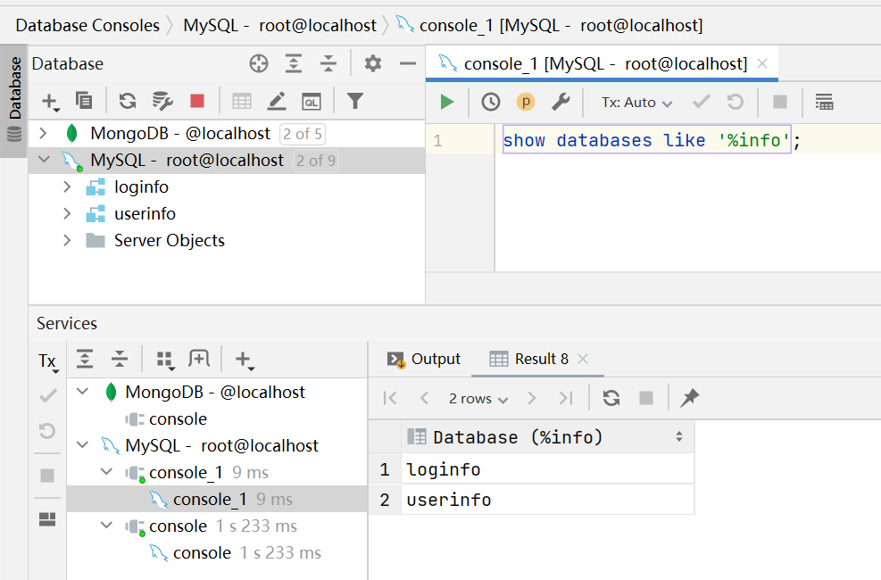
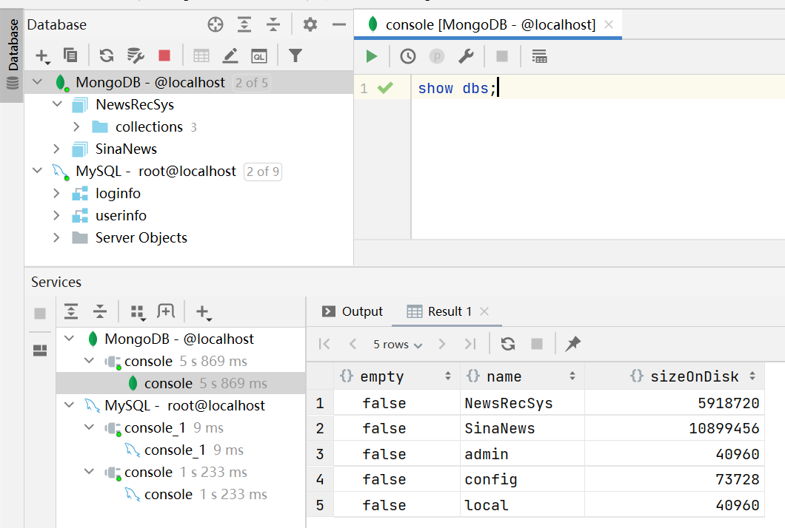

# Task02 数据库的基本使用

## 1 数据库在项目中的用途
- MySQL数据库：用于存储结构化数据，包括用户信息和用户阅读日志
- MongoDB数据库：用于存储爬取到的新浪新闻数据，以及画像数据（用户画像、新闻特征画像、备份前端展示的新闻画像）
- Redis内存数据库：用于存储变化快的数据，主要存储新闻动态画像数据（即用户对新闻的行为数据）、热门页列表数据、推荐页列表数据、用户曝光表、新闻详情信息

## 2 MySQl数据库的使用

### 2.1 数据库的基本操作
- 创建数据库：使用`CREATE`命令，创建指定名称的数据库
```sql
CREATE DATABASE [IF NOT EXISTS] <数据库名称>;
```

- 查看数据库：使用`SHOW`命令，查看所有存在的数据库
```sql
SHOW DATABASES [LIKE '数据库名'];
```


- 选择数据库：使用`USE`命令，指定要操作的数据库
```sql
USE <数据库名>
```

- 删除数据库：使用`DROP`命令，将指定的数据库删除
```sql
DROP DATABASE [IF EXISTS] <数据库名>
```

### 2.2 表的基本操作
- 创建表：使用`CREATE TABLE`命令，创建指定的表，并需要指定表结构
```sql
CREATE TABLE <表名> (<字段1> <数据类型> <该列所需约束>，
   <字段2> <数据类型> <该列所需约束>，
   <字段3> <数据类型> <该列所需约束>，
   <字段4> <数据类型> <该列所需约束>，
   .
   <该表的约束1>， <该表的约束2>，……);
```
其中，`PRIMARY KEY`表示主键，该字段对应的内容唯一且不能为空；`NOT NULL`：在 `NULL` 之前加上了表示否定的` NOT`，表示该字段不能为空。可通过`DESC`命令，查看该表的表结构

- 删除表：使用`DROP TABLE`命令，删除指定的表，删除后无法恢复
```sql
DROP TABLE <表名>;
```

- 更新表：使用`ALTER TABLE`语句，修改表字段
```sql
ALTER TABLE <表名> <操作指令> <表字段>;
```

- 查询表：使用`SELECT FROM`语句，查询表中的数据
```sql
SELECT <字段名>, ......
   FROM <表名>;
```

- 复制表：使用`CREATE TABLE SELECT FROM`结构的语句，将指定表的表结构和数据全部复制，或只复制表结构
```sql
CREATE TABLE <表名1>
    SELECT * FROM <表名2>;
```

### 2.3 运算操作
- 算术运算：可使用四则运算符，对指定字段的数据进行运算
- 比较运算：使用`WHERE`的条件表达式，进行过滤查找
- 逻辑运算：使用`NOT`、`AND`和`OR`结合`WHERE`语句进行过滤查找

### 2.4 分组查询
- 聚合函数：
  1. `COUNT`：计算表中的记录数（行数）
  2. `SUM`： 计算表中数值列中数据的合计值
  3. `AVG`： 计算表中数值列中数据的平均值
  4. `MAX`： 求出表中任意列中数据的最大值
  5. `MIN`： 求出表中任意列中数据的最小值

- 分组操作：使用`GROUP BY`语句，对指定的字段进行分组
```sql
SELECT <列名1>, <列名2>, <列名3>, ...
 FROM <表名>
 GROUP BY <列名1>, <列名2>, <列名3>, ...;
```

- 使用`WHERE`语句进行过滤分组：使用`WHERE`进行条件过滤，再进行分组操作
```sql
SELECT <列名1>, <列名2>, <列名3>, ...
 FROM <表名>
 WHERE <条件表达式>
 GROUP BY <列名1>, <列名2>, <列名3>, ...;
```

- 指定聚合结果的条件：使用`HAVING`语句，进行条件过滤
```sql
SELECT <列名1>, <列名2>, <列名3>, ...
 FROM <表名>
 GROUP BY <列名1>, <列名2>, <列名3>, ...
HAVING <分组结果对应的条件>
```

- 排序：使用`ORDER BY`语句，对指定字段进行排序
```sql
SELECT <列名1>, <列名2>, <列名3>, ...
 FROM <表名>
 ORDER BY <排序基准列1>, <排序基准列2>, ...
```

### 2.5 插入及更新数据
- 插入数据：使用`INSERT INTO`语句，向表中插入数据
  ```sql
  -- 往表中插入一行数据
  INSERT INTO <表名> (字段1, 字段2, 字段3, ...) VALUES (值1, 值2, 值3, ...);
  -- 往表中插入多行数据
  INSERT INTO <表名> (字段1, 字段2, 字段3, ...) VALUES 
      (值1, 值2, 值3, ...),
      (值1, 值2, 值3, ...),
      ...;
  ```

- 删除数据：使用`DELETE`语句，结合`WHERE`条件语句，筛选要删除的数据
```sql
DELETE FROM <表名> 
  WHERE <条件表达式>;
```

- 更新数据：使用`UPDATE SET`语句，将指定的数据进行更新
```
UPDATE <表名>
  SET <字段名> = <表达式>;
```

### 2.6 使用pymysql库操作MySQL数据库
- 连接数据库
```python
import pymysql
# 这里登陆到我之前创建的admin账户
db = pymysql.connect(
     host='localhost',
     user='root',
     password='123456',
     database='shop',				
     charset='utf8mb4',
     cursorclass=pymysql.cursors.DictCursor
)
```

- 创建游标，可指定游标的类型（`Cursor`：元组类型，`DictCursor`：字典类型，`SSCursor`：无缓冲元组类型，`SSDictCursor`：无缓冲字典类型）
```python
# 创建游标
cursor = db.cursor()
```

- 重点类方法
    1. `connect`的`rollback()`方法：事务回滚
    2. `cursors`的`fetchone()`方法：获取单条数据
    3. `cursors`的`fetchall()`方法：获取所有数据
    4. `cursors`的`scroll(value, mode)`方法：数据的查询操作都是基于游标，可以通过`scroll`控制游标的位置。
        + `mode=absolute`：绝对位置移动，控制游标位置到上一次查询的第`value`条数据，最小值为`0`；
        + `mode=relative`：相对位置移动，基于当前位置，跳过`value`条数据；

## 3 MongoDB数据库的使用

### 3.1 MongoDB特点
- 由C++语言编写的，是一个基于分布式文件存储的开源数据库系统
- 将数据存储为一个文档，类似于 JSON 对象。字段值可以包含其他文档，数组及文档数组
- Mongo支持丰富的查询表达式。查询指令使用JSON形式的标记，可轻易查询文档中内嵌的对象及数组
- GridFS是MongoDB中的一个内置功能，可以用于存放大量小文件

### 3.2 数据库的基本操作
- 创建数据库：使用`use`命令，创建一个数据库
```sql
use DATABASE_NAME
```
- 查看所有数据库：使用`show dbs`命令，显示所有数据库


### 3.3 集合操作
- 创建集合：使用`createCollection()`方法，创建集合
```js
db.createCollection(name, options)
```

- 删除集合：使用`drop()`方法，删除集合
```js
db.collection.drop()
```

### 3.4 文档操作
- 插入文档：使用`insert()`或`save()`方法向集合中插入文档
```js
db.collection.insertOne(document)
db.COLLECTION_NAME.insert(document)
```

- 更新文档：使用`update()`方法，对集合中指定的字段数据进行更新
```js
db.collection.update(
   <query>,
   <update>,
   {
     upsert: <boolean>,
     multi: <boolean>,
     writeConcern: <document>
   }
)
```

- 删除文档：使用`remove()`函数，移除集合中的数据
```js
db.collection.remove(
   <query>,
   {
     justOne: <boolean>,
     writeConcern: <document>
   }
)
```

- 查询文档：使用`find()`方法查询数据，并以结构化的方式显示所有文档
```js
db.collection.find(query, projection).pretty()
```

### 3.5 条件过滤和排序
- 条件过滤：结合`find()`方法，通过`$or`关键字进行条件过滤
```js
db.col.find({key1:value1, key2:value2}).pretty()
或
db.col.find(
   {
      $or: [
         {key1: value1}, {key2:value2}
      ]
   }
).pretty()
```

- 排序：使用`sort()`方法，对数据进行排序，使用`1`和`-1`来指定排序的方式，其中`1`为升序排列，而`-1`是用于降序排列
```
db.COLLECTION_NAME.find().sort({KEY:1})
```

### 3.6 使用pymongo操作MongoDB数据库
- 创建数据库
```python
import pymongo
myclient = pymongo.MongoClient("mongodb://localhost:27017/")
mydb = myclient["NewsRecSys"]
```

- 判断数据库是否存在
```python
dblist = myclient.list_database_names()
if "NewsRecSys" in dblist:
  print("数据库已存在！")
else:
  print('数据库不存在')
```

- 创建集合
```python
mycol = myclient["NewsRecSys"]["FeatureProtrail"]
```

- 判断集合是否已存在
```python
collist = mydb.list_collection_names()
if "FeatureProtrail" in collist:
  print("集合已存在！")
else:
  print('集合不存在')
```

- 重要方法：
  1. 插入文档：`insert_one(<字典类型>)`，`insert_many(<字典类型的数组>)`
  2. 查询一条记录：`find_one()`
  3. 查询集合中所有记录：`find()`
  4. 指定条件查询：`find(<字典>)`
  5. 返回指定条数记录：`find().limit(num)`
  6. 修改文档：`update_one(<old>, <new>)`
  7. 删除文档：`delete_one(<字典>)`
  8. 删除集合中所有文档：`delete_many({})`
  9. 删除集合：`drop()`
  10. 排序：`find().sort(<col>, <1/-1>)`

## 4 Redis内存数据库的使用

### 4.1 数据库的基本操作
- 切换库：`select index`，默认16个库（0~15）
- 删除库的数据：`flushdb`
- 删除所有库数据：`flushall`
- 查看key的个数：`dbsize`

### 4.2 Key的操作
- 查找符合模板的Key：`key pattern`
- 查找存在key的数量：`exists key or [key...]`
- 设置过期时间：`expire key seconds`
- 查看key的类型：`type key`
- 删除key：`del key or [key...]`

### 4.3 字符串操作
- 设置key：`SET key value [EX seconds] [PX milliseconds] [NX|XX]`
- 返回与key相关的字符串值：`get key`
- 追加字符串值：`append key_name new_value`
- 自增：`incr key_name`
- 自减：`decr key_name`
- 返回字符串值得长度：`strlen key_name`
- 根据偏移量`offset`用`value`覆盖字符串值：`setrang key offset value`
- 返回字符串的字串：`getrang key start end`
- 设置多个key-value：`mset key value [key value ...]`
- 返回多个指定key的value：`mget key [key ...]`

### 4.4 列表操作
- 一个或多个值插入到列表`key` 的头部：`lpush key value [value ...]`
- 向`key`中的列表尾部插入指定的值：`rpush key value [value ...]`
- 返回列表中指定区间内的元素(闭区间)，区间以偏移量`start`和`end`指定：`lrange key start end`
- 返回列表`key`里索引`index`位置存储的元素：`lindex key index`
- 用于返回存储在`key`中的列表长度：`llen key`
- 从列表`key`中删除前`count`个值等于`element`的元素：`lrem key count value`
- 设置列表`key`中`index`位置的元素值为`element`：`lset key index value`
- 将`element`插入到列表`key`的前面或后面：`linsert key before|after pivot value`

### 4.5 哈希表操作
- 将存储在`key`中的哈希表的`field`字段赋值`value`：`hset key field value`
- 返回哈希表中指定字段`field`的值：`hget key field`
- 将多个`field-value`设置到哈希表中：`hmset key field value [field value ...]`
- 返回存储在`key`中的哈希表中所有的字段和值：`getall key`
- 删除哈希表 key 中的一个或多个指定字段：`hdel key field [field ...]`
- 查看哈希表的指定字段`field`是否存在：`hexists key field`
- 返回存储在`key`中哈希表的所有字段：`hkeys key`
- 返回哈希表所有字段`field`的值：`hvals key`

### 4.6 集合操作
- 将一个或多个成员元素加入到集合中：`sadd key member [member ...]`
- 返回存储在`key`中集合的所有成员：`smembers key`
- 判断元素`member`是否集合`key`的成员：`sismember key member`
- 返回集合中元素的数量：`scard key`
- 在集合中删除指定的元素：`srem key member [member ...]`
- 返回含有 count 个不同的元素的数组：`srandmember key [count]`
- 从集合`key`中删除并返回一个或多个随机元素：`spop key [count]`

### 4.7 有序集合操作
- 将一个或多个`member`元素及其`score`值加入到有序集`key`当中：`zdd key [NX|XX] [CH] [INCR] score member [score member ...]`
- 按分数值递增（从小到大），返回有序集中指定区间内（闭区间）的成员：`zrange key start end [withsroces]`
- 按score值递减（从高到低），返回有序集`key`中指定区间内的成员：`zrevrange key start end [withsroces]`
- 从有序集合`key`中删除指定的成员`member`：`zrem key member [member ...]`
- 返回有序集的成员个数：`zcard key`
- 返回有序集`key`中，所有 介于`min`和`max`之间的`score`值的成员：`zrangebyscore key min max [withsroces] [limit offset count]`
- 返回有序集合中指定分数区间的成员列表：`zrevrangebyscore key min max [withsroces] [limit offset count]`
- 返回有序集`key`中，所有 介于`min`和`max`之间的`score`值的成员数量：`zcount key min max`

### 4.8 使用redis库操作Redis数据库
- 连接数据库
```python
import redis
# 直连模式
r = redis.Redis(host='127.0.0.1', port=6379, db=0, password='')
# 连接池模式
pool = redis.ConnectionPool(host="127.0.0.1", port=6379, db=0, password="", decode_responses=True, max_connections=10)
r1 = redis.Redis(connection_pool=pool)
```

- 对String、Hash、List、Set、SortedSet的操作采用调用方法的方式，基本上和Redis一致
- 管道操作：使用`pipline`实现一次请求指定多个命令
```python
pipe = r.pipeline(transaction=True)
pipe.set('name', 'hurf')
pipe.set('age', '33')
pipe.execute()
```

## 5 总结
&emsp;&emsp;本次任务，主要介绍了MySQL、MongoDB、Redis数据库的基本使用，以及在本项目中的用户，详细介绍了各个数据库关于库、表、成员（MongoDB中的集合、文档等，Redis中的Key、字符串、列表、哈希表、集合和有序集合等）的运算、分组、条件过滤、排序等操作，结合这些数据库，还讲解了在Python下通过不同的依赖库操作相关数据库的方法。