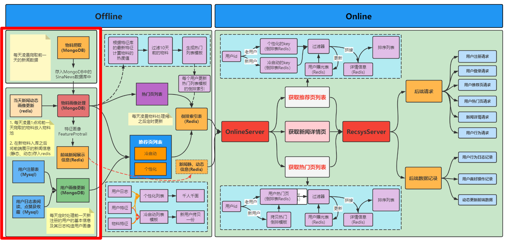

# Task03 离线物料系统的构建



## 1 离线物料系统基本流程
- 新闻物料爬取：主要采用`scrapy`爬虫工具，在每天晚上23点将当天的新闻内容从网页中进行抓取，存入MongoDB的`SinaNews`数据库中。
- 物料画像构建：更新当天新闻动态画像，将用户对前一天新闻的交互，包括阅读、点赞和收藏等行为（动态）存入Redis中；对物料画像处理，将新闻静态和动态数据分别存入对应的Redis中。
- 用户画像构建：用户通过前端注册页面，进行用户注册，将用户信息存入MySQL的用户注册信息表（register_user）中；用户通过阅读、点赞及收藏新闻，将用户行为数据存入MySQL的用户阅读信息表（user_read）、用户点赞信息表（user_likes）和用户收藏信息表（user_collections）；将当天的新注册用户基本信息及其行为数据构造用户画像，存入MongoDB中的`UserProtrai`集合中。
- 自动化构建画像：将物料画像构建和用户画像构建进行整合，构建整个自动化流程。

## 2 scrapy与新闻爬取
### 2.1  创建新闻爬取项目
使用`scrapy startproject sinanews`创建项目

<pre>
sinanews--------------------------------------项目python模块
+---__init__.py-------------------------------模块初始化文件
+---items.py----------------------------------items文件，用于定义类对象
+---middlewares.py----------------------------中间件，用于配置请求头、代理、cookie、会话维持等
+---pipelines.py------------------------------管道文件，用于将爬取的数据进行持久化存储
+---run.py------------------------------------单独运行项目的脚本，用于自动化爬取
+---settings.py-------------------------------配置文件，用于配置数据库
+---spiders-----------------------------------爬取新闻模块
|   +---__init__.py---------------------------爬取新闻模块初始化文件
|   +---sina.py-------------------------------爬取新浪新闻的具体逻辑，解析网页内容
scrapy.cfg------------------------------------项目配置文件
</pre>


### 2.2 爬取流程
1. 通过调用`start_request()`方法开始爬取，并作为返回请求的迭代器
2. 通过提供的URL链接，由`scrapy`下载，调用`parse()`方法进行处理
3. 通过回调`parse()`方法，解析网页并返回在`items.py`中定义的对象，可由下一层`parse_content()`方法处理新闻内容
4. 通过回调`parse_content()`方法，解析新闻内容

### 2.3 新闻爬取业务逻辑
- 每天定时从[新浪新闻网站](https://news.sina.com.cn/roll/#pageid=153&lid=2509&k=&num=50&page=1)中爬取新闻数据，存入MongoDB数据库中，通过程序监控爬取新闻的状态
- 每天只爬取当天的新闻，通过单独去重处理重复的新闻

### 2.4 获取新浪新闻网页的请求链接


其中：
- `pageid`：固定，153
- `lid`：新闻分类，根据字典进行映射
- `num`：每页新闻个数
- `page`：页号

### 2.5 核心文件的主要内容
- `items.py`：定义新闻数据的对象
- `sina.py`：主要爬取新闻数据，通过新闻分类映射字典，遍历获取新闻网页，解析网页获取新闻数据
- `pipelines.py`：连接MongoDB数据库，处理每一条数据，如果在24小时范围内，则存储到MongoDB的`SinaNews`库的`new_<current_date>`集合中

## 3 物料画像构建

### 3.1 物料画像更新的业务逻辑
- 将新物料画像添加到物料特征库（MongoDB的`NewsRecSys`库的`FeatureProtrail`集合）中
- 将用户的行为记录（阅读、点赞和收藏）更新到旧物料（新闻动态画像）
- 将所有的物料特征库数据复制到`RedisPortrail`集合中，用于给前端展示

### 3.2 核心函数的代码逻辑
代码位于`materials/material_process/news_protrait.py`
- `update_new_items()`方法：添加新物料到物料库（`FeatureProtrail`集合）
- `update_dynamic_feature_protrail()`方法：获取Redis中的用户行为（又称“新闻动态画像”），更新物料库中的点赞（`likes`）、收藏（`collections`）和阅读次数（`read_num`）字段的值
- `update_redis_mongo_protrail_data()`方法：删除在`RedisPortrail`集合中的数据（该集合存放前一天的物料库数据，作为当天Redis中的新闻数据备份），把最新的物料库数据存入该集合中，去掉一些不用给前端展示的字段内容（类似于DO->VO）

### 3.3 将更新之后的物料添加到Redis中
- 使用方法：`news_detail_to_redis()`方法，代码位于`materials/material_process/news_to_redis.py`
- 具体代码逻辑：删除所有Redis中的内容，将新闻静态数据（`news_id`、`title`、`ctime`、`content`、`cate`、`url`）存入Redis[1]中，将新闻动态画像（`likes`、`collections`、`read_num`）存入Redis[2]中，具体格式如下：
```python
# 当天新闻静态数据（static_news_detail:新闻ID :{新闻ID、标题、发布时间、新闻内容、类别、URL链接}）
static_news_info_db_num = 1
# 动态新闻画像（dynamic_news_detail:新闻ID :{用户行为：阅读、点赞、收藏}）
dynamic_news_info_db_num = 2
```

## 4 用户画像构建

### 4.1 用户画像更新的业务逻辑
- 将用户的新闻曝光数据保存到MySQL中，用于进行去重
- 更新用户画像，主要更新用户的静态信息和动态信息（阅读、点赞、收藏等相关指标数据），存储到MongoDB中

### 4.2 核心函数的代码逻辑
- `user_exposure_to_mysql()`方法（代码位于`materials/user_process/user_to_mysql.py`）：将用户的新闻曝光数据从Redis（用户ID：{\<list\>(新闻ID: 曝光时刻)}）存入到MySQL中`exposure_<current_date>`表中
- `update_user_protrail_from_register_table()`方法（代码位于`materials/user_process/user_protrail.py`）：将当天新用户（注册用户）和老用户的静态信息和动态信息（阅读、点赞、收藏等相关指标数据）都添加到用户画像库中（MongoDB的`NewsRecSys`库的`UserProtrail`集合）
- `_user_info_to_dict()`方法（代码位于`materials/user_process/user_protrail.py`）：将用户基本属性和用户的动态信息进行组合，对于已存在的指标数据（分为爱好和收藏，每个分类都包括历史喜欢最多的Top3的新闻类别、历史喜欢新闻的Top3的关键词、用户喜欢新闻的平均热度、用户15天内喜欢的新闻数量）进行更新，对于未存在的指标数据进行初始化


## 5 自动化构建画像
1. 将以上业务流程形成脚本：物料更新脚本（`process_material.py`）、用户画像更新脚本（`process_user.py`）、Redis数据更新脚本（`update_redis.py`），3个脚本均位于`materials`路径下
2. 使用`shell`脚本进行整合`offline_material_and_user_process.sh`（位于`scheduler/offline_material_and_user_process.sh`）
3. 使用`crontab`定时任务，每天凌晨1点执行`shell`脚本

## 6 总结
&emsp;&emsp;本次任务，主要介绍了离线物料系统的构建，包括新闻物料爬取、物料画像构建、用户画像构建和自动化构建画像；
1. 新闻物料爬取：采用`scrapy`爬虫技术，将新闻内容从网页上爬取存入MongoDB数据库
2. 物料画像构建：更新当天新闻动态画像，并对物料画像进行处理，得到特征物料，并将新闻的静态和动态数据分别存入相应的Redis中
3. 用户画像构建：保存用户的新闻曝光数据并存入MySQL中，更新用户画像数据并存入MongoDB中
4. 自动化构建画像：使用`crontab`命令，定时执行整合后的`shell`脚本