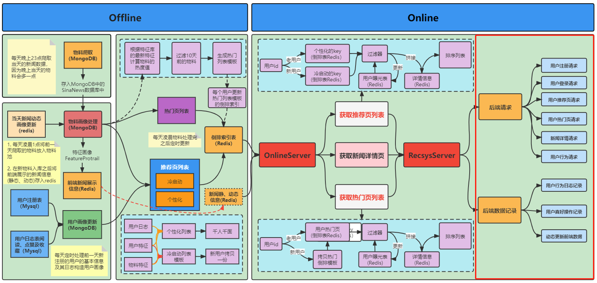

# Task04 前后端基础及交互

## 1 前后端交互基本流程

&emsp;&emsp;本项目的前端采用基于vue框架的Vant UI组件库，完成用户注册页、用户退出页、用户热门列表页、用户推荐列表页、新闻详情页等功能；后端采用Flask框架，使用MySQL、MongoDB和Redis作为数据存储，根据新闻推荐系统的整体功能，提供用户注册、用户登录、用户推荐页列表、用户热门页列表、新闻详情、用户行为等服务请求，完成用户从注册到新闻浏览、点赞和收藏的全流程。

## 2 前端框架

### 2.1 目录结构
<pre>
Vue-newsinfo
+---src---------------------------------项目主文件夹
|   +---assets--------------------------静态资源文件，包括img、css、js
|   |   +---css-------------------------样式文件
|   |   |   +---sign.css----------------登录注册页的样式
|   |   |   +---test.css----------------顶部导航样式
|   |   +---js--------------------------前端功能
|   |   |   +---cookie.js---------------定义cooki的相关操作，用于用户登录注册、退出时的cookie操作
|   +---components----------------------组件
|   |   +---bottomBar.vue---------------底部导航
|   |   +---hotLists.vue----------------热门页
|   |   +---Myself.vue------------------个人中心“我的”
|   |   +---NewsInfo.vue----------------新闻详情页
|   |   +---recLists.vue----------------推荐页
|   |   +---signIn.vue------------------登录页
|   |   +---signUp.vue------------------注册页
|   +---images--------------------------网站Logo图标，显示在浏览器地址栏或网页标签上
|   |   +---datawhale.png---------------Datawhale头像，用于“我的”页面
|   |   +---dw.png----------------------Datawhale二维码，用于“我的”页面
|   +---App.vue-------------------------根组件
|   +---index.html----------------------项目主页面
|   +---main.js-------------------------主脚本文件，用于定义全局变量、引入插件
|   +---router.js-----------------------路由脚本文件，用于配置路由url链接与页面组件的映射关系
|   +---store.js------------------------状态管理
+---.babelrc----------------------------ES6转码的配置文件
+---favicon.ico-------------------------浏览器小图标
+---package.json------------------------依赖包的配置文件，配置前端项目运行脚本
+---vue.config.js-----------------------vue项目的配置文件
+---webpack.config.js-------------------webpack的配置文件，用于项目打包
</pre>

### 2.2 Vue框架

#### 2.2.1 Vue实例的生命周期

- 创建期间的生命周期函数：
    1. beforeCreate：实例刚在内存中被创建出来，此时，还没有初始化好`data`和`methods`属性
    2. created：实例已经在内存中创建完毕，此时`data`和`methods`已经创建完毕，此时还没有开始编译模板
    3. beforeMount：此时已经完成了模板的编译，但是还没有挂载到页面中
    4. mounted：此时已经将编译好的模板，挂载到了页面指定的容器中显示

- 运行期间的生命周期函数：
    1. beforeUpdate：状态更新之前执行此函数， 此时`data`中的状态值是最新的，但是界面上显示的数据还是旧的，因为此时还没有开始重新渲染`DOM`节点
    2. updated：实例更新完毕之后调用此函数，此时`data`中的状态值和界面上显示的数据，都已经完成了更新，界面已经被重新渲染好了

- 销毁期间的生命周期函数：
    1. beforeDestroy：实例销毁之前调用，在这一步，实例仍然完全可用
    2. destroyed：Vue实例销毁后调用，调用后，Vue实例指示的所有东西都会解绑定，所有的事件监听器会被移除，所有的子实例也会被销毁

#### 2.2.2 创建Vue项目的流程
1. 安装Vue CLI：提供基于Vue.js快速开发的工具，可实现交互式的项目脚手架搭建
2. 创建Vue项目：使用`vue create`命令，创建项目
3. 路由配置：使用`vue-router`库，配置`router.js`
4. 数据请求：使用`axios`封装数据请求
5. 选择UI组件库：选择UI设计组件，用于保证界面一致、用户交互、设计简洁的操作流程

### 2.3 页面功能

#### 2.3.1 登录/注册页（signIn.vue/signUp.vue）
- 代码位于`src/components/`中的`signIn.vue`和`signUp.vue`
- 用户登录：输入用户名和密码，登录系统，勾选“记住我”，可以暂存7天的登录信息
- 用户注册：输入用户名、密码、验证密码、年龄，勾选性别和城市，进行用户注册，注册成功之后，将跳转到推荐页

#### 2.3.2 推荐/热门页（recLists.vue/hotLists.vue）
- 代码位于`src/components/`中的`recLists.vue`和`hotLists.vue`
- 推荐页列表：展示用户推荐页新闻列表，一次展示10条数据
- 热门页列表：展示用户热门页新闻列表，一次展示10条数据

#### 2.3.3 新闻详情页（NewsInfo.vue）
- 代码位于`src/components/`中的`NewsInfo.vue`
- 新闻详情：展示当前新闻内容，并提供点赞（喜欢）和收藏功能

#### 2.3.4 个人中心页（Myself.vue）
- 代码位于`src/components/`中的`Myself.vue`
- 个人中心：展示用户头像和用户名，提供用户退出功能

## 3 后端交互请求

### 3.1 目录结构
<pre>
news_rec_sys
+---conf----------------------------------------项目配置文件
+---controller----------------------------------控制层，用于操作数据库接口
+---dao-----------------------------------------DAO层，定义数据对象以及数据库连接对象
+---materials-----------------------------------离线物料构建
|   +---news_scrapy-----------------------------爬取新闻
|   +---user_proccess---------------------------用户画像处理
|   +---material_proccess-----------------------物料画像处理
+---recpocess-----------------------------------推荐流程
|   +---cold_start------------------------------冷启动生成热门/推荐页列表
|   +---recall----------------------------------计算热度值
|   +---online.py-------------------------------在线构建热门/推荐页列表
|   +---offline.py------------------------------离线构建热门/推荐页列表
+---scheduler-----------------------------------定时任务脚本
+--server.py------------------------------------后端项目启动主程序
</pre>

### 3.2 服务请求

#### 3.2.1 用户注册请求
- 注册流程：通过前端接收JSON数据（包括用户名、密码、年龄、性别、所在城市），并使用Flask提供用户注册请求服务`/recsys/register`
- 代码逻辑：位于`server.py`中的`register()`方法，接收用户名、密码、年龄、性别、所在城市，根据用户名判断是否已经存在（调用`user_action_controller`中的`user_is_exist()`方法），如果有记录，则返回1，表示注册正常，否则返回0，表示注册失败；再将数据存入MySQL的`userinfo`库的`register_user`表中

#### 3.2.2 用户登录请求
- 登录流程：通过前端接收JSON数据（包括用户名、密码），并使用Flask提供用户登录请求服务`/recsys/login`
- 代码逻辑：位于`server.py`中的`login()`方法，接收用户名、密码，根据用户名和密码判断是否有记录，如果有记录，则返回1，表示登录正常；如果仅用户名存在，返回2，表示密码错误；否则返回0，表示用户不存在

#### 3.2.3 用户推荐页请求
- 登录流程：通过前端接收json数据（包括用户名、年龄、性别），并使用Flask提供用户推荐页请求服务`/recsys/rec_list`
- 代码逻辑：位于`server.py`中的`rec_list()`方法，接收用户名、年龄、性别，根据用户名得到用户ID，根据用户ID调用冷启动的推荐页列表方法（`recprocess/online.py`中的`get_cold_start_rec_list_v2()`方法），返回10条推荐新闻

#### 3.2.4 用户热门页请求
- 登录流程：通过前端接收json数据（包括用户名），并使用Flask提供用户热门页请求服务`/recsys/hot_list`
- 代码逻辑：位于`server.py`中的`hot_list()`方法，接收用户名，根据用户名得到用户ID，根据用户ID调用热门页列表方法（`recprocess/online.py`中的`get_hot_list_v2()`方法），返回10条热门新闻

#### 3.2.5 新闻详情请求
- 登录流程：通过前端接收json数据（包括用户名，新闻ID），并使用Flask提供新闻详情请求服务`/recsys/news_detail`
- 代码逻辑：位于`server.py`中的`news_detail()`方法，接收用户名，新闻ID，根据用户名得到用户ID，根据新闻ID得到新闻内容，通过查询`user_likes`表和`user_collections`表，得到新闻的用户行为（是否点赞、是否收藏），返回前端需要的新闻详情（新闻内容、用户是否点赞、用户是否收藏）

#### 3.2.6 用户行为请求
- 登录流程：通过前端接收json数据（包括用户名，新闻ID、用户行为），并使用Flask提供新闻详情请求服务`/recsys/action`
- 代码逻辑：位于`server.py`中的`actions()`方法，接收用户名，新闻ID、用户行为，根据用户名得到用户ID，根据用户行为（是否点赞、收藏），修改`user_likes`表和`user_collections`表中对应的记录

## 4 总结

&emsp;&emsp;本次任务，主要介绍了前后端交互相关内容：
1. 前后端交互的基本流程：前后端使用的技术路线，具备用户注册、用户登录、用户推荐页列表、用户热门页列表、展示新闻详情、记录用户行为等功能
2. 前端框架：前端项目结构（Vue框架），主要实现登录/注册、推荐/热门、新闻详情、个人中心等页面功能
3. 后端交互请求：后端目录结构（Flask框架），主要实现用户注册、用户登录、用户推荐页列表、用户热门页列表、新闻详情、用户行为等服务请求