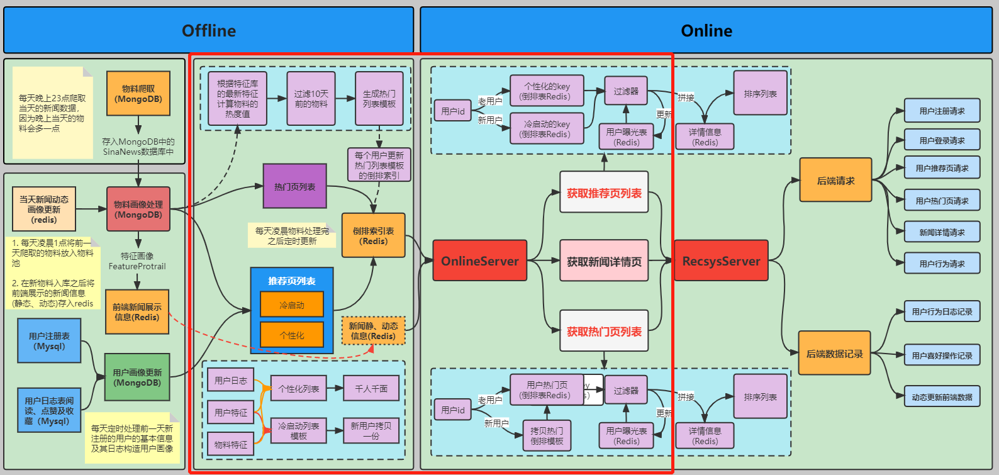

# Task05 推荐流程的构建



## 1 推荐系统基本流程
- `Offilne`部分：主要是基于离线物料系统生成的物料画像和用户画像进行处理，为每个用户生成热门页列表和推荐页列表，并将其存储到Redis中
- `Online`部分：主要是针对不同的用户，使用不同的策略，提供热门页列表和推荐页列表的新闻数据，进行过滤排序之后，展示到前端页面上

## 2 `Offline`部分

### 2.1 热门页列表构建

#### 2.1.1 业务流程
- 基于离线物料系统生成的物料画像（`MongoDB`的`NewsRecSys`库的`FeatureProtail`集合数据），根据其发布时间以及用户的行为记录（阅读量、点赞量和收藏量）计算热度值，更新物料中所有新闻的热度值
- 将所有新闻按照类别，将热门列表存入缓存中，提供给`Online`的热门页列表

#### 2.1.2 核心代码逻辑
代码位于`recprocess/recall/hot_recall.py`
- `update_hot_value()`方法：主要用于更新物料中所有新闻的热度值，通过遍历`MongoDB`的`NewsRecSys`库的`FeatureProtail`集合数据，选取最近3天发布的新闻，通过使用下列公式，进行热度值的计算，并更新`hot_value`字段（初始值为1000）：
```python
news_hot_value = (news_likes_num * 0.6 + news_collections_num * 0.3 + news_read_num * 0.1) * 10 / (1 + time_hour_diff / 72)
```

> **注：**
> 上述公式源自魔方秀公式：
> 魔方秀热度 = (总赞数 * 0.7 + 总评论数 * 0.3) * 1000 / (公布时间距离当前时间的小时差+2) ^ 1.2
> 
> 最初的公式为Hacker News算法：
> Score = (P-1) / (T+2)^G
> 其中P表示文章得到的投票数，需要去掉文章发布者的那一票；T表示时间衰减（单位小时）；G为权重，默认值为1.8

- `group_cate_for_news_list_to_redis()`方法：主要用于将物料库（`FeatureProtail`集合），通过遍历各类新闻，按照下面形式存入Redis[0]的`hot_list_news_cate`中：
```
hot_list_news_cate:<新闻类别标识>: {<新闻类别名>_<新闻id>:<热度值>}
```

### 2.2 推荐页列表构建

#### 2.2.1 业务流程
- 针对注册用户，建立冷启动的推荐页列表数据，通过用户年龄、性别指定用户群，自定义用户的新闻类别，根据新闻热度值，生成冷启动的推荐列表
- 针对老用户，提供个性化推荐，目前该系统没有提供千人千面的推荐功能

#### 2.2.2 核心代码逻辑
代码位于`recprocess/cold_start/cold_start.py`
- `generate_cold_user_strategy_templete_to_redis_v2()`方法：按照用户类别、新闻类别提供各类新闻的热度值；通过自定义配置将用户分为4类，遍历各类别中的新闻类型，将物料库（`MongoDB`的`NewsRecSys`库的`FeatureProtail`集合数据）中对应的新闻热度值按照下面形式存入Redis[0]的`cold_start_group`中:
    ```
    cold_start_group:<人群分类ID>:<新闻类别标识>: {<新闻类别名>_<新闻id>:<热度值>}
    ```

- `user_news_info_to_redis()`方法：
  1. 按照用户、新闻分类提供用户冷启动的推荐模板；遍历所有用户，针对每个用户分类，从Redis[0]的`cold_start_group`中取出新闻热度值，按照以下形式存入Redis[0]的`cold_start_user`中：
        ```
        cold_start_user:<用户ID>:<新闻类别标识>: {<新闻类别名>_<新闻id>:<热度值>}
        ```
  2. 按照用户提供用户的新闻类别标识；针对每个用户，根据自定义的用户新闻类别（即每个用户分类具有哪些新闻类别），按照以下形式存入Redis[0]的`cold_start_user_cate_set`中：
        ```
        cold_start_user_cate_set:<用户ID>: {<新闻类别标识>}
        ```

## 3 `Online`部分

### 3.1 热门页列表构建

#### 3.1.1 业务流程
- 获取用户曝光列表，得到所有的新闻ID
- 针对新用户，从之前的离线热门页列表中，为该用户生成一份热门页列表，针对老用户，直接获取该用户的热门页列表
- 对上述热门列表，每次选取10条新闻，进行页面展示
- 对已选取的10条新闻，更新曝光记录

#### 3.1.2 核心代码逻辑
代码位于`recprocess/online.py`
- `_get_user_expose_set()`方法：主要获取用户曝光列表，得到所有的新闻ID；该数据存储在Redis[3]中，数据格式如下：
    ```
    user_exposure:<用户ID>: {<新闻ID>:<曝光时间>} 
    ```
  
- `_judge_and_get_user_reverse_index()`方法：用于判断用户是否存在热门页列表，如果用户是新用户，根据Redis[0]的`hot_list_news_cate`中的数据，复制创建该用户的热门页列表，具体数据格式如下：
    ```
    user_id_hot_list:<用户ID>:<新闻分类标识>: {<新闻类别名>_<新闻id>:<热度值>}
    ```
- `_get_polling_rec_list()`方法：通过轮询方式获取用户的展示列表，每次只取出10条新闻；通过while循环方式，从Redis[0]的`user_id_hot_list:<用户ID>:<新闻分类标识>`中选取新闻，之后删除已选取的新闻，并把选取的10条新闻内容放到用户新闻（`user_news_list`）数组中，新闻ID放到曝光列表（`exposure_news_list`）中
  
- `_save_user_exposure()`方法：将曝光新闻数据存储到Redis[3]中；设置曝光时间，删除重复的曝光新闻，并按照下列格式存储到Redis[3]的`user_exposure`中：
    ```
    user_exposure:<用户ID>: {<新闻ID>:<曝光时间>} 
    ```

### 3.2 推荐页列表构建

#### 3.2.1 业务流程
- 获取用户曝光列表，得到所有的新闻ID
- 针对新用户，从之前的离线推荐页列表中，为该用户生成一份推荐页列表，针对老用户，直接获取该用户的推荐页列表
- 对上述热门列表，每次选取10条新闻，进行页面展示
- 对已选取的10条新闻，更新曝光记录

#### 3.2.1 核心代码逻辑
代码位于`recprocess/online.py`
- `_get_user_expose_set()`方法：主要获取用户曝光列表，得到所有的新闻ID；该数据存储在Redis[3]中，数据格式如下：
    ```
    user_exposure:<用户ID>: {<新闻ID>:<曝光时间>} 
    ```

- `_judge_and_get_user_reverse_index()`方法：用于判断用户是否存在冷启动列表，如果用户是新用户，获取分组ID，根据用户DI和分组ID，从Redis[0]的`cold_start_group`中的数据，复制创建该用户的推荐列表，具体数据格式如下：
    ```
    cold_start_user:<用户ID>:<新闻分类标识>: {<新闻类别名>_<新闻id>:<热度值>}
    ```
    将用户当前的新闻类别标识，存放到`cold_start_user_cate_set`中，具体格式如下：
    ```
    cold_start_user_cate_set:<用户ID>: {<新闻ID>}
    ```

- `_get_polling_rec_list()`方法：通过轮询方式获取用户的展示列表，每次只取出10条新闻；通过while循环方式，从Redis[0]的`cold_start_user:<用户ID>:<新闻分类标识>`中选取新闻，之后删除已选取的新闻，并把选取的10条新闻内容放到用户新闻（`user_news_list`）数组中，新闻ID放到曝光列表（`exposure_news_list`）中

- `_save_user_exposure()`方法：将曝光新闻数据存储到Redis[3]中；设置曝光时间，删除重复的曝光新闻，并按照下列格式存储到Redis[3]的`user_exposure`中：
    ```
    user_exposure:<用户ID>: {<新闻ID>:<曝光时间>} 
    ```

## 4 总结
&emsp;&emsp;本次任务主要介绍了离线/在线的热门页列表和推荐页列表生成，离线部分的列表生成，主要是用于Redis存储，提供给在线服务使用，前端页面通过调用在线服务，利用Redis中的热门页和推荐页列表数据进行展示，其中推荐页列表数据主要是冷启动部分。